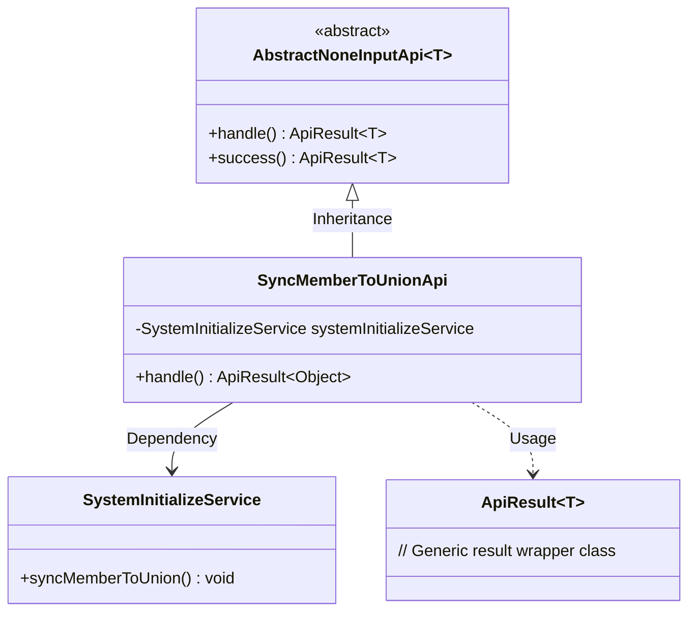
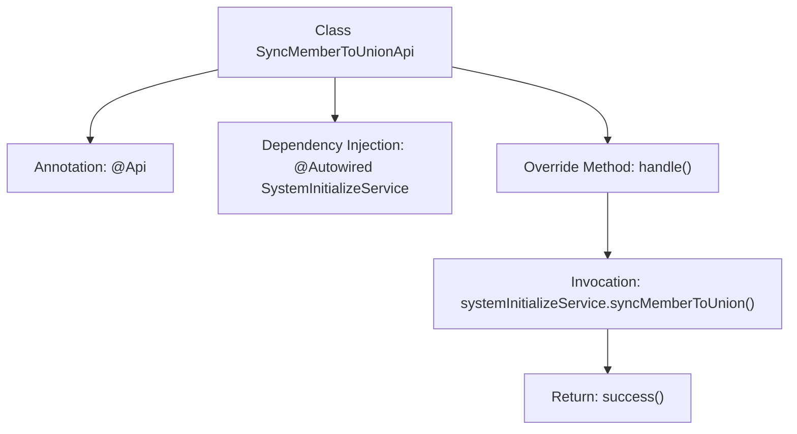

# Basic Information

|      |      |
|------|------|
| Name | SyncMemberToUnionApi |
| Language | .java |
| Code Path | WeFe/board/board-service/src/main/java/com/welab/wefe/board/service/api/member/SyncMemberToUnionApi.java |
| Package Name | com.welab.wefe.board.service.api.member |
| Dependencies | ['com.welab.wefe.board.service.service.SystemInitializeService', 'com.welab.wefe.common.exception.StatusCodeWithException', 'com.welab.wefe.common.web.api.base.AbstractNoneInputApi', 'com.welab.wefe.common.web.api.base.Api', 'com.welab.wefe.common.web.dto.ApiResult', 'org.springframework.beans.factory.annotation.Autowired'] |
| Brief Description | Synchronize member information to the alliance's API, used for member recovery after alliance data loss, invoking SystemInitializeService to implement the synchronization function. |

# Description

This is an API class named SyncMemberToUnionApi, designed to synchronize member information to the union system. The primary purpose of this API is to restore member data after union data loss. It inherits from the AbstractNoneInputApi base class, indicating that the interface requires no input parameters. The class automatically injects the SystemInitializeService and calls the syncMemberToUnion method to achieve synchronization. Upon successful processing, it returns an empty result object. The API path is member/sync_to_union, and its functional description explicitly states its data recovery purpose. The entire implementation is concise and straightforward, containing only the necessary business logic invocation and a success return.

# Class Summary

| Name   | Type  | Description |
|-------|------|-------------|
| SyncMemberToUnionApi | class | Synchronize member information to the alliance's API for member recovery after alliance data loss. |

## Class SyncMemberToUnionApi

|      |      |
|------|------|
| Access Modifier | @Api(;        path = "member/sync_to_union",;        name = "Synchronize member information to union",;        desc = "Used for membership recovery after union data loss";);public |
| Type | class |
| Name | SyncMemberToUnionApi |
| Description | Synchronize member information to the alliance's API for member recovery after alliance data loss. |

### UML Class Diagram

This code demonstrates a member information synchronization API implementation class SyncMemberToUnionApi, which inherits from the generic abstract class AbstractNoneInputApi. It relies on SystemInitializeService to complete core business logic and returns an empty result encapsulated in ApiResult. The class diagram clearly presents inheritance relationships, service dependencies, and generic result encapsulation, reflecting the application of Spring dependency injection and the template method pattern.

### Internal Method Call Graph

This code defines an API class named SyncMemberToUnionApi for synchronizing member information to the union system. The class specifies path, name, and description through the @Api annotation, inherits from AbstractNoneInputApi, and overrides the handle method. Within the handle method, it invokes the syncMemberToUnion method of systemInitializeService to complete the synchronization operation, ultimately returning a success result. The flowchart illustrates the complete execution path from class definition to method invocation.

### Field List

| Name  | Type  | Description |
|-------|-------|------|
| systemInitializeService | SystemInitializeService | Automatic injection system initializes service instances. |

### Method List

| Name  | Type  | Description |
|-------|-------|------|
| handle | ApiResult<Object> | Handling synchronous members to the alliance by overriding methods, returning successful results. |

