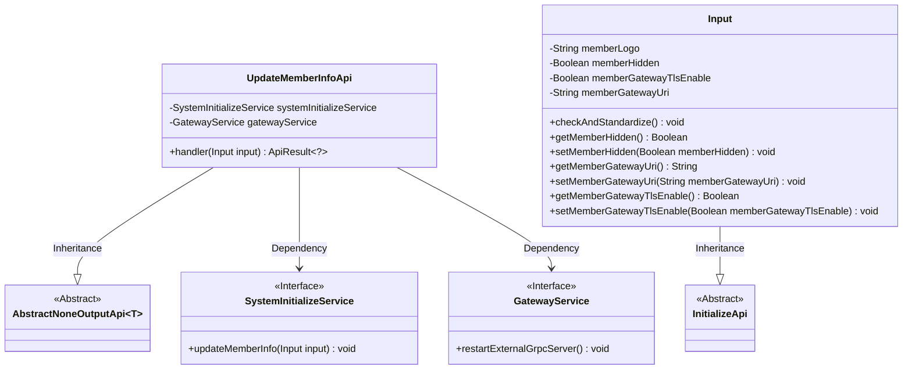

# Basic Information

|      |      |
|------|------|
| Name | UpdateMemberInfoApi |
| Language | .java |
| Code Path | WeFe/board/board-service/src/main/java/com/welab/wefe/board/service/api/member/UpdateMemberInfoApi.java |
| Package Name | com.welab.wefe.board.service.api.member |
| Dependencies | ['com.welab.wefe.board.service.service.GatewayService', 'com.welab.wefe.board.service.service.SystemInitializeService', 'com.welab.wefe.common.Convert', 'com.welab.wefe.common.StatusCode', 'com.welab.wefe.common.exception.StatusCodeWithException', 'com.welab.wefe.common.fieldvalidate.annotation.Check', 'com.welab.wefe.common.web.api.base.AbstractNoneOutputApi', 'com.welab.wefe.common.web.api.base.Api', 'com.welab.wefe.common.web.dto.ApiResult', 'org.springframework.beans.factory.annotation.Autowired'] |
| Brief Description | API class for updating member information, including input parameters such as member logo, stealth status, TLS communication, and gateway address. It validates the port validity of the gateway address, calls the service to update information, and notifies the gateway to refresh the cache. |

# Description

The code defines an API class named `UpdateMemberInfoApi`, which is used to update member information. The API path is `"member/update"`, inheriting from `AbstractNoneOutputApi`, with the input type being the inner class `Input`. Its primary functions include invoking `systemInitializeService` to update member information and restarting the external gRPC server via `gatewayService` to refresh the cache.  

The `Input` class contains fields such as member logo, stealth status, TLS communication switch, and a mandatory gateway communication address. The gateway address requires port range validation (1–65535). The class provides getter and setter methods for each field and executes parameter standardization and validation logic in the `checkAndStandardize` method.

# Class Summary

| Name   | Type  | Description |
|-------|------|-------------|
| UpdateMemberInfoApi | class | API class for updating member information, including input parameters such as member logo, stealth status, TLS communication, and gateway address. It validates the port validity of the gateway address, calls the service to update information, and notifies the gateway to refresh the cache. |

## Class UpdateMemberInfoApi

|      |      |
|------|------|
| Access Modifier | @Api(path = "member/update", name = "update member info");public |
| Type | class |
| Name | UpdateMemberInfoApi |
| Description | API class for updating member information, including input parameters such as member logo, stealth status, TLS communication, and gateway address. It validates the port validity of the gateway address, calls the service to update information, and notifies the gateway to refresh the cache. |

### UML Class Diagram

This code demonstrates the implementation of a member information update API. The UpdateMemberInfoApi inherits from AbstractNoneOutputApi, processes member information update requests, updates member details via SystemInitializeService, and restarts the external gRPC service through GatewayService. The Input class inherits from InitializeApi, containing fields such as member logo, stealth status, TLS communication switch, and gateway address, along with parameter validation logic. The class diagram clearly illustrates the inheritance and dependency relationships between classes.

### Internal Method Call Graph

```mermaid
graph TD
    A["Class UpdateMemberInfoApi"]
    B["Annotation: @Api(path='member/update', name='update member info')"]
    C["Inheritance: AbstractNoneOutputApi<Input>"]
    D["Dependency Injection: @Autowired SystemInitializeService"]
    E["Dependency Injection: @Autowired GatewayService"]
    F["Overridden Method: handler(Input input)"]
    G["Invocation: systemInitializeService.updateMemberInfo"]
    H["Invocation: gatewayService.restartExternalGrpcServer"]
    I["Return: success()"]
    J["Nested Class: Input"]
    K["Inheritance: InitializeApi.Input"]
    L["Field: @Check memberLogo"]
    M["Field: @Check memberHidden"]
    N["Field: @Check memberGatewayTlsEnable"]
    O["Field: @Check memberGatewayUri"]
    P["Method: checkAndStandardize()"]
    Q["Validation: Port range 1~65535"]
    R["Throw Exception: StatusCodeWithException"]

    A --> B
    A --> C
    A --> D
    A --> E
    A --> F
    F --> G
    F --> H
    F --> I
    A --> J
    J --> K
    J --> L
    J --> M
    J --> N
    J --> O
    J --> P
    P --> Q
    Q -->|Invalid Port| R
```

This code defines an API class for updating member information, which inherits from an abstract base class and implements core processing logic. The flowchart illustrates class structure relationships, including dependency-injected services, main processing methods, and input parameter validation. The handler method invokes two services for member info updates and gateway restart. The Input class ensures parameter validity through inheritance and field validation, with strict range checking on the gateway URI's port.

### Field List

| Name  | Type  | Description |
|-------|-------|------|
| gatewayService | GatewayService | Automatically inject the GatewayService instance. |
| systemInitializeService | SystemInitializeService | Automatic injection system initializes service instances. |

### Method List

| Name  | Type  | Description |
|-------|-------|------|
| handler | ApiResult<?> | Process the input and update member information, notify the gateway to refresh the cache, and finally return a successful result. |

