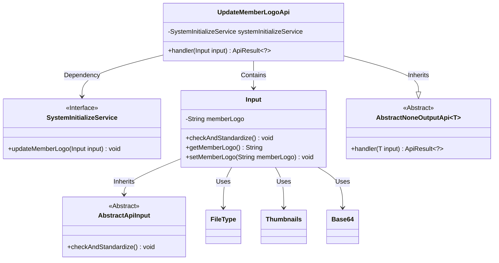
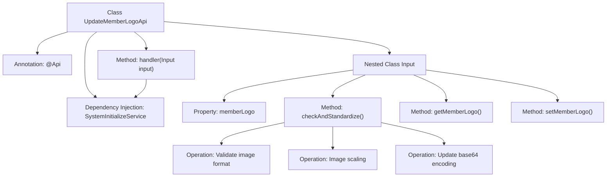

# Basic Information

|      |      |
|------|------|
| Name | UpdateMemberLogoApi |
| Language | .java |
| Code Path | WeFe/board/board-service/src/main/java/com/welab/wefe/board/service/api/member/UpdateMemberLogoApi.java |
| Package Name | com.welab.wefe.board.service.api.member |
| Dependencies | ['com.welab.wefe.board.service.service.SystemInitializeService', 'com.welab.wefe.common.StatusCode', 'com.welab.wefe.common.exception.StatusCodeWithException', 'com.welab.wefe.common.fieldvalidate.annotation.Check', 'com.welab.wefe.common.util.FileType', 'com.welab.wefe.common.util.StringUtil', 'com.welab.wefe.common.web.api.base.AbstractNoneOutputApi', 'com.welab.wefe.common.web.api.base.Api', 'com.welab.wefe.common.web.dto.AbstractApiInput', 'com.welab.wefe.common.web.dto.ApiResult', 'net.coobird.thumbnailator.Thumbnails', 'org.apache.commons.codec.binary.Base64', 'org.springframework.beans.factory.annotation.Autowired', 'java.io.ByteArrayInputStream', 'java.io.ByteArrayOutputStream', 'java.io.IOException'] |
| Brief Description | API for updating member logo, which accepts base64 images, validates the format, and performs scaling to prevent malicious content. |

# Description

The code defines an API class named UpdateMemberLogoApi, which is used to update a member's logo. The API path is member/update_logo, and it accepts an input parameter containing the member's logo. The input parameter memberLogo must be Base64-encoded image data. The system will validate the image format and perform scaling operations on the image to filter out potential malicious content. Upon successful processing, it returns a success result. The input class Input inherits from AbstractApiInput and includes parameter validation and standardization logic to ensure the image data is valid and secure.

# Class Summary

| Name   | Type  | Description |
|-------|------|-------------|
| UpdateMemberLogoApi | class | API for updating member logos, validating image formats and processing to prevent malicious content. |

## Class UpdateMemberLogoApi

|      |      |
|------|------|
| Access Modifier | @Api(path = "member/update_logo", name = "update member logo");public |
| Type | class |
| Name | UpdateMemberLogoApi |
| Description | API for updating member logos, validating image formats and processing to prevent malicious content. |

### UML Class Diagram

Class Diagram Description: This diagram illustrates the structure of UpdateMemberLogoApi and its related classes. UpdateMemberLogoApi inherits from the generic class AbstractNoneOutputApi and contains an inner class Input. Input inherits from AbstractApiInput and is responsible for validating and processing member logo image data. UpdateMemberLogoApi updates the member logo through the SystemInitializeService interface, relying on utility classes such as Base64 and Thumbnails for image processing. The overall structure reflects a design that separates API request handling, input validation, and business logic.

### Internal Method Call Graph

The flowchart describes the structure and main processing flow of the UpdateMemberLogoApi class. This class is an API interface for updating member logo images. The core process includes: receiving input parameters through the handler method and invoking system services to process the request; the Input nested class handles parameter validation, where the checkAndStandardize() method verifies the image format, performs secure scaling, and regenerates the base64 encoding. The entire process involves three key steps: image format validation, secure processing, and encoding conversion.

### Field List

| Name  | Type  | Description |
|-------|-------|------|
| systemInitializeService | SystemInitializeService | Automatic injection system initialization service instance. |

### Method List

| Name  | Type  | Description |
|-------|-------|------|
| handler | ApiResult<?> | The method overrides the input processing, calls the service to update member flags, and returns the result upon success. |

