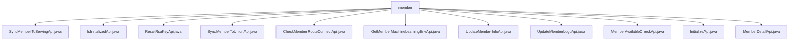

# Basic Information

|      |      |
|------|------|
| Name | member |
| Language | .java |
| Code Path | WeFe/board/board-service/src/main/java/com/welab/wefe/board/service/api/member |
| Package Name | docs.board.board-service.src.main.java.com.welab.wefe.board.service.api.member |
| Brief Description | SyncMemberToServingApi synchronizes member information to the server. IsInitializedApi checks the system initialization status. ResetRsaKeyApi resets the RSA key. SyncMemberToUnionApi synchronizes members to the union. CheckMemberRouteConnectApi checks member route connectivity. GetMemberMachineLearningEnvApi retrieves the member's machine learning environment. UpdateMemberInfoApi updates member information. UpdateMemberLogoApi updates the member logo. MemberAvailableCheckApi checks member service availability. InitializeApi initializes the system. MemberDetailApi retrieves member details. |

# Description

## Overview  
The core responsibility of this module is to manage alliance member information, including functions such as initialization, synchronization, status checks, and attribute updates, similar to a membership management center. The interface specifications follow the RESTful style, with all paths starting with `member/` and inheriting from the AbstractApi series of base classes, featuring clear input and output types. Key data structures include the Input class (with field validation), Output classes (such as Env/MemberInfoModel), and MemberAvailableCheckOutput, among others. External dependencies include SystemInitializeService, GatewayService, and GlobalConfigService. For example, SyncMemberToServingApi synchronizes data via SystemInitializeService, while UpdateMemberInfoApi relies on GatewayService to refresh the cache.

## Key Business Scenarios  
The module supports member lifecycle management: initialization (InitializeApi), data synchronization (SyncMemberToXxxApi), status monitoring (MemberAvailableCheckApi), and attribute maintenance (UpdateMemberXxxApi). The interaction mode is primarily service calls, such as SystemInitializeService handling core logic and GatewayService verifying connections. Typical applications include alliance data recovery, key resets (ResetRsaKeyApi), and gateway checks (CheckMemberRouteConnectApi). API types encompass queries (IsInitializedApi), operations (ResetRsaKeyApi), and hybrid types (UpdateMemberLogoApi requires Base64 image validation). For instance, InitializeApi strictly validates member name length, while UpdateMemberLogoApi filters malicious images.

### Package Internal Structure View

This flowchart illustrates the API file structure under the "member" directory in the WeFe project. The root node "member" directly connects to 11 Java API files, encompassing functional modules such as member synchronization, initialization checks, key reset, and route detection. All files reside at the same hierarchical level without nested subdirectory structures, clearly presenting the layout of member management-related API interfaces.

# File List

| Name   | Type  | Description |
|-------|------|-------------|
| [SyncMemberToServingApi.java](SyncMemberToServingApi.md) | file | Synchronize member information to the server for member recovery in case of alliance data loss. |
| [IsInitializedApi.java](IsInitializedApi.md) | file | This is an API to check if the system is initialized, with the path "member/is_initialized". If not initialized, the system cannot access functional modules. The response includes a boolean value indicating the initialization status. |
| [ResetRsaKeyApi.java](ResetRsaKeyApi.md) | file | The code defines an API class named ResetRsaKeyApi, which is used to reset a member's RSA key pair. It achieves this functionality by invoking the updateMemberRsaKey method of systemInitializeService and returns an ApiResult upon successful execution. |
| [SyncMemberToUnionApi.java](SyncMemberToUnionApi.md) | file | Synchronize member information to the alliance's API, used for member recovery after alliance data loss, by invoking the SystemInitializeService to achieve synchronization functionality. |
| [CheckMemberRouteConnectApi.java](CheckMemberRouteConnectApi.md) | file | Check the API for member gateway route connections, requiring the member ID and gateway address, and use the `ping` method of `GatewayService` to verify connectivity. |
| [GetMemberMachineLearningEnvApi.java](GetMemberMachineLearningEnvApi.md) | file | API class for retrieving details of a member's machine learning environment, inherits from an inputless abstract class and returns an Env object. |
| [UpdateMemberInfoApi.java](UpdateMemberInfoApi.md) | file | API class for updating member information, including input parameters such as member logo, stealth status, TLS communication, and gateway address. It validates the port validity of the gateway address, calls the service to update information, and notifies the gateway to refresh the cache. |
| [UpdateMemberLogoApi.java](UpdateMemberLogoApi.md) | file | API for updating member logo, which accepts base64 image, validates the format, and performs scaling to prevent malicious content. |
| [MemberAvailableCheckApi.java](MemberAvailableCheckApi.md) | file | API for checking the availability of member system services, which receives a member ID and returns service status information, while clearing detail values when requested by the gateway. |
| [InitializeApi.java](InitializeApi.md) | file | Initialize the system API with the path "member/initialize". The input parameters include member name (3-12 characters of Chinese/English letters or numbers), email, phone number, whether to make the dataset public, and key type (default: rsa). Invoke the SystemInitializeService to perform the initialization. |
| [MemberDetailApi.java](MemberDetailApi.md) | file | Member Details API class, inherits from the abstract No-Input API, retrieves the MemberInfoModel via the global configuration service, and returns the result after clearing the private key. |

