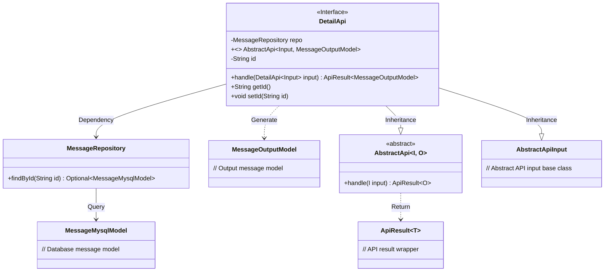
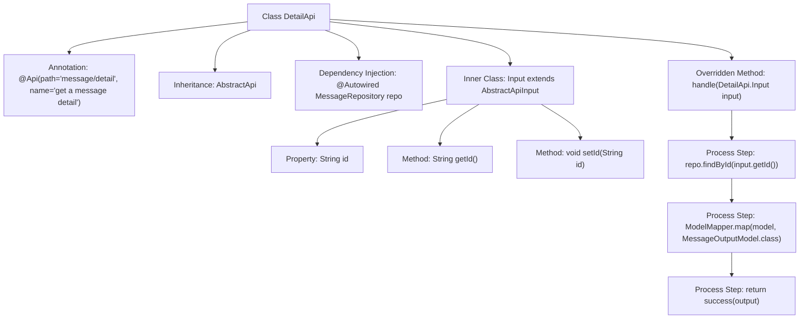

# Basic Information

|      |      |
|------|------|
| Name | DetailApi |
| Language | .java |
| Code Path | WeFe/board/board-service/src/main/java/com/welab/wefe/board/service/api/message/DetailApi.java |
| Package Name | com.welab.wefe.board.service.api.message |
| Dependencies | ['com.welab.wefe.board.service.database.entity.MessageMysqlModel', 'com.welab.wefe.board.service.database.repository.MessageRepository', 'com.welab.wefe.board.service.dto.entity.MessageOutputModel', 'com.welab.wefe.common.exception.StatusCodeWithException', 'com.welab.wefe.common.web.api.base.AbstractApi', 'com.welab.wefe.common.web.api.base.Api', 'com.welab.wefe.common.web.dto.AbstractApiInput', 'com.welab.wefe.common.web.dto.ApiResult', 'com.welab.wefe.common.web.util.ModelMapper', 'org.springframework.beans.factory.annotation.Autowired'] |
| Brief Description | The DetailApi class retrieves message details by ID, calls the MessageRepository to fetch data, and converts it into a MessageOutputModel for return. The input parameter is the ID. |

# Description

The code defines an API class named DetailApi for retrieving message details. It inherits from AbstractApi, accepts DetailApi.Input as input, and returns a MessageOutputModel. The class is annotated with an API path of "message/detail" and a name of "get a message detail". It queries the database using the auto-injected MessageRepository to fetch message data based on the input ID and maps it to the output model using ModelMapper. The input class Input contains a string-type id field along with its getter/setter methods. In the processing logic, it returns null if no corresponding message is found, otherwise returns the mapped output model.

# Class Summary

| Name   | Type  | Description |
|-------|------|-------------|
| DetailApi | class | The DetailApi class handles requests for retrieving message details, queries the database by id, and returns the message details. The input is id, and the output is MessageOutputModel. |

## Class DetailApi

|      |      |
|------|------|
| Access Modifier | @Api(path = "message/detail", name = "get a message detail");public |
| Type | class |
| Name | DetailApi |
| Description | The DetailApi class handles requests for retrieving message details, queries the database by id, and returns the message details. The input is id, and the output is MessageOutputModel. |

### UML Class Diagram

This code implements a message detail retrieval API interface, inheriting from the generic abstract class AbstractApi and utilizing MessageRepository for database queries. DetailApi contains a nested Input class as input parameters, processes requests through the handle method, and returns MessageOutputModel. The class diagram illustrates inheritance, dependency, and association relationships between core classes, including abstract base classes, database operations, model mapping, and other key components, demonstrating a clear hierarchical structure and division of responsibilities.

### Internal Method Call Graph

This flowchart illustrates the structure and main processing flow of the DetailApi class. DetailApi is a class annotated with API annotations, inheriting from AbstractApi and overriding the handle method. The inner class Input is used to encapsulate request parameters. The handle method queries data through MessageRepository, performs model conversion using ModelMapper, and finally returns a successful result. The entire process clearly presents the complete chain from input processing to result return.

### Field List

| Name  | Type  | Description |
|-------|-------|------|
| repo | MessageRepository | Use @Autowired to automatically inject the MessageRepository instance repo. |

### Method List

| Name  | Type  | Description |
|-------|-------|------|
| handle | ApiResult<MessageOutputModel> | This method queries the database based on the input ID, maps the result, and returns a successful response. If no data is found, it returns null. |

