# Basic Information

|      |      |
|------|------|
| Name | QueryApi |
| Language | .java |
| Code Path | WeFe/board/board-service/src/main/java/com/welab/wefe/board/service/api/message/QueryApi.java |
| Package Name | com.welab.wefe.board.service.api.message |
| Dependencies | ['com.welab.wefe.board.service.dto.base.PagingInput', 'com.welab.wefe.board.service.dto.base.PagingOutput', 'com.welab.wefe.board.service.dto.entity.MessageOutputModel', 'com.welab.wefe.board.service.service.MessageService', 'com.welab.wefe.common.exception.StatusCodeWithException', 'com.welab.wefe.common.fieldvalidate.annotation.Check', 'com.welab.wefe.common.web.api.base.AbstractApi', 'com.welab.wefe.common.web.api.base.Api', 'com.welab.wefe.common.web.dto.ApiResult', 'com.welab.wefe.common.wefe.enums.MessageEvent', 'org.springframework.beans.factory.annotation.Autowired', 'java.util.List'] |
| Brief Description | Query message pagination interface, inherits from AbstractApi, utilizes MessageService to process input parameters including message level, unread status, event list, to-do items, and completion status, and returns paginated message results. |

# Description

The code defines an API class named QueryApi for paginated message queries. The API path is "message/query", which accepts an Input class as the input parameter and returns paginated MessageOutputModel results. The Input class inherits from PagingInput and includes validated fields such as message level, unread status, event list, to-do status, and processing status. The processing logic executes the query through the injected MessageService and returns encapsulated results. The entire class inherits from AbstractApi, adhering to a unified API processing pattern.

# Class Summary

| Name   | Type  | Description |
|-------|------|-------------|
| QueryApi | class | API for paginated message query, with inputs including message level, unread status, event list, to-do status, etc., and output as a paginated message list. |


## Class QueryApi

|      |      |
|------|------|
| Access Modifier | @Api(path = "message/query", name = "query messages by pagination");public |
| Type | class |
| Name | QueryApi |
| Description | API for paginated message query, with inputs including message level, unread status, event list, to-do status, etc., and output as a paginated message list. |


### UML Class Diagram

```mermaid
classDiagram
    class QueryApi {
        +MessageService service
        +handle(QueryApi~Input~ input) ApiResult~PagingOutput~MessageOutputModel~~
    }
    QueryApi --> MessageService : Dependency
    QueryApi --> PagingOutput~MessageOutputModel~ : Dependency
    QueryApi --> ApiResult~PagingOutput~MessageOutputModel~~ : Dependency
    QueryApi --> StatusCodeWithException : Dependency

    class MessageService {
        <<Interface>>
        +query(QueryApi~Input~ input) PagingOutput~MessageOutputModel~
    }

    class PagingInput {
        <<Abstract>>
    }

    class QueryApi~Input~ {
        +String level
        +Boolean unread
        +List~MessageEvent~ eventList
        +Boolean todo
        +Boolean todoComplete
    }
    QueryApi~Input~ --|> PagingInput : Inheritance

    class PagingOutput~T~ {
        <<Generic>>
    }

    class MessageOutputModel {
    }

    class ApiResult~T~ {
        <<Generic>>
    }

    class StatusCodeWithException {
    }

    class MessageEvent {
    }
```

This code demonstrates a paginated message query API implementation. The QueryApi inherits from AbstractApi, processes input parameters including message level, unread status, and other conditions, and returns paginated message output results. The class diagram clearly illustrates the dependency relationship between QueryApi and MessageService, as well as the structure where the input parameter class Input inherits from PagingInput. The design utilizes generics for flexibility and employs annotations for API metadata marking and parameter validation.


### Internal Method Call Graph

```mermaid
graph TD
    A["Class QueryApi"]
    B["Annotation: @Api(path='message/query', name='query messages by pagination')"]
    C["Inheritance: AbstractApi<Input, PagingOutput<MessageOutputModel>>"]
    D["Dependency Injection: @Autowired MessageService service"]
    E["Overridden Method: handle(Input input)"]
    F["Inner Class: Input"]
    G["Parent Class: PagingInput"]
    H["Field: String level @Check('Message Level')"]
    I["Field: Boolean unread @Check('Unread Status')"]
    J["Field: List<MessageEvent> eventList @Check('Event List')"]
    K["Field: Boolean todo @Check('Is To-Do Item')"]
    L["Field: Boolean todoComplete @Check('To-Do Completion Status')"]
    M["Method Call: service.query(input)"]
    N["Return: success(service.query(input))"]

    A --> B
    A --> C
    A --> D
    A --> E
    E --> M
    M --> N
    A --> F
    F --> G
    F --> H
    F --> I
    F --> J
    F --> K
    F --> L
```



This code defines a class named QueryApi for paginated message queries. The class inherits from AbstractApi and includes an inner class Input to encapsulate query parameters. The flowchart illustrates the class structure, annotations, inheritance relationships, field definitions, and the core handle method's processing flow, where the handle method retrieves paginated results by calling service.query(input) and returns a success response.

### Field List

| Name  | Type  | Description |
|-------|-------|------|
| service | MessageService | Using @Autowired to automatically inject an instance of MessageService. |

### Method List

| Name  | Type  | Description |
|-------|-------|------|
| handle | ApiResult<PagingOutput<MessageOutputModel>> | This is a Java method override that processes query input and returns paginated message results, invoking the service layer query method upon success. |


