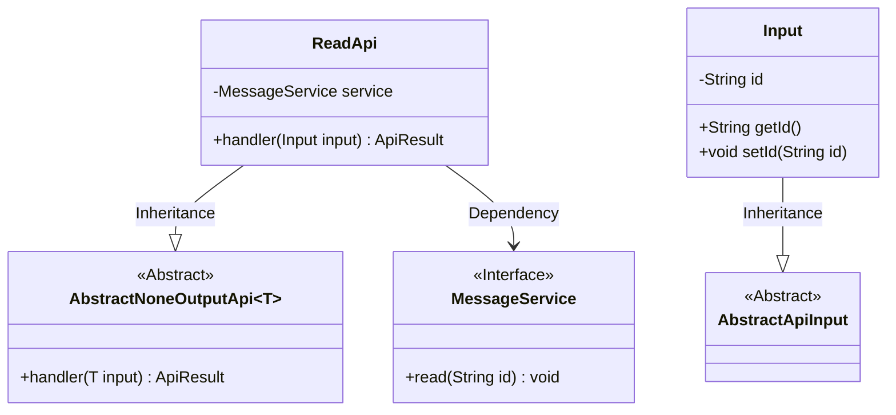
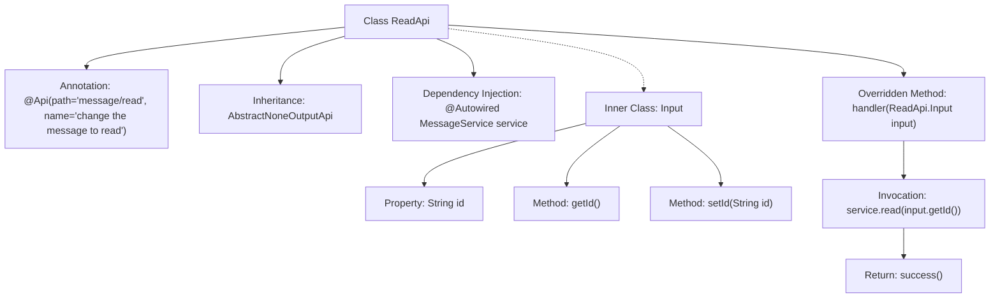

# Basic Information

|      |      |
|------|------|
| Name | ReadApi |
| Language | .java |
| Code Path | WeFe/board/board-service/src/main/java/com/welab/wefe/board/service/api/message/ReadApi.java |
| Package Name | com.welab.wefe.board.service.api.message |
| Dependencies | ['com.welab.wefe.board.service.service.MessageService', 'com.welab.wefe.common.exception.StatusCodeWithException', 'com.welab.wefe.common.web.api.base.AbstractNoneOutputApi', 'com.welab.wefe.common.web.api.base.Api', 'com.welab.wefe.common.web.dto.AbstractApiInput', 'com.welab.wefe.common.web.dto.ApiResult', 'org.springframework.beans.factory.annotation.Autowired'] |
| Brief Description | This is a message read API that receives a message ID and calls the service to mark it as read, with no return value. The input class contains an ID field along with its getter/setter methods. |

# Description

The code defines an API class named `ReadApi`, which is used to mark messages as read. It inherits from `AbstractNoneOutputApi` with the generic parameter set to the inner class `Input`. The API path is `message/read`, and its functional description is to update the message status to "read". The class injects the `MessageService` service and overrides the `handler` method, calling `service.read` to process the `id` from the input parameters and return a successful result. The inner class `Input` inherits from `AbstractApiInput` and contains a string-type `id` property along with its getter and setter methods.

# Class Summary

| Name   | Type  | Description |
|-------|------|-------------|
| ReadApi | class | This is a message read status update API that takes a message ID parameter, calls the service layer to mark the message as read, and returns no value. |

## Class ReadApi

|      |      |
|------|------|
| Access Modifier | @Api(path = "message/read", name = "change the message to read");public |
| Type | class |
| Name | ReadApi |
| Description | This is a message read status update API that takes a message ID parameter, calls the service layer to mark the message as read, and returns no value. |

### UML Class Diagram

This code demonstrates the implementation structure of a message read API. ReadApi inherits from the generic abstract class AbstractNoneOutputApi, processes Input type parameters, and implements the message read functionality through the MessageService interface. Input is an internal static class that inherits from AbstractApiInput, containing a message ID field and its accessors. The overall design follows dependency injection and layered architecture principles, decoupling business logic through service interfaces.

### Internal Method Call Graph

This flowchart illustrates the structure and key behaviors of the ReadApi class. ReadApi is an API class annotated with a specific path and name, inheriting from AbstractNoneOutputApi and handling Input type parameters. The core logic resides in the handler method, which invokes the read method of the injected MessageService to process the message ID, ultimately returning a success result. The Input inner class encapsulates the message ID property and its accessor methods. The overall flow clearly demonstrates the data path from request processing to service invocation.

### Field List

| Name  | Type  | Description |
|-------|-------|------|
| service | MessageService | Using @Autowired to automatically inject an instance of MessageService. |

### Method List

| Name  | Type  | Description |
|-------|-------|------|
| handler | ApiResult<?> | Java method override, calling the service layer to read input ID data, successfully returning the result. |

