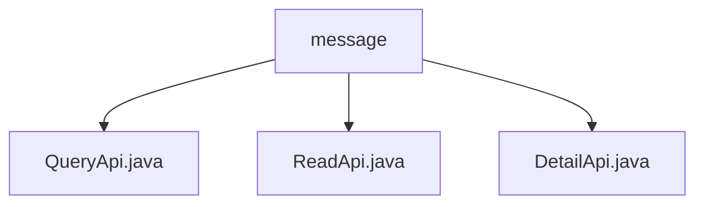

# Basic Information

|      |      |
|------|------|
| Name | message |
| Language | .java |
| Code Path | WeFe/board/board-service/src/main/java/com/welab/wefe/board/service/api/message |
| Package Name | docs.board.board-service.src.main.java.com.welab.wefe.board.service.api.message |
| Brief Description | The QueryApi is used for paginated message queries with various filtering conditions. The ReadApi marks messages as read, requiring the input of message IDs. The DetailApi retrieves message details, querying and returning detailed data based on the ID. |

# Description

## Overview  
The core responsibility of this module is to provide CRUD operations for the messaging system, including paginated queries, read status marking, and detail retrieval. The interface specifications adhere to the RESTful style, uniformly inheriting from the AbstractApi base class with a path prefix of "message". Key data structures include MessageOutputModel (message output model) and PagingInput (pagination input base class). External dependencies involve the MessageService business service and MessageRepository persistence layer component. For example, QueryApi supports filtering messages by status, while ReadApi updates the read status via ID.

## Primary Business Scenarios  
The module supports full lifecycle management of the message center, similar to inbox operations in an email system. Typical workflows include: users querying message lists (pagination + filtering), viewing details, and marking messages as read. The interaction mode is exclusively synchronous HTTP requests, such as DetailApi precisely querying a single message by ID. API types encompass query classes (QueryApi/DetailApi) and state modification classes (ReadApi). Integration use cases include unread message badge notifications and paginated loading of message lists.

### Package Internal Structure View

This flowchart illustrates three Java files under the message directory: QueryApi.java, ReadApi.java, and DetailApi.java. These files are directly subordinate to the message directory with no deeper nested structure. The entire organization is concise and clear, effectively presenting the arrangement of API files within the message directory.

# File List

| Name   | Type  | Description |
|-------|------|-------------|
| [QueryApi.java](QueryApi.md) | file | Query message pagination interface, inherits from AbstractApi, uses MessageService to process input parameters including message level, unread status, event list, to-do items, and completion status, returns paginated message results. |
| [ReadApi.java](ReadApi.md) | file | This is a message read API that receives a message ID and calls the service to mark it as read, with no return value. The input class contains an ID field along with its getter/setter methods. |
| [DetailApi.java](DetailApi.md) | file | The DetailApi class retrieves message details by ID, calls the MessageRepository to fetch data, and converts it into a MessageOutputModel for return. The input parameter is the ID. |

