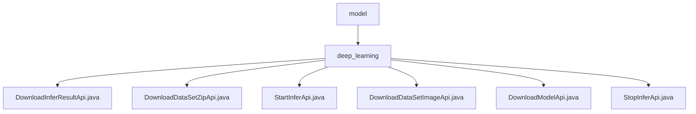

# Basic Information

|      |      |
|------|------|
| Name | model |
| Language | .java |
| Code Path | WeFe/board/board-service/src/main/java/com/welab/wefe/board/service/api/model |
| Package Name | docs.board.board-service.src.main.java.com.welab.wefe.board.service.api.model |
| Brief Description | Six deep learning APIs are defined: download inference results, batch inference zip, start inference, download inference images, download model, and abort inference. All require the taskId parameter to handle file operations and task validation. |

# Description

## Overview  
This module provides full lifecycle management for deep learning model inference, including functions such as starting/stopping inference, result downloading, and model retrieval. Core interfaces adhere to the RESTful specification, all inheriting from the AbstractApi base class and using ResponseEntity for unified responses. Key data structures include identifier fields like TaskId and InferSessionId, with mandatory parameters encapsulated via the Input inner class. External dependencies include the VisualFL service, WeFeFileSystem, and TaskResultService. For example, the DownloadModelApi retrieves model files via VisualFL, while the StartInferApi generates compressed packages and invokes the inference service.  

## Core Business Scenarios  
The module supports end-to-end inference workflows: Users submit tasks (single images or compressed packages) via StartInferApi, the system generates session IDs and triggers inference; DownloadInferResultApi retrieves JSON results, while DownloadDataSetZipApi/DownloadDataSetImageApi download batch or single result files, respectively. Operating similarly to a task queue pattern, StopInferApi can abort running tasks. A typical application is medical image analysis: After uploading a CT scan package, users asynchronously obtain lesion detection results. API types cover CRUD operations, with integration cases including model version management and inference resource recycling.

### Package Internal Structure View

This flowchart illustrates the hierarchical structure of deep learning APIs in the WeFe project. The top-level node "model" contains a subdirectory "deep_learning", which in turn includes six specific API implementation class files. These represent various API endpoints with functionalities such as downloading inference results, dataset zip files, model files, etc. All nodes display only the last-level names of the paths, clearly presenting the organizational structure of the API modules.

# File List

| Name   | Type  | Description |
|-------|------|-------------|
| [deep_learning](deep_learning/_module.md) | package | Defined 6 deep learning APIs: download inference results, batch inference zip, start inference, download inference images, download model, and abort inference. All require the taskId parameter to handle file operations and task validation. |

