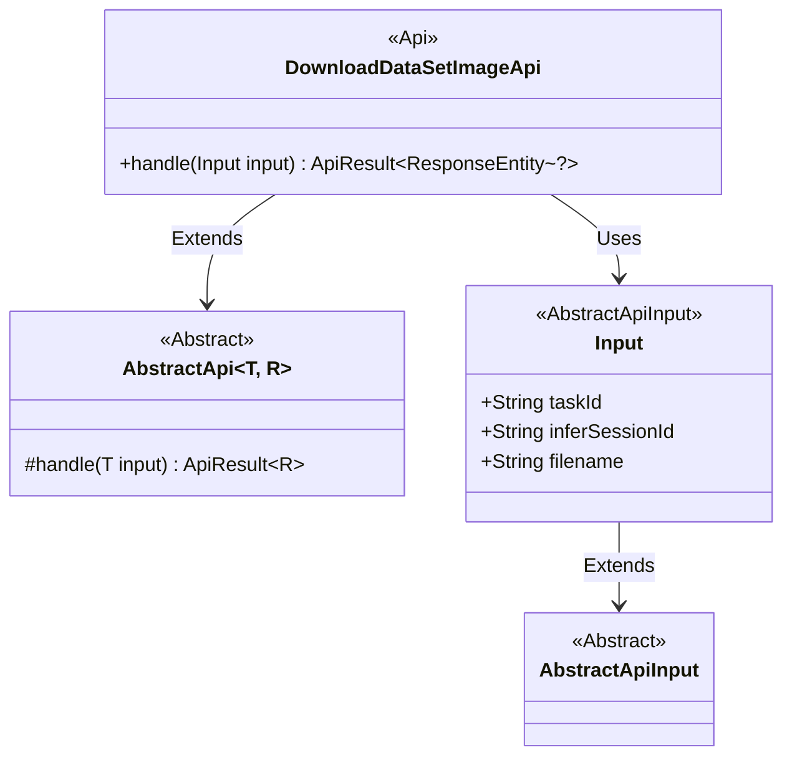

# Basic Information

|      |      |
|------|------|
| Name | DownloadDataSetImageApi |
| Language | .java |
| Code Path | WeFe/board/board-service/src/main/java/com/welab/wefe/board/service/api/model/deep_learning/DownloadDataSetImageApi.java |
| Package Name | com.welab.wefe.board.service.api.model.deep_learning |
| Dependencies | ['com.welab.wefe.board.service.base.file_system.WeFeFileSystem', 'com.welab.wefe.common.StatusCode', 'com.welab.wefe.common.fieldvalidate.annotation.Check', 'com.welab.wefe.common.web.api.base.AbstractApi', 'com.welab.wefe.common.web.api.base.Api', 'com.welab.wefe.common.web.dto.AbstractApiInput', 'com.welab.wefe.common.web.dto.ApiResult', 'org.springframework.http.ResponseEntity', 'java.io.File'] |
| Brief Description | Download inference image API, which receives task ID, session ID, and file name, checks for file existence, and returns the file. |

# Description

The code defines an API class named `DownloadDataSetImageApi`, designed to handle download requests for deep learning model inference images. The API path is `"model/deep_learning/call/download/image"`. This class inherits from `AbstractApi`, accepts input parameters of type `Input`, and returns a `ResponseEntity`. Its primary functionality is to locate the file path based on the input `taskId`, `inferSessionId`, and `filename`, verify the file's existence, and return the file if it exists or throw a file-not-found exception if it does not. The `Input` class includes three mandatory fields: `taskId`, `inferSessionId`, and `filename`.

# Class Summary

| Name   | Type  | Description |
|-------|------|-------------|
| DownloadDataSetImageApi | class | The DownloadDataSetImageApi is used to download inference images. It accepts parameters such as taskId, inferSessionId, and filename, and returns the file after verifying its existence. |

## Class DownloadDataSetImageApi

|      |      |
|------|------|
| Access Modifier | @Api(path = "model/deep_learning/call/download/image", name = "下载推理图片");public |
| Type | class |
| Name | DownloadDataSetImageApi |
| Description | The DownloadDataSetImageApi is used to download inference images. It accepts parameters such as taskId, inferSessionId, and filename, and returns the file after verifying its existence. |

### UML Class Diagram

Class diagram description: This diagram illustrates that the DownloadDataSetImageApi class inherits from the generic AbstractApi class and implements file download functionality. The Input class, as an inner class extending AbstractApiInput, contains three mandatory fields: task ID, session ID, and filename. AbstractApi serves as an abstract base class defining the core processing method. The overall structure reflects the hierarchical relationship of API interfaces and the input parameter validation mechanism.

### Internal Method Call Graph

```mermaid
graph TD
    A["Class DownloadDataSetImageApi"]
    B["Inheritance: AbstractApi<Input, ResponseEntity<?>>"]
    C["Annotation: @Api"]
    D["Method: handle(Input input)"]
    E["Get file path: WeFeFileSystem.CallDeepLearningModel.getImageSimpleDir()"]
    F["Resolve filename: resolve(input.filename)"]
    G["Convert to File object: toFile()"]
    H["Check file existence: file.exists()"]
    I["Exception handling: StatusCode.FILE_DOES_NOT_EXIST.throwException()"]
    J["Return result: file(file)"]
    K["Inner class Input"]
    L["Inheritance: AbstractApiInput"]
    M["Field: String taskId"]
    N["Field: String inferSessionId"]
    O["Field: String filename"]
    P["Annotation: @Check(require=true)"]

    A --> B
    A --> C
    A --> D
    D --> E
    E --> F
    F --> G
    G --> H
    H --"No"--> I
    H --"Yes"--> J
    A --> K
    K --> L
    K --> M
    K --> N
    K --> O
    M --> P
    N --> P
    O --> P
```

This code demonstrates an API class for downloading inference images, which inherits from AbstractApi and handles file download requests. The flowchart clearly outlines the complete process from receiving input parameters to ultimately returning a file response, including key steps such as file path construction, existence checking, exception handling, and result returning. The inner class Input defines the required request parameters and ensures parameter integrity through the @Check annotation. The entire process reflects a robust error handling mechanism and clear division of responsibilities.

### Field List

| Name  | Type  | Description |
|-------|-------|------|

### Method List

| Name  | Type  | Description |
|-------|-------|------|
| handle | ApiResult<ResponseEntity<?>> | The method processes input parameters, checks whether the files under the specified task and session directories exist, throws an exception if they do not, and returns the files if they do. |

