# Basic Information

|      |      |
|------|------|
| Name | DownloadDataSetZipApi |
| Language | .java |
| Code Path | WeFe/board/board-service/src/main/java/com/welab/wefe/board/service/api/model/deep_learning/DownloadDataSetZipApi.java |
| Package Name | com.welab.wefe.board.service.api.model.deep_learning |
| Dependencies | ['com.welab.wefe.board.service.base.file_system.WeFeFileSystem', 'com.welab.wefe.common.fieldvalidate.annotation.Check', 'com.welab.wefe.common.web.api.base.AbstractApi', 'com.welab.wefe.common.web.api.base.Api', 'com.welab.wefe.common.web.dto.AbstractApiInput', 'com.welab.wefe.common.web.dto.ApiResult', 'org.springframework.http.ResponseEntity', 'java.io.File'] |
| Brief Description | This is an API endpoint for downloading the zip file required for batch inference, with the path model/deep_learning/call/download/zip, which requires signed access. The input parameters are taskId and inferSessionId, and it returns a zip file. |

# Description

The code defines an API class named `DownloadDataSetZipApi`, which handles the download of zip files required for batch inference. The API path is `"model/deep_learning/call/download/zip"` and allows signed access. Input parameters include the mandatory `taskId` and `inferSessionId`. The processing logic involves retrieving the zip file corresponding to the specified task ID and inference session ID via `WeFeFileSystem` and returning the file. The entire API inherits from `AbstractApi` and uses `ResponseEntity` as the return type.

# Class Summary

| Name   | Type  | Description |
|-------|------|-------------|
| DownloadDataSetZipApi | class | This API is used to download the zip file required for batch inference, requiring the parameters taskId and inferSessionId, and supports signed access. |


## Class DownloadDataSetZipApi

|      |      |
|------|------|
| Access Modifier | @Api(path = "model/deep_learning/call/download/zip", name = "下载需要批量推理的zip文件", allowAccessWithSign = true);public |
| Type | class |
| Name | DownloadDataSetZipApi |
| Description | This API is used to download the zip file required for batch inference, requiring the parameters taskId and inferSessionId, and supports signed access. |


### UML Class Diagram

```mermaid
classDiagram
    class DownloadDataSetZipApi {
        <<Interface>> AbstractApi~Input, ResponseEntity~?~~
        +handle(Input input) ApiResult~ResponseEntity~?~~
    }
    
    class Input {
        <<Abstract>> AbstractApiInput
        +String taskId
        +String inferSessionId
    }

    DownloadDataSetZipApi --> Input : uses
    DownloadDataSetZipApi ..|> AbstractApi~Input, ResponseEntity~?~~ : extends
    Input --|> AbstractApiInput : extends
```

This code demonstrates a Spring framework-based file download API implementation. The DownloadDataSetZipApi class extends the generic abstract class AbstractApi, processes input parameters containing taskId and inferSessionId, retrieves ZIP files via WeFeFileSystem, and returns the result. Input, as a static nested class inheriting from AbstractApiInput, includes two mandatory string fields. The class diagram clearly reflects inheritance relationships and dependencies, illustrating the interaction between the API interface and input parameters.


### Internal Method Call Graph

```mermaid
graph TD
    A["Class DownloadDataSetZipApi"]
    B["Parent Class: AbstractApi<Input, ResponseEntity<?>>"]
    C["Annotation: @Api"]
    D["Method: handle(Input input)"]
    E["Inner Class: Input"]
    F["Field: String taskId"]
    G["Field: String inferSessionId"]
    H["Method Call: WeFeFileSystem.CallDeepLearningModel.getZipFile"]
    I["Return: file(zipFile)"]

    A --> B
    A --> C
    A --> D
    A --> E
    E --> F
    E --> G
    D --> H
    H --> I
```



This code demonstrates a Spring framework-based file download API implementation, primarily designed to handle batch inference data download requests for deep learning models. The flowchart clearly illustrates the class inheritance relationship, annotation configuration, input parameter validation structure, and core file processing logic. It retrieves the ZIP file corresponding to the specified task ID and inference session ID through WeFeFileSystem, ultimately returning a file response entity. The input class Input contains two mandatory fields, taskId and inferSessionId, with parameter integrity verification ensured through the @Check annotation.

### Field List

| Name  | Type  | Description |
|-------|-------|------|

### Method List

| Name  | Type  | Description |
|-------|-------|------|
| handle | ApiResult<ResponseEntity<?>> | Process the input and return the compressed file result. |


