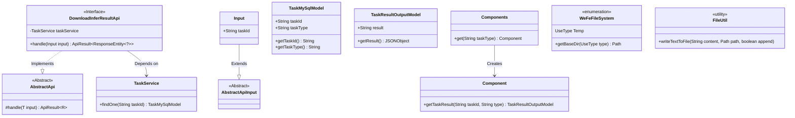
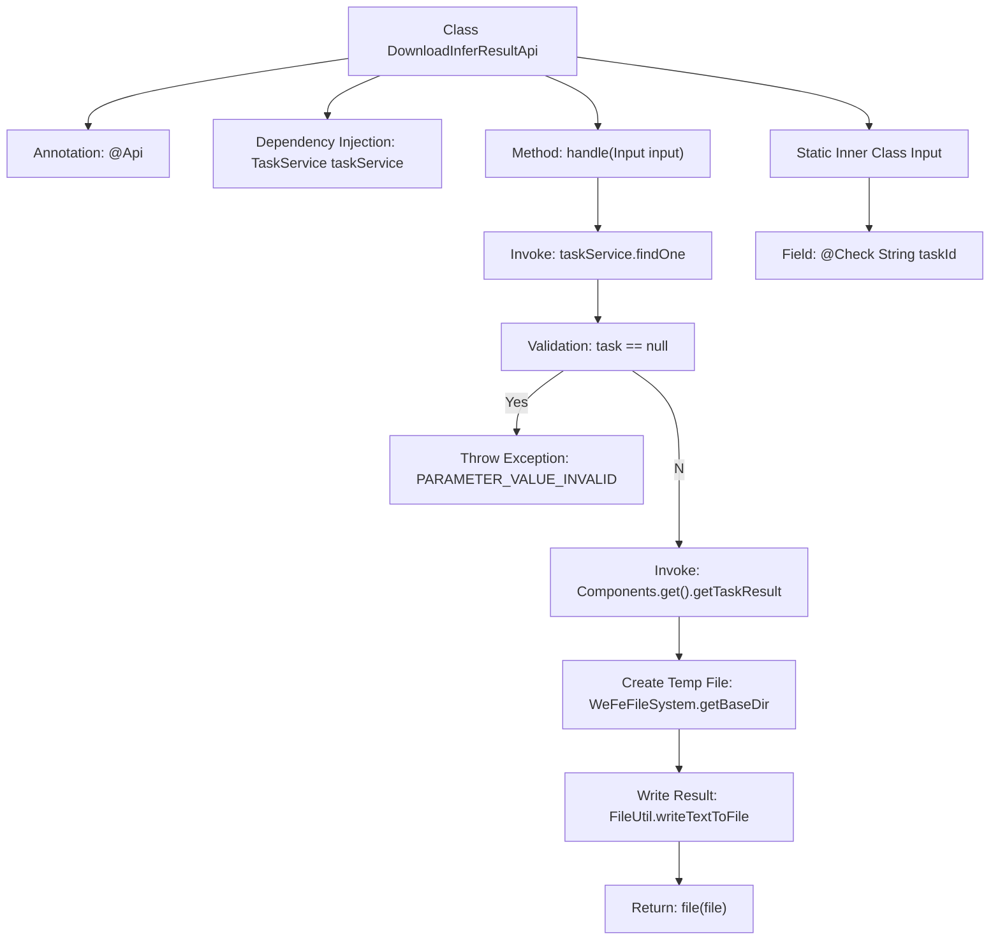

# Basic Information

|      |      |
|------|------|
| Name | DownloadInferResultApi |
| Language | .java |
| Code Path | WeFe/board/board-service/src/main/java/com/welab/wefe/board/service/api/model/deep_learning/DownloadInferResultApi.java |
| Package Name | com.welab.wefe.board.service.api.model.deep_learning |
| Dependencies | ['com.welab.wefe.board.service.base.file_system.WeFeFileSystem', 'com.welab.wefe.board.service.component.Components', 'com.welab.wefe.board.service.database.entity.job.TaskMySqlModel', 'com.welab.wefe.board.service.dto.entity.job.TaskResultOutputModel', 'com.welab.wefe.board.service.service.TaskService', 'com.welab.wefe.common.StatusCode', 'com.welab.wefe.common.fieldvalidate.annotation.Check', 'com.welab.wefe.common.util.FileUtil', 'com.welab.wefe.common.web.api.base.AbstractApi', 'com.welab.wefe.common.web.api.base.Api', 'com.welab.wefe.common.web.dto.AbstractApiInput', 'com.welab.wefe.common.web.dto.ApiResult', 'org.springframework.beans.factory.annotation.Autowired', 'org.springframework.http.ResponseEntity', 'java.io.File', 'java.util.UUID'] |
| Brief Description | This API is used to download the inference results of a deep learning model. It accepts a task ID parameter, verifies the existence of the task, retrieves the results, and returns them as a JSON file. |

# Description

The code defines an API class named `DownloadInferResultApi`, which is used to download model inference results. The API path is `model/deep_learning/infer/result/download`. The class inherits from `AbstractApi`, with the input type being the inner class `Input` and the output being `ResponseEntity`. The core logic involves querying the task by `taskId`, retrieving the inference result, and writing it to a temporary file for return. The input parameter `taskId` is mandatory. During processing, it validates the existence of the task and fetches the corresponding result component based on the task type. Finally, it writes the JSON-formatted result to a randomly named temporary file for download.

# Class Summary

| Name   | Type  | Description |
|-------|------|-------------|
| DownloadInferResultApi | class | This is an API class designed for downloading model inference results, which retrieves task outcomes by task ID and saves them as a JSON file for return. |

## Class DownloadInferResultApi

|      |      |
|------|------|
| Access Modifier | @Api(path = "model/deep_learning/infer/result/download", name = "下载模型推理结果");public |
| Type | class |
| Name | DownloadInferResultApi |
| Description | This is an API class designed for downloading model inference results, which retrieves task outcomes by task ID and saves them as a JSON file for return. |

### UML Class Diagram

This code defines a DownloadInferResultApi interface for downloading model inference results, which inherits from the generic abstract class AbstractApi. Its core functionality involves querying task information via taskId, retrieving inference results, and writing them to temporary files for return. The class diagram illustrates key class relationships, including dependencies with TaskService, inheritance of the Input parameter class, and usage of utility classes like WeFeFileSystem and FileUtil. The design adopts a layered architecture with abstract classes and interfaces to ensure extensibility.

### Internal Method Call Graph

This flowchart illustrates the core processing logic of the DownloadInferResultApi class: querying a task by taskId, validating its existence, retrieving the inference result, writing the result to a temporary JSON file, and returning it. It includes exception handling paths and the structure of the inner class Input, clearly presenting the end-to-end flow from request processing to file generation, involving key steps such as service invocation, component retrieval, and file operations.

### Field List

| Name  | Type  | Description |
|-------|-------|------|
| taskService | TaskService | Using @Autowired to automatically inject a TaskService instance. |

### Method List

| Name  | Type  | Description |
|-------|-------|------|
| handle | ApiResult<ResponseEntity<?>> | Processing task results: Check task existence, retrieve task results, and save them as a JSON file. |

