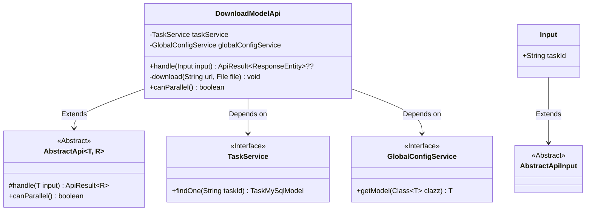

# Basic Information

|      |      |
|------|------|
| Name | DownloadModelApi |
| Language | .java |
| Code Path | WeFe/board/board-service/src/main/java/com/welab/wefe/board/service/api/model/deep_learning/DownloadModelApi.java |
| Package Name | com.welab.wefe.board.service.api.model.deep_learning |
| Dependencies | ['com.welab.wefe.board.service.base.file_system.WeFeFileSystem', 'com.welab.wefe.board.service.database.entity.job.TaskMySqlModel', 'com.welab.wefe.board.service.service.TaskService', 'com.welab.wefe.board.service.service.globalconfig.GlobalConfigService', 'com.welab.wefe.common.InformationSize', 'com.welab.wefe.common.StatusCode', 'com.welab.wefe.common.TimeSpan', 'com.welab.wefe.common.exception.StatusCodeWithException', 'com.welab.wefe.common.fieldvalidate.annotation.Check', 'com.welab.wefe.common.util.StringUtil', 'com.welab.wefe.common.web.api.base.AbstractApi', 'com.welab.wefe.common.web.api.base.Api', 'com.welab.wefe.common.web.dto.AbstractApiInput', 'com.welab.wefe.common.web.dto.ApiResult', 'com.welab.wefe.common.wefe.dto.global_config.DeepLearningConfigModel', 'org.apache.http.client.config.RequestConfig', 'org.apache.http.client.methods.CloseableHttpResponse', 'org.apache.http.client.methods.HttpGet', 'org.apache.http.impl.client.CloseableHttpClient', 'org.apache.http.impl.client.HttpClients', 'org.springframework.beans.factory.annotation.Autowired', 'org.springframework.http.ResponseEntity', 'java.io.File', 'java.io.FileOutputStream', 'java.io.IOException', 'java.io.InputStream'] |
| Brief Description | This API is used to download deep learning models, retrieving and downloading model files via task ID. It checks global configurations and VisualFL service addresses, handles exceptions and timeouts during the download process, and records download progress and time consumption. |

# Description

The code defines an API class named `DownloadModelApi` for downloading deep learning models, which inherits from `AbstractApi`. Its primary functionalities include: querying task information via `taskId`, checking the VisualFL service address in the global configuration, constructing a download URL, and invoking the download method to save the model file locally. During the download process, timeout parameters and buffer size are configured, while download progress and time consumption are logged. If an exception occurs, it logs the error and raises an exception. The input parameter `taskId` is mandatory, and this API does not support parallel processing.

# Class Summary

| Name   | Type  | Description |
|-------|------|-------------|
| DownloadModelApi | class | This API is used to download deep learning models, retrieving model files by task ID, checking configurations before downloading from a specified URL and saving them locally, handling timeouts and exceptions, and returning the download results. |

## Class DownloadModelApi

|      |      |
|------|------|
| Access Modifier | @Api(path = "model/deep_learning/download", name = "下载模型");public |
| Type | class |
| Name | DownloadModelApi |
| Description | This API is used to download deep learning models, retrieving model files by task ID, checking configurations before downloading from a specified URL and saving them locally, handling timeouts and exceptions, and returning the download results. |

### UML Class Diagram

This code demonstrates the implementation of a deep learning model download API. DownloadModelApi inherits from AbstractApi, utilizes TaskService and GlobalConfigService to retrieve task information and configurations, and implements the functionality to download model files from remote servers. The class diagram clearly illustrates inheritance and dependency relationships between classes, including abstract base classes, interface implementations, and input parameter structures. The core download logic is encapsulated in private methods, handling details such as timeout settings, progress tracking, and exception handling.

### Internal Method Call Graph

```mermaid
graph TD
    A["DownloadModelApi Class"]
    B["Dependency Injection: TaskService taskService"]
    C["Dependency Injection: GlobalConfigService globalConfigService"]
    D["Main Processing Method: handle(Input input)"]
    E["Download Method: download(String url, File file)"]
    F["Inner Class: Input extends AbstractApiInput"]
    G["Parallel Control: canParallel()"]

    A --> B
    A --> C
    A --> D
    A --> E
    A --> F
    A --> G

    D --> D1["Query Task: taskService.findOne(input.taskId)"]
    D --> D2["Get Configuration: globalConfigService.getModel(DeepLearningConfigModel.class)"]
    D --> D3["Validate Configuration"]
    D --> D4["Construct Download URL"]
    D --> D5["Get Local File Path: WeFeFileSystem.CallDeepLearningModel.getModelFile"]
    D --> D6["Invoke Download Method"]
    D --> D7["Process Download Result"]

    E --> E1["Configure HTTP Request Parameters"]
    E --> E2["Create HTTP Client"]
    E --> E3["Execute GET Request"]
    E --> E4["Validate Response Status Code"]
    E --> E5["Process Response Stream"]
    E --> E6["Write to Local File"]
    E --> E7["Record Download Progress"]
    E --> E8["Clean Up Resources"]
```

This code implements a deep learning model download API. The main workflow includes: querying task information by task ID, obtaining and validating global configurations, constructing download URLs, invoking HTTP client for download operations, saving model files locally, and handling various exceptions. The flowchart clearly illustrates the complete call chain from API entry to file download completion, including key steps such as service dependency injection, input parameter validation, HTTP request configuration, streaming file writing, as well as auxiliary functions like error handling and logging.

### Field List

| Name  | Type  | Description |
|-------|-------|------|
| taskService | TaskService | Using @Autowired to automatically inject a TaskService instance. |
| globalConfigService | GlobalConfigService | Using @Autowired to automatically inject an instance of GlobalConfigService. |

### Method List

| Name  | Type  | Description |
|-------|-------|------|
| download | void | The method `download` retrieves a file via HTTP and saves it locally, with a 10-second timeout. It checks for a status code of 200, uses a 10KB buffer to write the file, logs the download progress, and closes the resources upon completion. |
| handle | ApiResult<ResponseEntity<?>> | Process input and download model: Check configuration, concatenate URL, download model file, record time consumption, handle exceptions, and return the file. |
| canParallel | boolean | The method canParallel returns false, indicating that parallel processing is not supported. |

