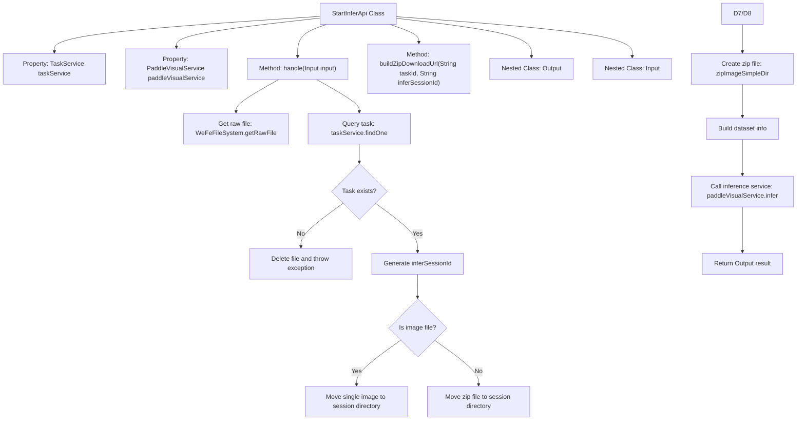
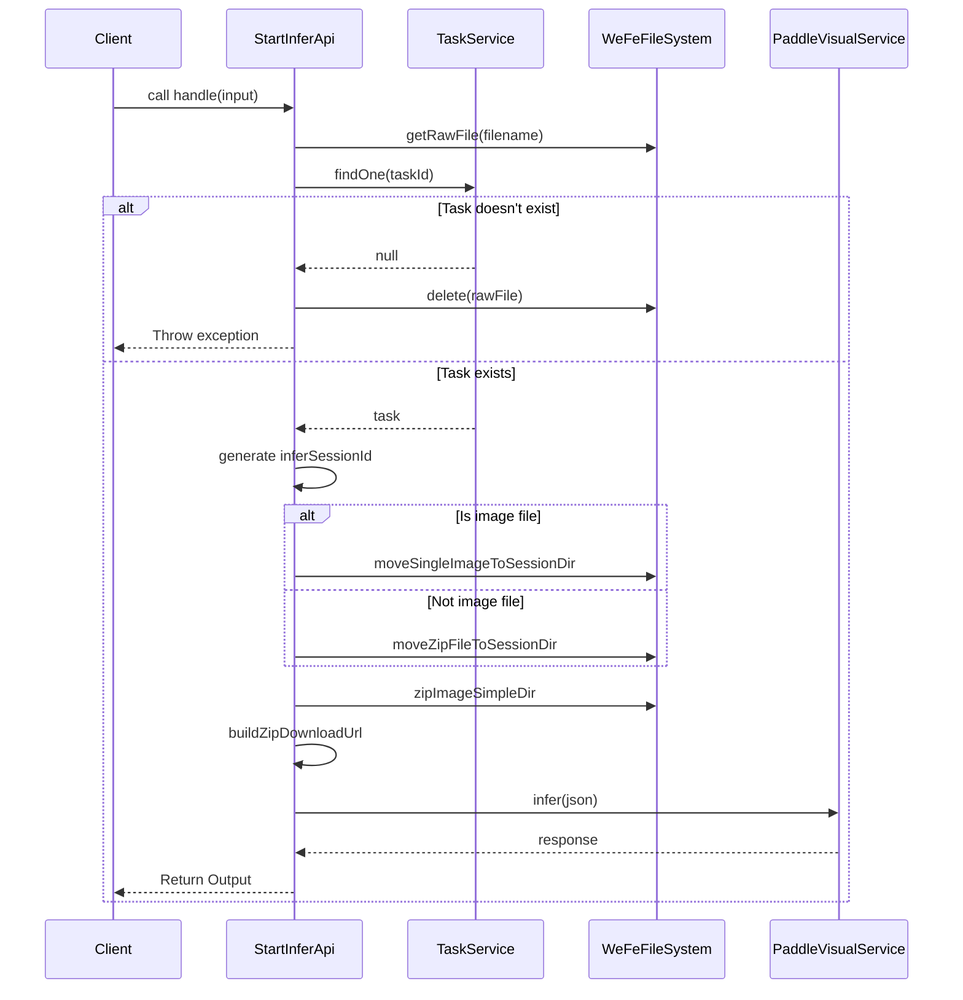

# Basic Information

|      |      |
|------|------|
| Name | StartInferApi |
| Language | .java |
| Code Path | WeFe/board/board-service/src/main/java/com/welab/wefe/board/service/api/model/deep_learning/StartInferApi.java |
| Package Name | com.welab.wefe.board.service.api.model.deep_learning |
| Dependencies | ['com.alibaba.fastjson.JSON', 'com.alibaba.fastjson.JSONObject', 'com.welab.wefe.board.service.base.file_system.WeFeFileSystem', 'com.welab.wefe.board.service.database.entity.job.TaskMySqlModel', 'com.welab.wefe.board.service.sdk.PaddleVisualService', 'com.welab.wefe.board.service.service.TaskService', 'com.welab.wefe.board.service.service.globalconfig.GlobalConfigService', 'com.welab.wefe.common.StatusCode', 'com.welab.wefe.common.fieldvalidate.annotation.Check', 'com.welab.wefe.common.util.FileUtil', 'com.welab.wefe.common.util.JObject', 'com.welab.wefe.common.web.Launcher', 'com.welab.wefe.common.web.api.base.AbstractApi', 'com.welab.wefe.common.web.api.base.Api', 'com.welab.wefe.common.web.dto.AbstractApiInput', 'com.welab.wefe.common.web.dto.ApiResult', 'com.welab.wefe.common.wefe.dto.global_config.BoardConfigModel', 'org.springframework.beans.factory.annotation.Autowired', 'java.io.File', 'java.util.UUID'] |
| Brief Description | This API is used to initiate deep learning model inference, process input files, and generate inference results. After validating the task ID, it moves the files to the session directory, calls the VisualFL service for inference, and returns the session ID and response data. |

# Description

The code defines an API class named `StartInferApi`, designed to initiate deep learning model inference. The API endpoint is `model/deep_learning/infer/start`. It accepts input parameters including `taskId` and `filename`, validates the existence of the task, and generates a unique inference session ID. Depending on the file type (single image or compressed archive), it moves the file to a specified directory and creates a compressed archive. Subsequently, it invokes the VisualFL service for inference and returns output containing the session ID and inference results. The code also includes a helper method to construct a download URL for the compressed archive. The entire process handles file operations, parameter validation, and concurrency control.

# Class Summary

| Name   | Type  | Description |
|-------|------|-------------|
| StartInferApi | class | The `StartInferApi` class is designed to invoke deep learning models, process input files (images or compressed packages), generate unique inference session IDs, call the VisualFL service for inference, and return results. It includes functionalities for input validation, file processing, and result encapsulation. |


## Class StartInferApi

|      |      |
|------|------|
| Access Modifier | @Api(path = "model/deep_learning/infer/start", name = "调用深度学习模型");public |
| Type | class |
| Name | StartInferApi |
| Description | The `StartInferApi` class is designed to invoke deep learning models, process input files (images or compressed packages), generate unique inference session IDs, call the VisualFL service for inference, and return results. It includes functionalities for input validation, file processing, and result encapsulation. |


### UML Class Diagram

```mermaid
classDiagram
    class StartInferApi {
        -TaskService taskService
        -PaddleVisualService paddleVisualService
        +handle(StartInferApi~Input~ input) ApiResult~Output~
        -buildZipDownloadUrl(String taskId, String inferSessionId) String
    }

    class AbstractApi~T, R~ {
        <<Abstract>>
        +handle(T input) ApiResult~R~
    }

    class TaskService {
        <<Interface>>
        +findOne(String taskId) TaskMySqlModel
    }

    class PaddleVisualService {
        <<Interface>>
        +infer(JSONObject json) JObject
    }

    class StartInferApi$Input {
        +String taskId
        +String filename
    }

    class StartInferApi$Output {
        +String inferSessionId
        +JObject response
    }

    class AbstractApiInput {
        <<Abstract>>
    }

    StartInferApi --|> AbstractApi : Extends
    StartInferApi --> TaskService : Depends on
    StartInferApi --> PaddleVisualService : Depends on
    StartInferApi$Input --|> AbstractApiInput : Extends
```

This code implements a deep learning model invocation API, with main functionalities including: validating task validity, processing input files (images or compressed packages), generating inference session IDs, and invoking PaddleVisualService for inference. The class diagram shows that StartInferApi inherits from the generic abstract class AbstractApi, depends on the TaskService and PaddleVisualService interfaces, and uses nested classes Input and Output to handle input/output data. Input inherits from AbstractApiInput and contains two mandatory fields: task ID and filename.


### Internal Method Call Graph





This code implements a deep learning model invocation API with core functionalities including: validating task validity, processing input files (images or zip packages), generating unique session IDs, calling inference services and returning results. The flowchart illustrates the class structure and main method invocation relationships, while the sequence diagram details the complete API call process, including both exception handling paths and normal execution paths. The code ensures reliability of inference tasks through strict parameter checks and file operations, while using UUID to address concurrency issues.

### Field List

| Name  | Type  | Description |
|-------|-------|------|
| taskService | TaskService | Using @Autowired to automatically inject an instance of TaskService. |
| paddleVisualService | PaddleVisualService | Automatically inject the PaddleVisualService instance. |

### Method List

| Name  | Type  | Description |
|-------|-------|------|
| handle | ApiResult<Output> | Handling deep learning model inference requests: Verify task validity, generate a unique session ID, move files to the session directory, package and invoke the inference service to return results. |
| buildZipDownloadUrl | String | This method constructs the dataset compressed package download URL by concatenating the internal network base path and API path with the task ID and session ID to generate the complete download link. |


