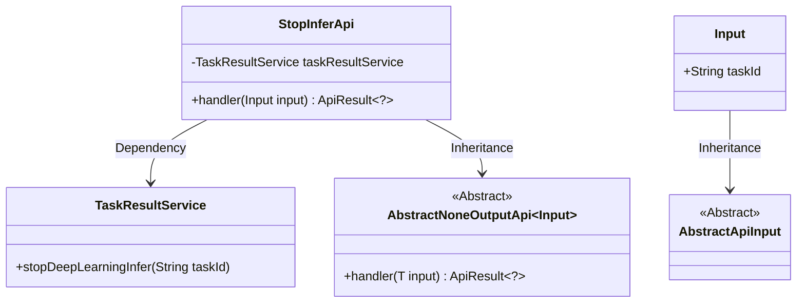
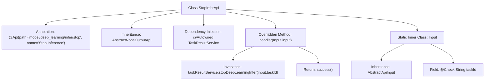

# Basic Information

|      |      |
|------|------|
| Name | StopInferApi |
| Language | .java |
| Code Path | WeFe/board/board-service/src/main/java/com/welab/wefe/board/service/api/model/deep_learning/StopInferApi.java |
| Package Name | com.welab.wefe.board.service.api.model.deep_learning |
| Dependencies | ['com.welab.wefe.board.service.service.TaskResultService', 'com.welab.wefe.common.exception.StatusCodeWithException', 'com.welab.wefe.common.fieldvalidate.annotation.Check', 'com.welab.wefe.common.web.api.base.AbstractNoneOutputApi', 'com.welab.wefe.common.web.api.base.Api', 'com.welab.wefe.common.web.dto.AbstractApiInput', 'com.welab.wefe.common.web.dto.ApiResult', 'org.springframework.beans.factory.annotation.Autowired'] |
| Brief Description | This is an API designed to abort deep learning inference tasks, with the path "model/deep_learning/infer/stop". It accepts a task ID as input and invokes the TaskResultService to terminate the specified task. |

# Description

This is an API class for aborting deep learning inference tasks, with the path "model/deep_learning/infer/stop" and the name "Abort Inference". The class inherits from AbstractNoneOutputApi, using generics to specify the input type as the inner class Input. It calls the stopDeepLearningInfer method through the auto-injected TaskResultService to stop the specified inference task based on the provided taskId. The input class Input inherits AbstractApiInput and contains a required field taskId. An empty result is returned upon successful processing.

# Class Summary

| Name   | Type  | Description |
|-------|------|-------------|
| StopInferApi | class | This is an API class designed to abort deep learning inference tasks, which stops a specified task by its taskId and implements the functionality by calling the TaskResultService. The input must include the mandatory taskId field. |

## Class StopInferApi

|      |      |
|------|------|
| Access Modifier | @Api(path = "model/deep_learning/infer/stop", name = "中止推理");public |
| Type | class |
| Name | StopInferApi |
| Description | This is an API class designed to abort deep learning inference tasks, which stops a specified task by its taskId and implements the functionality by calling the TaskResultService. The input must include the mandatory taskId field. |

### UML Class Diagram

This code describes a StopInferApi class designed to terminate deep learning inference tasks. It inherits from the generic abstract class AbstractNoneOutputApi and relies on TaskResultService to perform the actual termination operation. The Input class, as an internal static class, inherits from AbstractApiInput and contains the required taskId field. The class diagram clearly illustrates the inheritance and dependency relationships: StopInferApi processes input parameters and returns results via the handler method, while the concrete termination operation is delegated to TaskResultService.

### Internal Method Call Graph

This flowchart illustrates the complete structure of the StopInferApi class, including class annotations, inheritance relationships, the dependency-injected TaskResultService, and the core handler method logic. The handler method stops a specified task by invoking taskResultService's stopDeepLearningInfer method and finally returns a success result. The static inner class Input inherits from AbstractApiInput and contains a taskId field with a validation annotation for receiving API request parameters. The entire design implements the API functionality for stopping deep learning inference tasks.

### Field List

| Name  | Type  | Description |
|-------|-------|------|
| taskResultService | TaskResultService | Use @Autowired to automatically inject an instance of TaskResultService. |

### Method List

| Name  | Type  | Description |
|-------|-------|------|
| handler | ApiResult<?> | Rewrite the handler method to invoke the taskResultService for stopping the deep learning inference task and return a successful result. |

