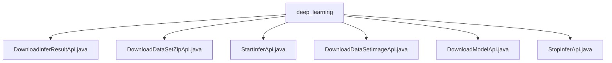

# Basic Information

|      |      |
|------|------|
| Name | deep_learning |
| Language | .java |
| Code Path | WeFe/board/board-service/src/main/java/com/welab/wefe/board/service/api/model/deep_learning |
| Package Name | docs.board.board-service.src.main.java.com.welab.wefe.board.service.api.model.deep_learning |
| Brief Description | Defined 6 deep learning APIs: download inference results, batch inference zip, start inference, download inference images, download model, and abort inference. All require the taskId parameter to handle file operations and task validation. |

# Description

## Overview  
This module provides comprehensive lifecycle management for deep learning model inference, including functions such as starting/stopping inference, result downloading, and model retrieval. Core interfaces adhere to the RESTful specification, all inheriting from the AbstractApi base class and using ResponseEntity for unified responses. Key data structures include identifier fields like TaskId and InferSessionId, with mandatory parameters encapsulated via the Input inner class. External dependencies include the VisualFL service, WeFeFileSystem, and TaskResultService. For example, DownloadModelApi downloads model files via VisualFL, while StartInferApi generates compressed packages and invokes the inference service.  

## Core Business Scenarios  
The module supports end-to-end inference workflows: Users submit tasks (single images or compressed packages) via StartInferApi, and the system generates session IDs to trigger inference; DownloadInferResultApi retrieves JSON results, while DownloadDataSetZipApi/DownloadDataSetImageApi downloads batch or single result files, respectively. Operating similarly to a task queue, StopInferApi can abort running tasks. A typical application is medical image analysis: After uploading a CT scan package, users asynchronously obtain lesion detection results. API types cover CRUD operations, with integration cases including model version management and inference resource recycling.

### Package Internal Structure View

This flowchart illustrates the hierarchical structure of deep learning model service APIs. The root node is the `deep_learning` folder, which contains six Java interface files: `DownloadInferResultApi`, `DownloadDataSetZipApi`, `StartInferApi`, etc. These files are directly under the `deep_learning` directory without any intermediate subdirectory levels, forming a clear peer-to-peer relationship structure.

# File List

| Name   | Type  | Description |
|-------|------|-------------|
| [DownloadInferResultApi.java](DownloadInferResultApi.md) | file | This API is used to download the inference results of a deep learning model. It accepts a task ID parameter, verifies the existence of the task, retrieves the results, and returns them as a JSON file. |
| [DownloadDataSetZipApi.java](DownloadDataSetZipApi.md) | file | This is an API interface for downloading zip files required for batch inference, with the path model/deep_learning/call/download/zip, which requires signature-based access. The input parameters are taskId and inferSessionId, and it returns a zip file. |
| [StartInferApi.java](StartInferApi.md) | file | This API is used to initiate deep learning model inference, process input files, and generate inference results. After validating the task ID, it moves the files to the session directory, invokes the VisualFL service for inference, and returns the session ID and response data. |
| [DownloadDataSetImageApi.java](DownloadDataSetImageApi.md) | file | Download Inference Image API, which receives a task ID, session ID, and file name, checks for the file's existence, and returns the file if present. |
| [DownloadModelApi.java](DownloadModelApi.md) | file | This API is used to download deep learning models, retrieving and downloading model files via task ID, checking global configurations and VisualFL service addresses, handling exceptions and timeouts during the download process, and recording download progress and time consumption. |
| [StopInferApi.java](StopInferApi.md) | file | This is an API designed to abort deep learning inference tasks, with the path "model/deep_learning/infer/stop". It accepts a task ID as input and invokes the TaskResultService to terminate the specified task. |

