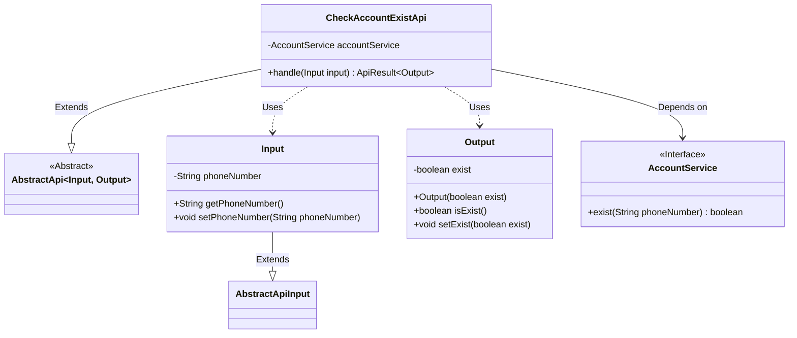
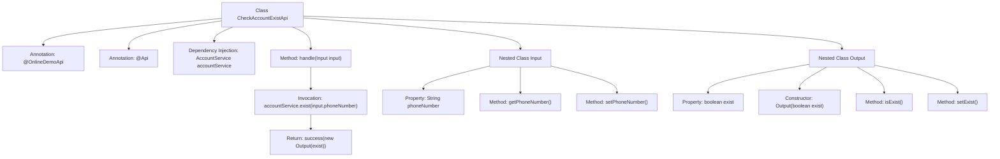

# Basic Information

|      |      |
|------|------|
| Name | CheckAccountExistApi |
| Language | .java |
| Code Path | WeFe/board/board-service/src/main/java/com/welab/wefe/board/service/api/online_demo/CheckAccountExistApi.java |
| Package Name | com.welab.wefe.board.service.api.online_demo |
| Dependencies | ['com.welab.wefe.board.service.base.OnlineDemoApi', 'com.welab.wefe.board.service.service.account.AccountService', 'com.welab.wefe.common.exception.StatusCodeWithException', 'com.welab.wefe.common.fieldvalidate.annotation.Check', 'com.welab.wefe.common.web.api.base.AbstractApi', 'com.welab.wefe.common.web.api.base.Api', 'com.welab.wefe.common.web.dto.AbstractApiInput', 'com.welab.wefe.common.web.dto.ApiResult', 'org.springframework.beans.factory.annotation.Autowired'] |
| Brief Description | API to check account existence, with the path as account/online_demo/exist, no login required. Input a phone number, and it returns whether the account exists. |

# Description

The code defines an API class named `CheckAccountExistApi`, which is used to check whether an account exists. The API path is `account/online_demo/exist` and can be accessed without login. The input parameter `Input` includes a validated phone number field `phoneNumber`, while the output parameter `Output` contains a boolean value `exist` indicating whether the account exists. The processing logic verifies if the phone number is already registered via the `exist` method of `AccountService` and returns the validation result. The entire API inherits from `AbstractApi`, adopting a standard input-output structure and exception handling mechanism.

# Class Summary

| Name   | Type  | Description |
|-------|------|-------------|
| CheckAccountExistApi | class | API to check if an account exists, with the path `account/online_demo/exist`. No login is required. It queries whether an account exists via a mobile number and returns a boolean result. |

## Class CheckAccountExistApi

|      |      |
|------|------|
| Access Modifier | @OnlineDemoApi;@Api(path = "account/online_demo/exist", name = "check if account already exists", login = false);public |
| Type | class |
| Name | CheckAccountExistApi |
| Description | API to check if an account exists, with the path `account/online_demo/exist`. No login is required. It queries whether an account exists via a mobile number and returns a boolean result. |

### UML Class Diagram

This class diagram illustrates the structure of an API implementation for checking account existence. The core class CheckAccountExistApi inherits from the generic abstract class AbstractApi, processes Input parameters, and returns Output results. The Input class contains a phone number field with its accessors, inheriting from AbstractApiInput; the Output class encapsulates a boolean existence status. CheckAccountExistApi implements business logic through the dependency-injected AccountService interface, which declares the exist() method. The overall design adheres to a layered architecture, with Input/Output serving as data transfer objects and the service layer decoupled via interfaces.

### Internal Method Call Graph

This code defines an API class named CheckAccountExistApi for checking account existence. The class inherits from AbstractApi and contains two nested classes: Input and Output. The main workflow verifies phone number existence via the accountService.exist method and returns the result. The flowchart illustrates the class structure, annotations, dependency injection, and method invocation relationships, clearly presenting the complete process from request handling to result return.

### Field List

| Name  | Type  | Description |
|-------|-------|------|
| accountService | AccountService | Using @Autowired to automatically inject an instance of AccountService. |

### Method List

| Name  | Type  | Description |
|-------|-------|------|
| handle | ApiResult<Output> | Rewrite the handle method to check if the phone number exists and return the result. |

