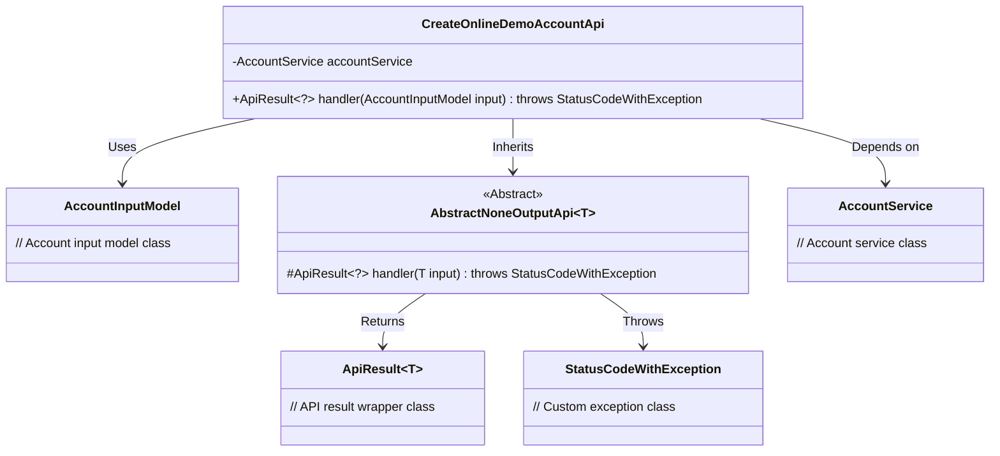
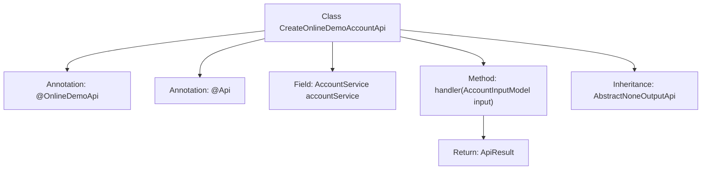

# Basic Information

|      |      |
|------|------|
| Name | CreateOnlineDemoAccountApi |
| Language | .java |
| Code Path | WeFe/board/board-service/src/main/java/com/welab/wefe/board/service/api/online_demo/CreateOnlineDemoAccountApi.java |
| Package Name | com.welab.wefe.board.service.api.online_demo |
| Dependencies | ['com.welab.wefe.board.service.base.OnlineDemoApi', 'com.welab.wefe.board.service.dto.vo.AccountInputModel', 'com.welab.wefe.board.service.service.account.AccountService', 'com.welab.wefe.common.exception.StatusCodeWithException', 'com.welab.wefe.common.web.api.base.AbstractNoneOutputApi', 'com.welab.wefe.common.web.api.base.Api', 'com.welab.wefe.common.web.dto.ApiResult', 'com.welab.wefe.common.wefe.enums.BoardUserSource', 'org.springframework.beans.factory.annotation.Autowired'] |
| Brief Description | This is an API class for creating a trial account, with the path "account/online_demo/create". No login is required. It calls the AccountService to process the input parameter AccountInputModel and returns a successful result. |

# Description

This is a Java class named CreateOnlineDemoAccountApi, designed as an online demo API for creating trial accounts. The class extends AbstractNoneOutputApi with the generic parameter set to AccountInputModel. It is annotated with @OnlineDemoApi and @Api to define the API path as "account/online_demo/create", named "open an experience account", and accessible without login. The class injects the AccountService and overrides the handler method to process the input parameter AccountInputModel, returning a successful ApiResult. The entire class is concisely designed, focusing solely on the functional implementation of creating trial accounts.

# Class Summary

| Name   | Type  | Description |
|-------|------|-------------|
| CreateOnlineDemoAccountApi | class | API for creating a trial account, no login required. It calls the AccountService to process the input parameter AccountInputModel and returns a successful result. |

## Class CreateOnlineDemoAccountApi

|      |      |
|------|------|
| Access Modifier | @OnlineDemoApi;@Api(path = "account/online_demo/create", name = "open an experience account", login = false);public |
| Type | class |
| Name | CreateOnlineDemoAccountApi |
| Description | API for creating a trial account, no login required. It calls the AccountService to process the input parameter AccountInputModel and returns a successful result. |

### UML Class Diagram

This class diagram illustrates the implementation structure of an API for creating demo accounts. CreateOnlineDemoAccountApi inherits from the generic abstract class AbstractNoneOutputApi, processes AccountInputModel type parameters, and relies on AccountService for business operations. It returns a unified response format via ApiResult and may throw StatusCodeWithException. The annotations indicate this is a login-free online demo interface designed in RESTful style. The overall architecture demonstrates clear hierarchical relationships and separation of responsibilities.

### Internal Method Call Graph

This code defines an API class for creating online demo accounts, which inherits from the AbstractNoneOutputApi base class. The class is annotated with @OnlineDemoApi and @Api, the latter specifying the API path as "account/online_demo/create" with no login required. It injects the AccountService and overrides the handler method to process AccountInputModel input parameters, returning an ApiResult. The complete flow illustrates the structure from class definition to method implementation, showcasing a typical Spring Boot API design pattern.

### Field List

| Name  | Type  | Description |
|-------|-------|------|
| accountService | AccountService | Use @Autowired to automatically inject an instance of AccountService. |

### Method List

| Name  | Type  | Description |
|-------|-------|------|
| handler | ApiResult<?> | Java method override, handling AccountInputModel input, returning ApiResult success result, may throw StatusCodeWithException. |

