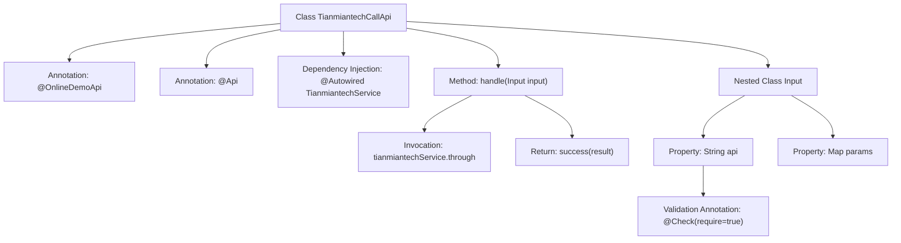

# Basic Information

|      |      |
|------|------|
| Name | TianmiantechCallApi |
| Language | .java |
| Code Path | WeFe/board/board-service/src/main/java/com/welab/wefe/board/service/api/online_demo/TianmiantechCallApi.java |
| Package Name | com.welab.wefe.board.service.api.online_demo |
| Dependencies | ['com.welab.wefe.board.service.base.OnlineDemoApi', 'com.welab.wefe.board.service.onlinedemo.TianmiantechService', 'com.welab.wefe.common.exception.StatusCodeWithException', 'com.welab.wefe.common.fieldvalidate.annotation.Check', 'com.welab.wefe.common.util.JObject', 'com.welab.wefe.common.web.api.base.AbstractApi', 'com.welab.wefe.common.web.api.base.Api', 'com.welab.wefe.common.web.dto.AbstractApiInput', 'com.welab.wefe.common.web.dto.ApiResult', 'org.springframework.beans.factory.annotation.Autowired', 'java.io.IOException', 'java.util.Map'] |
| Brief Description | TianmiantechCallApi is an online API class that invokes Tianmian Technology's service interface, accepts api and params parameters, and returns JSON results. |

# Description

This is an online API class named TianmiantechCallApi, designed for invoking Tianmian Tech service interfaces. It inherits from AbstractApi, accepts input parameters of type Input, and returns results of type JObject. The class is annotated with @OnlineDemoApi and @Api, specifying the API path and name. Internally, it processes requests through the auto-injected TianmiantechService, calls the through method, and returns the result. The Input inner class defines a required api string parameter and an optional params map parameter. The entire API encapsulates the generic processing logic for calling third-party services.

# Class Summary

| Name   | Type  | Description |
|-------|------|-------------|
| TianmiantechCallApi | class | Tianmian Tech API calling class, which invokes the tianmiantechService by inputting api and params parameters, and returns a JObject result. |


## Class TianmiantechCallApi

|      |      |
|------|------|
| Access Modifier | @OnlineDemoApi;@Api(path = "tianmiantech/call_api", name = "call tianmiantech service api");public |
| Type | class |
| Name | TianmiantechCallApi |
| Description | Tianmian Tech API calling class, which invokes the tianmiantechService by inputting api and params parameters, and returns a JObject result. |


### UML Class Diagram

```mermaid
classDiagram
    class TianmiantechCallApi {
        -TianmiantechService tianmiantechService
        +handle(Input input) ApiResult~JObject~
    }
    class AbstractApi~TianmiantechCallApi.Input, JObject~ {
        <<Abstract>>
        +handle(Input input) ApiResult~JObject~
    }
    class TianmiantechCallApi$Input {
        +String api
        +Map~String, Object~ params
    }
    class AbstractApiInput {
        <<Abstract>>
    }
    class JObject {
    }
    class ApiResult~R~ {
        <<Generic>>
    }
    class TianmiantechService {
        <<Interface>>
        +through(String api, Map~String, Object~ params) JObject
    }

    TianmiantechCallApi --> AbstractApi~TianmiantechCallApi.Input, JObject~ : Inheritance
    TianmiantechCallApi --> TianmiantechService : Dependency
    TianmiantechCallApi$Input --> AbstractApiInput : Inheritance
    TianmiantechCallApi ..> TianmiantechCallApi$Input : Contains
    AbstractApi~TianmiantechCallApi.Input, JObject~ ..> ApiResult~JObject~ : Uses
    TianmiantechService ..> JObject : Returns
```

This code demonstrates the class structure of an API for calling Tianmian Tech services. TianmiantechCallApi inherits from the generic abstract class AbstractApi, processes the Input class containing API paths and parameters, and invokes remote services through the TianmiantechService interface to return results in JObject format. The class diagram clearly illustrates inheritance relationships, dependency injection, and service invocation flow, reflecting a Spring-style API encapsulation pattern that includes a nested Input static class as a parameter carrier.


### Internal Method Call Graph



This code demonstrates a Spring framework-based API class TianmiantechCallApi for invoking third-party services. The class is marked with @OnlineDemoApi and @Api annotations, inherits AbstractApi, and implements the handle method to process requests. The method internally calls the through interface of TianmiantechService and returns the result. The nested Input class defines the parameter structure required by the API, including a mandatory api field and optional params map, with parameter validation implemented via the @Check annotation. The overall flow clearly illustrates the chain from request processing to service invocation.

### Field List

| Name  | Type  | Description |
|-------|-------|------|
| tianmiantechService | TianmiantechService | Automatically inject the TianmiantechService service instance. |

### Method List

| Name  | Type  | Description |
|-------|-------|------|
| handle | ApiResult<JObject> | Java method override, calling Tianmian Tech service to process input and return results, returns an encapsulated object upon success, may throw exceptions or IO errors. |


