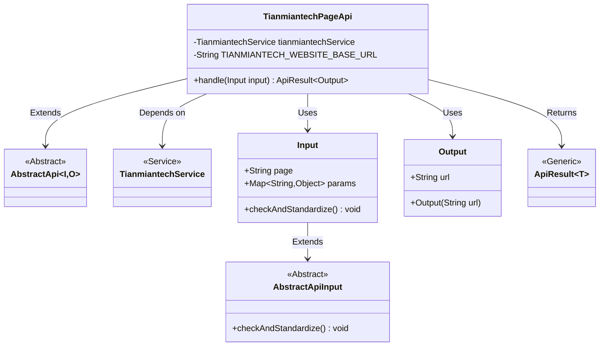
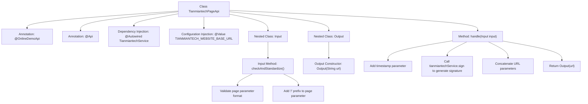

# Basic Information

|      |      |
|------|------|
| Name | TianmiantechPageApi |
| Language | .java |
| Code Path | WeFe/board/board-service/src/main/java/com/welab/wefe/board/service/api/online_demo/TianmiantechPageApi.java |
| Package Name | com.welab.wefe.board.service.api.online_demo |
| Dependencies | ['com.welab.wefe.board.service.base.OnlineDemoApi', 'com.welab.wefe.board.service.onlinedemo.TianmiantechService', 'com.welab.wefe.common.exception.StatusCodeWithException', 'com.welab.wefe.common.fieldvalidate.annotation.Check', 'com.welab.wefe.common.util.UrlUtil', 'com.welab.wefe.common.web.api.base.AbstractApi', 'com.welab.wefe.common.web.api.base.Api', 'com.welab.wefe.common.web.dto.AbstractApiInput', 'com.welab.wefe.common.web.dto.ApiResult', 'org.springframework.beans.factory.annotation.Autowired', 'org.springframework.beans.factory.annotation.Value', 'java.io.IOException', 'java.util.Map'] |
| Brief Description | Tianmian Technology Page API class, used to generate website URLs with signatures and timestamps. Input must include the page path and parameters, and the output is the complete URL. Automatically handles parameter validation and standardization. |

# Description

This is an API class named TianmiantechPageApi, designed to generate URLs for Tianmian Tech website pages. It inherits from AbstractApi, accepts Input parameters, and returns an Output result containing the URL. Key functionalities include: automatically adding timestamps and signatures to request parameters, concatenating the base URL with page paths, and performing validation and standardization on input parameters. The TianmiantechService is injected via @Autowired, while the configured base URL is retrieved using @Value. The input class Input includes a mandatory page field and a params map, while the output class Output contains the generated URL string.

# Class Summary

| Name   | Type  | Description |
|-------|------|-------------|
| TianmiantechPageApi | class | Tianmian Technology Page API class, used to generate website URLs with signatures and timestamps. The input includes the page path and parameters, and the output is the complete URL. It automatically validates and standardizes the input to ensure secure access. |

## Class TianmiantechPageApi

|      |      |
|------|------|
| Access Modifier | @OnlineDemoApi;@Api(path = "tianmiantech/page_url", name = "create tianmiantech website page url");public |
| Type | class |
| Name | TianmiantechPageApi |
| Description | Tianmian Technology Page API class, used to generate website URLs with signatures and timestamps. The input includes the page path and parameters, and the output is the complete URL. It automatically validates and standardizes the input to ensure secure access. |

### UML Class Diagram

This code demonstrates the class structure of an API for generating Tianmian Tech website page URLs. The TianmiantechPageApi inherits from the generic AbstractApi, processes Input parameters, and returns an Output result containing the URL. The Input class handles parameter validation and standardization, while the Output class encapsulates the generated URL. The overall structure utilizes TianmiantechService for signature calculation through dependency injection, reflecting clear responsibility division and layered design.

### Internal Method Call Graph

This code represents an API handler class primarily responsible for generating page URLs for Tianmian Tech's website. The flowchart illustrates the class structure, annotation usage, dependency injection relationships, and core processing logic. The handle method processes input parameters, adds timestamp and signature, then constructs the complete URL; the Input class handles parameter validation and standardization; the Output class encapsulates the final generated URL. The entire process demonstrates a complete workflow of parameter validation, secure signing, and URL construction.

### Field List

| Name  | Type  | Description |
|-------|-------|------|
| TIANMIANTECH_WEBSITE_BASE_URL | String | The code snippet defines a private String variable TIANMIANTECH_WEBSITE_BASE_URL, whose value is injected from the configuration item tianmiantech.website.base-url via the @Value annotation, with an empty string as the default value. |
| tianmiantechService | TianmiantechService | Using @Autowired to automatically inject an instance of TianmiantechService. |

### Method List

| Name  | Type  | Description |
|-------|-------|------|
| handle | ApiResult<Output> | Process input parameters, add timestamp and signature, generate a URL with parameters, and return the result. |

