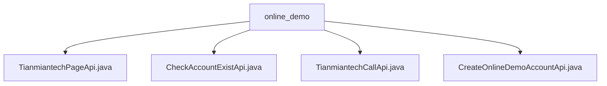

# Basic Information

|      |      |
|------|------|
| Name | online_demo |
| Language | .java |
| Code Path | WeFe/board/board-service/src/main/java/com/welab/wefe/board/service/api/online_demo |
| Package Name | docs.board.board-service.src.main.java.com.welab.wefe.board.service.api.online_demo |
| Brief Description | TianmiantechPageApi generates Tianmian Tech website URLs with checksum and signature. CheckAccountExistApi verifies account existence by returning a boolean value for input phone numbers. TianmiantechCallApi invokes Tianmian Tech service interfaces and returns JObject results. CreateOnlineDemoAccountApi creates trial accounts without requiring login. |

# Description

## Overview  
The core responsibility of this module is to provide online demo functionality for the Tianmian Tech website, including URL generation, account verification, and third-party service invocation. The interface specification adheres to a standard input-output structure, with APIs marked by the @OnlineDemoApi annotation indicating no login requirement. Key data structures include Input (with page/params fields) and Output (containing URL/exist boolean). External dependencies include TianmiantechService and AccountService. For example, TianmiantechPageApi automatically adds a signature to generate URLs, while CheckAccountExistApi verifies account existence via mobile numbers.  

## Primary Business Scenarios  
The module supports four typical interactions: page URL construction (similar to gateway routing), account status checks, third-party service passthrough (proxy-like pattern), and trial account creation. Business processes cover parameter validation (e.g., mobile number format), service invocation (e.g., AccountService.exist), and result encapsulation. For instance, TianmiantechCallApi forwards inputs to the Tianmian Tech service, and CreateOnlineDemoAccountApi implements account creation with no return value. All APIs inherit from AbstractApi, ensuring unified exception handling and logging.

### Package Internal Structure View

This flowchart illustrates the structure of 4 API files under the online_demo directory. The top-level node is the online_demo folder, which directly contains 4 Java interface files handling Tianmian Tech page, account existence check, Tianmian Tech calls, and online demo account creation functionalities respectively. All files reside at the same level without deeper nesting relationships.

# File List

| Name   | Type  | Description |
|-------|------|-------------|
| [TianmiantechPageApi.java](TianmiantechPageApi.md) | file | Tianmian Technology Page API class, used to generate website URLs with signatures and timestamps. The input must include the page path and parameters, and the output is the complete URL. Automatically handles parameter validation and standardization. |
| [CheckAccountExistApi.java](CheckAccountExistApi.md) | file | API to check account existence, path is account/online_demo/exist, no login required. Input phone number, returns whether the account exists. |
| [TianmiantechCallApi.java](TianmiantechCallApi.md) | file | TianmiantechCallApi is an online API class that invokes the Tianmian Technology service interface, accepts api and params parameters, and returns JSON results. |
| [CreateOnlineDemoAccountApi.java](CreateOnlineDemoAccountApi.md) | file | This is an API class for creating trial accounts, with the path "account/online_demo/create". It does not require login and invokes AccountService to process the input parameter AccountInputModel, returning a success result. |

