# Basic Information

|      |      |
|------|------|
| Name | LogQueryApi |
| Language | .java |
| Code Path | WeFe/board/board-service/src/main/java/com/welab/wefe/board/service/api/operation/LogQueryApi.java |
| Package Name | com.welab.wefe.board.service.api.operation |
| Dependencies | ['com.welab.wefe.board.service.dto.base.PagingInput', 'com.welab.wefe.board.service.dto.base.PagingOutput', 'com.welab.wefe.board.service.dto.entity.OperationLogOutputModel', 'com.welab.wefe.board.service.service.OperationLogService', 'com.welab.wefe.common.exception.StatusCodeWithException', 'com.welab.wefe.common.fieldvalidate.annotation.Check', 'com.welab.wefe.common.web.api.base.AbstractApi', 'com.welab.wefe.common.web.api.base.Api', 'com.welab.wefe.common.web.dto.ApiResult', 'org.springframework.beans.factory.annotation.Autowired'] |
| Brief Description | The LogQueryApi provides paginated query functionality for operation logs. The input includes the interface name, operator ID, and time range, while the output returns paginated results of operation logs. |

# Description

LogQueryApi is an API class designed for querying operation logs, inheriting from AbstractApi. It processes input of type Input and outputs paginated OperationLogOutputModel. The API path is "log/query", and its name is "query log". Requests are handled via the query method of OperationLogService, which returns paginated results.  

The Input class extends PagingInput and includes query conditions such as log interface name, operator ID, start time, and end time. The start and end times are accessed through getter and setter methods. All fields are validated using the Check annotation.

# Class Summary

| Name   | Type  | Description |
|-------|------|-------------|
| LogQueryApi | class | LogQueryApi is an API class for querying logs, which inherits from AbstractApi and uses OperationLogService to handle paginated query requests. The input parameters include the interface name, operator ID, start and end time, and it returns paginated operation log results. |


## Class LogQueryApi

|      |      |
|------|------|
| Access Modifier | @Api(path = "log/query", name = "query log");public |
| Type | class |
| Name | LogQueryApi |
| Description | LogQueryApi is an API class for querying logs, which inherits from AbstractApi and uses OperationLogService to handle paginated query requests. The input parameters include the interface name, operator ID, start and end time, and it returns paginated operation log results. |


### UML Class Diagram

```mermaid
classDiagram
    class LogQueryApi {
        -OperationLogService service
        +handle(Input input) ApiResult~PagingOutput~OperationLogOutputModel~~
    }
    LogQueryApi --> OperationLogService : Dependency
    LogQueryApi --> Input : Contains

    class Input {
        +String logInterface
        +String operatorId
        -Long startTime
        -Long endTime
        +Long getStartTime()
        +void setStartTime(Long startTime)
        +Long getEndTime()
        +void setEndTime(Long endTime)
    }
    Input --|> PagingInput : Inheritance

    class OperationLogService {
        <<Interface>>
        +query(Input input) PagingOutput~OperationLogOutputModel~
    }

    class AbstractApi~T, R~ {
        <<Abstract>>
        +handle(T input) ApiResult~R~
    }
    LogQueryApi --|> AbstractApi~Input, PagingOutput~OperationLogOutputModel~~ : Inheritance

    class PagingInput {
        <<Abstract>>
    }

    class PagingOutput~T~ {
    }

    class OperationLogOutputModel {
    }

    class ApiResult~T~ {
    }
```

This code demonstrates the implementation structure of a log query API. LogQueryApi inherits from the generic abstract class AbstractApi, processes Input parameters, and returns paginated OperationLogOutputModel results. The Input class inherits from PagingInput and contains log query condition fields. OperationLogService serves as an interface providing query functionality. The overall architecture reflects a layered design, achieving type-safe API processing flow through generics.


### Internal Method Call Graph

```mermaid
graph TD
    A["Class LogQueryApi"]
    B["Annotation: @Api(path='log/query', name='query log')"]
    C["Inheritance: AbstractApi<Input, PagingOutput<OperationLogOutputModel>>"]
    D["Dependency Injection: @Autowired OperationLogService service"]
    E["Overridden Method: handle(Input input)"]
    F["Inner Class: Input"]
    G["Parent Class: PagingInput"]
    H["Field: @Check String logInterface"]
    I["Field: @Check String operatorId"]
    J["Field: Long startTime/endTime"]
    K["Method: get/setStartTime()"]
    L["Method: get/setEndTime()"]
    M["Invocation: service.query(input)"]
    N["Return: success(result)"]

    A --> B
    A --> C
    A --> D
    A --> E
    E --> M
    M --> N
    A -.-> F
    F --> G
    F --> H
    F --> I
    F --> J
    J --> K
    J --> L
```



This code represents a log query API implementation class that inherits from the abstract base class AbstractApi, processing paginated query requests through OperationLogService. The inner class Input defines query parameters including fields like interface name, operator ID, and time range, while inheriting from the pagination parameter base class. The main flow involves invoking the service layer query via the handle method and returning encapsulated results. Annotations specify the API path and name, with field validation implemented through @Check.

### Field List

| Name  | Type  | Description |
|-------|-------|------|
| service | OperationLogService | Use @Autowired to automatically inject an instance of the OperationLogService. |

### Method List

| Name  | Type  | Description |
|-------|-------|------|
| handle | ApiResult<PagingOutput<OperationLogOutputModel>> | This is a Java method override that calls service.query to process the input and returns paginated operation log results, wrapped as ApiResult upon success. |


