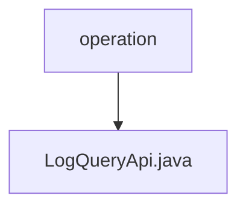

# Basic Information

|      |      |
|------|------|
| Name | operation |
| Language | .java |
| Code Path | WeFe/board/board-service/src/main/java/com/welab/wefe/board/service/api/operation |
| Package Name | docs.board.board-service.src.main.java.com.welab.wefe.board.service.api.operation |
| Brief Description | The LogQueryApi provides paginated query functionality for operation logs. The input includes the interface name, operator ID, and time range, while the output returns paginated results of operation logs. |

# Description

LogQueryApi is an API class designed for querying operation logs, inheriting from AbstractApi. It processes input of type Input and outputs paginated OperationLogOutputModel. The API path is "log/query" with the name "query log". Requests are handled via the query method of OperationLogService, returning paginated results.  

The Input class inherits from PagingInput and includes query conditions such as log interface name, operator ID, start time, and end time. The start time and end time are accessed through getter and setter methods. All fields are validated using the Check annotation.

### Package Internal Structure View

This flowchart illustrates the API operation path structure in the board-service module of the WeFe project. The parent node "operation" contains a child node "LogQueryApi.java," indicating that this is an operation-related API interface file. The entire structure is concise and clear, reflecting the hierarchical relationship between a single API file and its parent operation directory.

# File List

| Name   | Type  | Description |
|-------|------|-------------|
| [LogQueryApi.java](LogQueryApi.md) | file | The LogQueryApi provides the functionality to paginate query operation logs. The input includes the interface name, operator ID, and time range, while the output returns paginated results of operation logs. |

