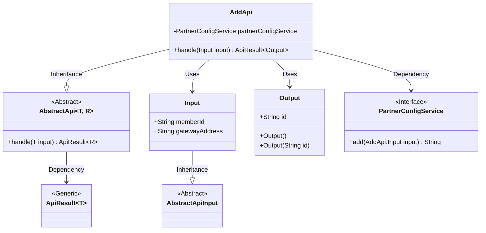
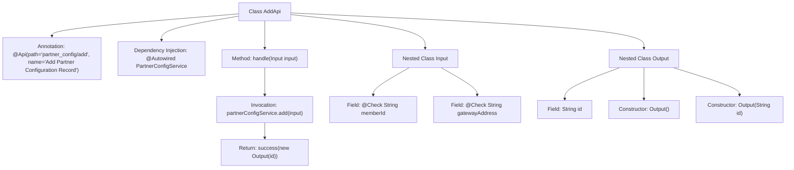

# Basic Information

|      |      |
|------|------|
| Name | AddApi |
| Language | .java |
| Code Path | WeFe/board/board-service/src/main/java/com/welab/wefe/board/service/api/partner_config/AddApi.java |
| Package Name | com.welab.wefe.board.service.api.partner_config |
| Dependencies | ['com.welab.wefe.board.service.service.PartnerConfigService', 'com.welab.wefe.common.fieldvalidate.annotation.Check', 'com.welab.wefe.common.web.api.base.AbstractApi', 'com.welab.wefe.common.web.api.base.Api', 'com.welab.wefe.common.web.dto.AbstractApiInput', 'com.welab.wefe.common.web.dto.ApiResult', 'org.springframework.beans.factory.annotation.Autowired'] |
| Brief Description | API class for adding partner configurations, including input parameters memberId and gatewayAddress, with output returning the generated configuration ID. |

# Description

This is a Java class named AddApi, used for adding partner configuration records. It inherits from AbstractApi and defines two inner classes: Input and Output. The input includes mandatory fields memberId and gatewayAddress, while the output contains the generated id. The class processes the request by calling the add method through the injected PartnerConfigService and returns a successful result containing the id. The entire API path is "partner_config/add".

# Class Summary

| Name   | Type  | Description |
|-------|------|-------------|
| AddApi | class | API class for adding partner configurations, which accepts memberId and gatewayAddress parameters, invokes PartnerConfigService to add a record, and returns the generated ID. |

## Class AddApi

|      |      |
|------|------|
| Access Modifier | @Api(path = "partner_config/add", name = "添加合作方配置记录");public |
| Type | class |
| Name | AddApi |
| Description | API class for adding partner configurations, which accepts memberId and gatewayAddress parameters, invokes PartnerConfigService to add a record, and returns the generated ID. |

### UML Class Diagram

Class Diagram Description: This diagram illustrates that the AddApi class inherits from the generic abstract class AbstractApi and relies on the PartnerConfigService interface to implement business logic. Input and Output serve as inner classes for data inheritance and encapsulation respectively, with Input extending AbstractApiInput. The PartnerConfigService interface defines the core method for adding configurations, while ApiResult acts as a generic result wrapper class utilized by AbstractApi. The overall structure demonstrates clear hierarchical relationships and division of responsibilities.

### Internal Method Call Graph

The flowchart depicts the structure and internal relationships of the AddApi class. This class is an API interface defined by the @Api annotation with its path and name, relying on PartnerConfigService for business logic processing. The handle method invokes the service layer to add a configuration and returns the result, containing two nested classes: Input (with validated parameters) and Output (output result structure). The flow clearly illustrates the complete chain from request handling to result return.

### Field List

| Name  | Type  | Description |
|-------|-------|------|
| partnerConfigService | PartnerConfigService | Automatically inject the PartnerConfigService instance. |

### Method List

| Name  | Type  | Description |
|-------|-------|------|
| handle | ApiResult<Output> | The method processes the input and invokes the service to add the configuration, returning a successful result containing the generated ID. |

