# Basic Information

|      |      |
|------|------|
| Name | DeleteApi |
| Language | .java |
| Code Path | WeFe/board/board-service/src/main/java/com/welab/wefe/board/service/api/partner_config/DeleteApi.java |
| Package Name | com.welab.wefe.board.service.api.partner_config |
| Dependencies | ['com.welab.wefe.board.service.service.PartnerConfigService', 'com.welab.wefe.common.fieldvalidate.annotation.Check', 'com.welab.wefe.common.web.api.base.AbstractApi', 'com.welab.wefe.common.web.api.base.Api', 'com.welab.wefe.common.web.dto.AbstractApiInput', 'com.welab.wefe.common.web.dto.ApiResult', 'org.springframework.beans.factory.annotation.Autowired'] |
| Brief Description | API class for deleting partner configuration records, inherits from an abstract class to handle input and output, calls the service to delete the record with the specified ID. The input must include the ID field, and the output is empty. |

# Description

This is an API class named DeleteApi, designed for deleting partner configuration records. It inherits from AbstractApi with generic parameters Input and Output. The class is annotated with the Api annotation, specifying the path as partner_config/delete. Internally, it injects the PartnerConfigService. The handle method processes the input parameters, calls the delete method of partnerConfigService to remove the record with the specified ID, and returns a successful result. The Input inner class extends AbstractApiInput and includes a mandatory string-type id field. The Output inner class is empty, indicating no return data.

# Class Summary

| Name   | Type  | Description |
|-------|------|-------------|
| DeleteApi | class | Delete partner configuration API, which accepts an ID parameter, calls the service to remove the record, and returns a successful result. |


## Class DeleteApi

|      |      |
|------|------|
| Access Modifier | @Api(path = "partner_config/delete", name = "删除合作方配置记录");public |
| Type | class |
| Name | DeleteApi |
| Description | Delete partner configuration API, which accepts an ID parameter, calls the service to remove the record, and returns a successful result. |


### UML Class Diagram

```mermaid
classDiagram
    class DeleteApi {
        -PartnerConfigService partnerConfigService
        +handle(Input input) ApiResult~Output~
    }
    
    class PartnerConfigService {
        <<Interface>>
        +delete(String id) void
    }
    
    class AbstractApi~I,O~ {
        <<Abstract>>
        +handle(I input) ApiResult~O~
    }
    
    class ApiResult~T~ {
        <<Generic>>
    }
    
    class DeleteApi$Input {
        +String id
    }
    
    class DeleteApi$Output {
    }
    
    class AbstractApiInput {
    }
    
    DeleteApi --> PartnerConfigService : Dependency
    DeleteApi --|> AbstractApi~Input,Output~ : Inheritance
    DeleteApi$Input --|> AbstractApiInput : Inheritance
```

This code demonstrates the implementation of an API for deleting partner configuration records. The DeleteApi inherits from the generic abstract class AbstractApi, defining two static inner classes Input and Output as parameter and return types. Input extends AbstractApiInput and contains a mandatory id field, while Output is an empty structure. DeleteApi implements the deletion functionality through the dependency-injected PartnerConfigService interface, with core logic encapsulated in the handle method. The overall design adheres to a layered architecture, where Input parameters are validated via annotations, reflecting clear responsibility division and type safety.


### Internal Method Call Graph

```mermaid
graph TD
    A["Class DeleteApi"]
    B["Annotation: @Api(path='partner_config/delete', name='Delete partner configuration record')"]
    C["Inheritance: AbstractApi<Input, Output>"]
    D["Dependency Injection: @Autowired PartnerConfigService"]
    E["Overridden Method: handle(Input input)"]
    F["Inner Class: Input"]
    G["Inner Class: Output"]
    H["Input Property: @Check(require=true) String id"]
    I["Method Call: partnerConfigService.delete(input.id)"]
    J["Return: success()"]

    A --> B
    A --> C
    A --> D
    A --> E
    A --> F
    A --> G
    F --> H
    E --> I
    E --> J
```



This code flowchart illustrates the structure and execution flow of the DeleteApi class. The class is an API-annotated controller that inherits from the AbstractApi template class and obtains PartnerConfigService through dependency injection. The core processing logic resides in the handle method, which invokes the service layer's delete method to remove a record with the specified ID before returning a success result. The Input inner class defines mandatory ID parameter validation, while Output serves as an empty response body. The entire flow clearly presents the critical path from request processing to business operation.

### Field List

| Name  | Type  | Description |
|-------|-------|------|
| partnerConfigService | PartnerConfigService | Automatically inject the PartnerConfigService service instance. |

### Method List

| Name  | Type  | Description |
|-------|-------|------|
| handle | ApiResult<Output> | Delete the partner configuration with the specified ID and return a successful result. |


