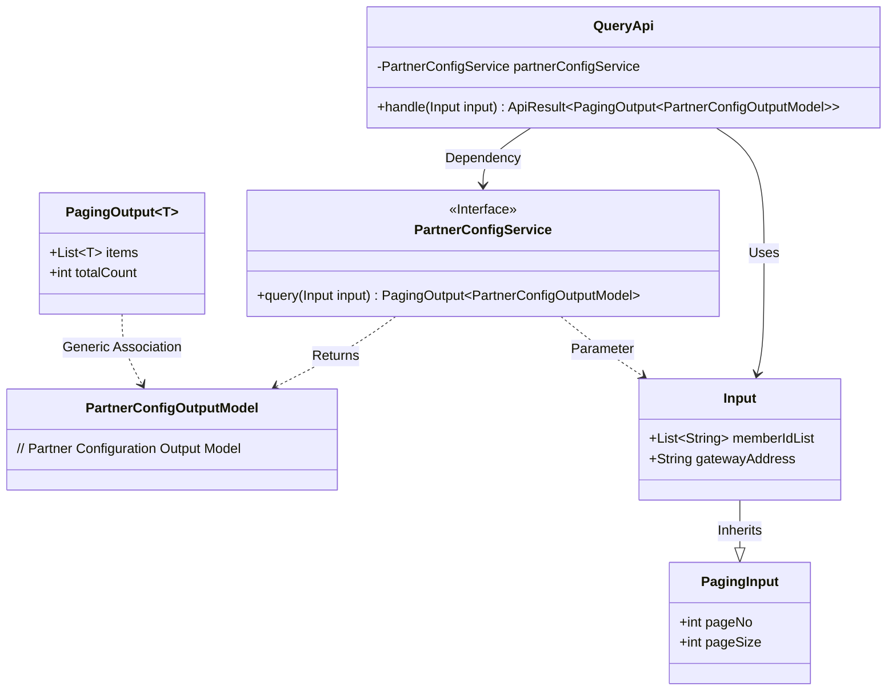

# Basic Information

|      |      |
|------|------|
| Name | QueryApi |
| Language | .java |
| Code Path | WeFe/board/board-service/src/main/java/com/welab/wefe/board/service/api/partner_config/QueryApi.java |
| Package Name | com.welab.wefe.board.service.api.partner_config |
| Dependencies | ['com.welab.wefe.board.service.dto.base.PagingInput', 'com.welab.wefe.board.service.dto.base.PagingOutput', 'com.welab.wefe.board.service.dto.entity.PartnerConfigOutputModel', 'com.welab.wefe.board.service.service.PartnerConfigService', 'com.welab.wefe.common.web.api.base.AbstractApi', 'com.welab.wefe.common.web.api.base.Api', 'com.welab.wefe.common.web.dto.ApiResult', 'org.springframework.beans.factory.annotation.Autowired', 'java.util.List'] |
| Brief Description | The QueryApi class is used for paginated querying of partner configuration records. It accepts an Input parameter containing memberIdList and gatewayAddress, and returns a paginated result PartnerConfigOutputModel. It processes the request by invoking the query method of PartnerConfigService. |

# Description

This is a Java class named QueryApi, designed for paginated querying of partner configuration records. It inherits from the AbstractApi base class, with generic parameters specifying the input type as the inner class Input and the output type as the paginated PartnerConfigOutputModel. The class defines the API path and name through the @Api annotation. The inner class Input extends PagingInput and includes two query parameters: memberIdList and gatewayAddress. The actual business logic is delegated to the auto-injected PartnerConfigService, whose query method accepts the Input parameter and returns paginated results. The handle method wraps the service layer call, returning a successful ApiResult. The overall class structure is clear, with well-defined responsibilities, implementing the functionality for paginated querying of partner configurations.

# Class Summary

| Name   | Type  | Description |
|-------|------|-------------|
| QueryApi | class | This is a Java class named QueryApi, designed for paginated querying of partner configuration records. It extends AbstractApi, accepts Input parameters, and returns paginated results. The Input includes memberIdList and gatewayAddress fields. The actual query is executed through PartnerConfigService. |

## Class QueryApi

|      |      |
|------|------|
| Access Modifier | @Api(path = "partner_config/query", name = "分页查询合作方配置记录");public |
| Type | class |
| Name | QueryApi |
| Description | This is a Java class named QueryApi, designed for paginated querying of partner configuration records. It extends AbstractApi, accepts Input parameters, and returns paginated results. The Input includes memberIdList and gatewayAddress fields. The actual query is executed through PartnerConfigService. |

### UML Class Diagram

This code demonstrates an API implementation for querying partner configuration records. QueryApi inherits from AbstractApi and processes paginated query requests through the PartnerConfigService. The Input class extends PagingInput with memberIdList and gatewayAddress fields to receive query parameters. The PartnerConfigService interface defines the query method, returning paginated results containing PartnerConfigOutputModel. The overall structure reflects clear dependency relationships and layered design, with Input parameters and output models decoupled through the generic PagingOutput.

### Internal Method Call Graph

```mermaid
graph TD
    A["Class QueryApi"]
    B["Annotation: @Api(path='partner_config/query', name='Paginated Query for Partner Configuration Records')"]
    C["Inheritance: AbstractApi<Input, PagingOutput<PartnerConfigOutputModel>>"]
    D["Dependency Injection: @Autowired PartnerConfigService"]
    E["Overridden Method: handle(Input input)"]
    F["Static Inner Class: Input"]
    G["Parent Class: PagingInput"]
    H["Field: List<String> memberIdList"]
    I["Field: String gatewayAddress"]
    J["Method Call: partnerConfigService.query(input)"]
    K["Return Result: success(...)"]

    A --> B
    A --> C
    A --> D
    A --> E
    E --> J
    J --> K
    A -.-> F
    F --> G
    F --> H
    F --> I
```

This code demonstrates a paginated query API implementation based on the Spring framework. The QueryApi class inherits from AbstractApi, defines the interface path and name through the @Api annotation, and injects the PartnerConfigService using @Autowired. The core logic resides in the handle method, which calls partnerConfigService.query() for paginated queries and returns wrapped results. Input, as a static inner class, extends PagingInput and includes two query parameter fields: memberIdList and gatewayAddress. The overall design reflects layered architecture and dependency injection principles.

### Field List

| Name  | Type  | Description |
|-------|-------|------|
| partnerConfigService | PartnerConfigService | Use @Autowired to automatically inject an instance of PartnerConfigService. |

### Method List

| Name  | Type  | Description |
|-------|-------|------|
| handle | ApiResult<PagingOutput<PartnerConfigOutputModel>> | Java method override, calling a service to query and return paginated results. |

