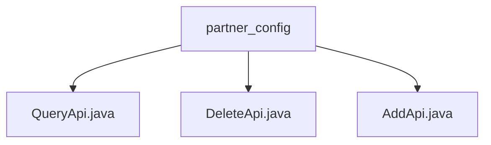

# Basic Information

|      |      |
|------|------|
| Name | partner_config |
| Language | .java |
| Code Path | WeFe/board/board-service/src/main/java/com/welab/wefe/board/service/api/partner_config |
| Package Name | docs.board.board-service.src.main.java.com.welab.wefe.board.service.api.partner_config |
| Brief Description | The QueryApi implements paginated queries for partner configurations, with Input containing memberIdList and gatewayAddress, returning paginated results. The DeleteApi handles deletion operations, requiring an id to be passed in. The AddApi is used to add records, requiring memberId and gatewayAddress, and returns the generated id. All inherit from AbstractApi and execute business logic through the PartnerConfigService. |

# Description

## Overview  
The core responsibility of this module is to manage CRUD operations for partner configurations, including paginated queries, deletions, and additions of records. The interface specifications follow a unified design: inheriting the AbstractApi base class, using the @Api annotation to define paths, and delegating business logic through the PartnerConfigService. Key data structures include the PartnerConfigOutputModel for paginated queries, ID parameters for deletion operations, and the returned ID for newly added records. The only external dependency is PartnerConfigService. For example, QueryApi handles paginated queries with memberIdList, DeleteApi removes records by ID, and AddApi adds configurations and returns the ID.  

## Key Business Scenarios  
The module fully supports the entire lifecycle management of partner configurations, similar to basic data maintenance in backend management systems. Typical workflows include querying configuration lists (paginated), deleting invalid configurations, and adding new partners. The interaction mode is exclusively synchronous HTTP calls, returning standard ApiResult. For instance, the frontend calls QueryApi to display paginated configuration lists, administrators trigger DeleteApi to remove records, and AddApi is used to add new gateway addresses. All APIs achieve data persistence through the service layer PartnerConfigService.

### Package Internal Structure View

This flowchart illustrates three Java files under the partner_config directory: QueryApi.java, DeleteApi.java, and AddApi.java. All three files are directly subordinate to the partner_config directory with no deeper nesting, forming a simple single-layer tree structure.

# File List

| Name   | Type  | Description |
|-------|------|-------------|
| [QueryApi.java](QueryApi.md) | file | The QueryApi class is used for paginated querying of partner configuration records. It accepts an Input parameter containing memberIdList and gatewayAddress, and returns a paginated result in the form of PartnerConfigOutputModel. It processes the request by invoking the query method of PartnerConfigService. |
| [DeleteApi.java](DeleteApi.md) | file | API class for deleting partner configuration records, inherits from an abstract class to handle input and output, calls the service to delete the record with the specified ID. The input must include the ID field, and the output is empty. |
| [AddApi.java](AddApi.md) | file | API class for adding partner configurations, including input parameters memberId and gatewayAddress, with the output returning the generated configuration ID. |

