# Basic Information

|      |      |
|------|------|
| Name | project |
| Language | .java |
| Code Path | WeFe/board/board-service/src/main/java/com/welab/wefe/board/service/api/project |
| Package Name | docs.board.board-service.src.main.java.com.welab.wefe.board.service.api.project |
| Brief Description | The module provides modeling information query APIs, supporting pagination and detail retrieval. The task management module enables full lifecycle control, including creation, suspension, resumption, etc. The dataset module manages CRUD operations and review processes. The project management module covers CRUD, status changes, and statistical analysis. The workflow management module handles process orchestration and status control. The member management module manages additions, deletions, modifications, and reviews. The federated learning module oversees alignment tasks and data fusion. The node module is responsible for node information maintenance and compliance checks. |

# Description

## Overview  
The core responsibility of this module is to establish a full lifecycle management system for federated learning projects, encompassing five key functionalities: project management, process orchestration, member collaboration, data governance, and task monitoring, akin to a combination of a workflow engine and a data platform. The interface specifications uniformly adopt the RESTful style, inheriting the `AbstractApi` base class to standardize input and output, with paths organized by functionality (e.g., `project/flow` for process management, `fusion/` for data fusion). Key data structures include pagination models (e.g., `ModelingInfoOutputModel`), detail models (e.g., `ProjectFlowDetailOutputModel`), and status enumerations (e.g., `PSIActuatorStatus`), all validated through annotation-based checks to ensure data integrity. External dependencies primarily revolve around the Spring framework and internal service layers (e.g., `ProjectFlowService`, `ProjectMemberService`), such as `ProjectService` providing core CRUD logic for projects and `FusionResultService` handling data fusion results.

## Key Business Scenarios  
The module supports closed-loop scenarios typical of federated learning: 1) Project creation (`AddApi`) → Member management (`AddApi`/`RemoveApi`) → Process design (`AddFlowApi`) → Node configuration (`UpdateApi`); 2) Data preparation (`AddDataSetApi`) → Task execution (`StartFlowApi`) → Result query (`QueryDerivedDataSetApi`); 3) Monitoring and analysis (`GetProgressApi`) → Review callbacks (`AuditCallbackApi`). The interaction mode is primarily synchronous HTTP, with API types covering CRUD operations (e.g., `DeleteApi`), status changes (e.g., `StopJobApi`), and complex queries (e.g., `ListFlowTableDataSetApi`). Functional completeness is reflected in cross-module collaboration, such as member exit (`ExitProjectApi`) triggering data cleanup and process node updates validating component compliance (`CheckExistVertModelComponentApi`). Typical applications include project management backends, modeling monitoring consoles, and automated review systems.

### Package Internal Structure View

```mermaid
graph TD
    project --> modeling
    project --> job
    project --> dataset
    project --> project
    project --> flow
    project --> member
    project --> fusion
    project --> node
    modeling --> QueryApi.java
    modeling --> DetailApi.java
    job --> task
    job --> PreviewJobApi.java
    job --> QueryApi.java
    job --> ResumeJobApi.java
    job --> DownloadLogApi.java
    job --> GetJobProgressApi.java
    job --> DetailApi.java
    job --> UpdateJobStatusApi.java
    job --> StopJobApi.java
    job --> ViewDataSetApi.java
    job --> OnJobFinishedApi.java
    task --> TaskProgressDetailApi.java
    task --> GetFeatureApi.java
    task --> DetailApi.java
    task --> GetResultHistoryApi.java
    task --> GetResultApi.java
    dataset --> ListApi.java
    dataset --> RawDataSetListApi.java
    dataset --> AddDataSetApi.java
    dataset --> QueryDerivedDataSetApi.java
    dataset --> GetFeaturesApi.java
    dataset --> RemoveDataSetApi.java
    dataset --> AuditDataSetApi.java
    project --> QueryApi.java
    project --> UpdateProjectApi.java
    project --> AddApi.java
    project --> TopProjectApi.java
    project --> DataInfoApi.java
    project --> DetailApi.java
    project --> AuditApi.java
    project --> CloseProjectApi.java
    project --> CountStatisticsApi.java
    flow --> ListFlowNodeApi.java
    flow --> AddFlowApi.java
    flow --> UpdateFlowBaseInfoApi.java
    flow --> QueryFlowTemplateApi.java
    flow --> StartFlowApi.java
    flow --> QueryDataIoTaskConfigApi.java
    flow --> GetProgressApi.java
    flow --> DeleteApi.java
    flow --> SaveFlowTemplateApi.java
    flow --> QueryDataIoTaskFeaturesApi.java
    flow --> UpdateFlowGraphApi.java
    flow --> DetailFlowApi.java
    flow --> FlowQueryApi.java
    flow --> AddOotFlowApi.java
    flow --> CopyFlowApi.java
    flow --> TopFlowApi.java
    flow --> FlowDataSetInfoApi.java
    flow --> ListFlowTableDataSetApi.java
    member --> audit
    member --> AddApi.java
    member --> ListInAllProjectApi.java
    member --> ListInProjectApi.java
    member --> ExitProjectApi.java
    member --> OnlineCheckApi.java
    member --> RemoveApi.java
    audit --> ProjectMemberAuditListApi.java
    audit --> AuditApi.java
    fusion --> result
    fusion --> actuator
    fusion --> task
    fusion --> member
    fusion --> HashOptionsEnumApi.java
    result --> ResultExportApi.java
    result --> ResultPreviewApi.java
    result --> TestDBConnectApi.java
    result --> ResultExportProgressApi.java
    actuator --> psi
    psi --> DownloadBFApi.java
    psi --> ReceiveResultApi.java
    psi --> ServerSynStatusApi.java
    psi --> ServerCloseApi.java
    psi --> PsiCryptoApi.java
    task --> ReceiveApi.java
    task --> InfoApi.java
    task --> PagingApi.java
    task --> UpdateApi.java
    task --> RestartApi.java
    task --> DeleteApi.java
    task --> AddApi.java
    task --> DeleteCallbackApi.java
    task --> AuditCallbackApi.java
    task --> DetailApi.java
    task --> AuditApi.java
    task --> TaskStatusApi.java
    member --> QueryProvidersApi.java
    node --> CheckExistVertModelComponentApi.java
    node --> UpdateApi.java
    node --> CheckExistEvaluationComponentApi.java
    node --> DetailApi.java
```

This flowchart illustrates the API hierarchy of the board-service module in the WeFe project, with "project" as the root node branching into 8 secondary directories including modeling, job, and dataset. The job directory contains a task subdirectory and 11 API files, while the flow directory comprises 17 API files. The fusion directory features complex substructures like result/actuator/task. The entire structure consists of 98 nodes, comprehensively presenting the modular design of the project's APIs, reflecting clear business function partitioning and hierarchical relationships.

# File List

| Name   | Type  | Description |
|-------|------|-------------|
| [fusion](fusion/_module.md) | package | Module 1: Data Fusion Result Management, providing preview, export, and progress query functionalities, utilizing RESTful interfaces, dependent on FusionResultService and storage services. Module 2: PSI Protocol API, managing Bloom filter downloads, status synchronization, and result reception, dependent on ActuatorManager. Module 3: Federated Learning Alignment Task Management, supporting task creation, query, and approval, with path prefix fusion/task/. Module 4: Query Project Provider List API, path being fusion/query/providers. Module 5: API for retrieving HashOptions enum values, path being fusion/hash_options_enum. |
| [node](node/_module.md) | package | Check the vertical model component API, path `project/flow/node/check_exist_vert_model_component`, returns a boolean result. Update the flow node API, path `project/flow/node/update`, checks if the number of classifications matches the evaluation mode. Check the evaluation component API, returns a boolean result. Get node details API, path `project/flow/node/detail`, queries and returns node data. |
| [member](member/_module.md) | package | This module manages the project member review process, providing APIs to query pending review lists and submit review results. It supports filtering by project or member ID, and requires comments for rejections. The module includes functionalities such as member addition, list querying, exit, online checking, and removal, all implemented through specific APIs, relying on a unified base class and service layer to handle business logic. |
| [flow](flow/_module.md) | package | ListFlowNodeApi queries the list of workflow nodes.  AddFlowApi adds a project workflow.  UpdateFlowBaseInfoApi updates workflow information.  QueryFlowTemplateApi queries workflow templates.  StartFlowApi initiates a workflow.  QueryDataIoTaskConfigApi queries data IO configurations.  GetProgressApi retrieves workflow progress.  DeleteApi deletes a workflow.  SaveFlowTemplateApi saves a template.  QueryDataIoTaskFeaturesApi queries feature columns.  UpdateFlowGraphApi updates the workflow diagram.  DetailFlowApi retrieves workflow details.  FlowQueryApi queries the workflow list.  AddOotFlowApi adds an OOT workflow.  CopyFlowApi copies a workflow.  TopFlowApi pins a workflow to the top.  FlowDataSetInfoApi retrieves dataset information.  ListFlowTableDataSetApi fetches the dataset list. |
| [project](project/_module.md) | package | QueryApi queries the project list, UpdateProjectApi updates project information, AddApi adds a new project, TopProjectApi sets the top status, DataInfoApi retrieves project data, DetailApi queries project details, AuditApi handles reviews, CloseProjectApi closes a project, CountStatisticsApi counts project quantities. |
| [dataset](dataset/_module.md) | package | ListApi lists project datasets, RawDataSetListApi retrieves the raw dataset list, AddDataSetApi adds a dataset, QueryDerivedDataSetApi queries derived datasets, GetFeaturesApi obtains feature lists, RemoveDataSetApi deletes a dataset, AuditDataSetApi audits dataset authorization. |
| [job](job/_module.md) | package | The Task Management API module provides functionalities such as task progress query, detail viewing, and historical traceability. It adheres to REST specifications, relies on the Spring framework, and supports full lifecycle management, including operations like preview, query, recovery, log download, status update, and task termination. |
| [modeling](modeling/_module.md) | package | The QueryApi is an API for paginated querying of modeling information, with the path "project/modeling/query". Its input includes optional conditions and boolean flags, and it outputs paginated results. The DetailApi is an API for retrieving modeling details, with the path "project/modeling/detail". Its input inherits from GetResultApi.Input, and it outputs TaskResultOutputModel. |

