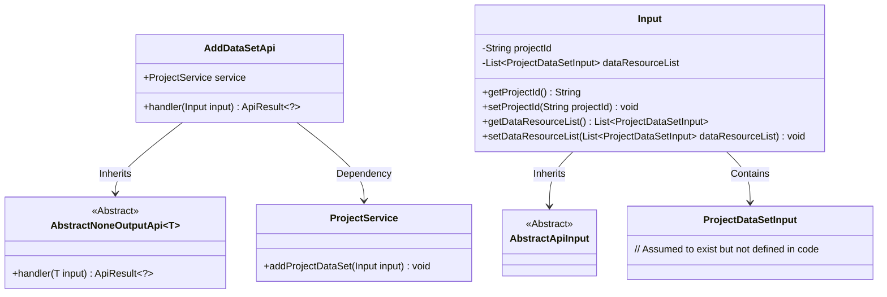

# Basic Information

|      |      |
|------|------|
| Name | AddDataSetApi |
| Language | .java |
| Code Path | WeFe/board/board-service/src/main/java/com/welab/wefe/board/service/api/project/dataset/AddDataSetApi.java |
| Package Name | com.welab.wefe.board.service.api.project.dataset |
| Dependencies | ['com.welab.wefe.board.service.dto.entity.ProjectDataSetInput', 'com.welab.wefe.board.service.service.ProjectService', 'com.welab.wefe.common.exception.StatusCodeWithException', 'com.welab.wefe.common.fieldvalidate.annotation.Check', 'com.welab.wefe.common.web.api.base.AbstractNoneOutputApi', 'com.welab.wefe.common.web.api.base.Api', 'com.welab.wefe.common.web.dto.AbstractApiInput', 'com.welab.wefe.common.web.dto.ApiResult', 'org.springframework.beans.factory.annotation.Autowired', 'java.util.List'] |
| Brief Description | This is an API class designed to add datasets to a project, which takes the project ID and a list of datasets as input parameters and processes the request by calling the `addProjectDataSet` method of `ProjectService`. |

# Description

The code defines an API class named AddDataSetApi, which is used to add datasets to a project. The API path is project/data_resource/add, and its name is "add data set to project". This class inherits from AbstractNoneOutputApi and uses the generic type Input as its input parameter. The ProjectService is injected via Autowired, and the handler method calls the service's addProjectDataSet method to process the input data. The Input inner class extends AbstractApiInput and includes two required fields: project ID (projectId) and dataset list (dataResourceList), along with corresponding getter and setter methods. Upon successful processing, it returns an empty result.

# Class Summary

| Name   | Type  | Description |
|-------|------|-------------|
| AddDataSetApi | class | This is an API class designed for adding datasets to a project, with the path "project/data_resource/add". It accepts a project ID and a list of datasets as input, invokes the ProjectService to perform the addition operation, and returns an empty result upon success. The input parameters include the mandatory project ID and dataset list. |

## Class AddDataSetApi

|      |      |
|------|------|
| Access Modifier | @Api(path = "project/data_resource/add", name = "add data set to project");public |
| Type | class |
| Name | AddDataSetApi |
| Description | This is an API class designed for adding datasets to a project, with the path "project/data_resource/add". It accepts a project ID and a list of datasets as input, invokes the ProjectService to perform the addition operation, and returns an empty result upon success. The input parameters include the mandatory project ID and dataset list. |

### UML Class Diagram

This code demonstrates an API implementation for adding datasets to a project. The AddDataSetApi inherits from the generic abstract class AbstractNoneOutputApi, using Input as the parameter type. The Input class contains project ID and dataset list fields, and inherits from AbstractApiInput. ProjectService is injected for business logic processing, with the core functionality implemented through the addProjectDataSet method. The class diagram clearly illustrates inheritance and dependency relationships, with an aggregation relationship between Input class and ProjectDataSetInput.

### Internal Method Call Graph

```mermaid
graph TD
    A["Class AddDataSetApi"]
    B["Annotation: @Api(path='project/data_resource/add', name='add data set to project')"]
    C["Inheritance: AbstractNoneOutputApi<Input>"]
    D["Dependency Injection: @Autowired ProjectService service"]
    E["Overridden Method: handler(Input input)"]
    F["Inner Class: Input"]
    G["Input Property: String projectId"]
    H["Input Property: List<ProjectDataSetInput> dataResourceList"]
    I["Input Methods: getter/setter"]
    J["handler Logic: service.addProjectDataSet(input)"]
    K["Return Result: success()"]

    A --> B
    A --> C
    A --> D
    A --> E
    E --> J
    E --> K
    A --> F
    F --> G
    F --> H
    F --> I
```

This code demonstrates an API class named AddDataSetApi for adding datasets to a project. The class inherits from AbstractNoneOutputApi with a specified generic type Input, and includes a ProjectService instance injected via @Autowired. The core logic is implemented in the handler method, which processes input parameters by calling service.addProjectDataSet and returns a success result. The inner class Input defines two mandatory fields (project ID and dataset list) with corresponding getter/setter methods. The entire flow clearly illustrates the call relationships and data transfer path from the API entry point to business processing.

### Field List

| Name  | Type  | Description |
|-------|-------|------|
| service | ProjectService | Automatically inject the ProjectService instance. |

### Method List

| Name  | Type  | Description |
|-------|-------|------|
| handler | ApiResult<?> | Rewrite the handler method to call service.addProjectDataSet for processing the input and return ApiResult upon success. |

