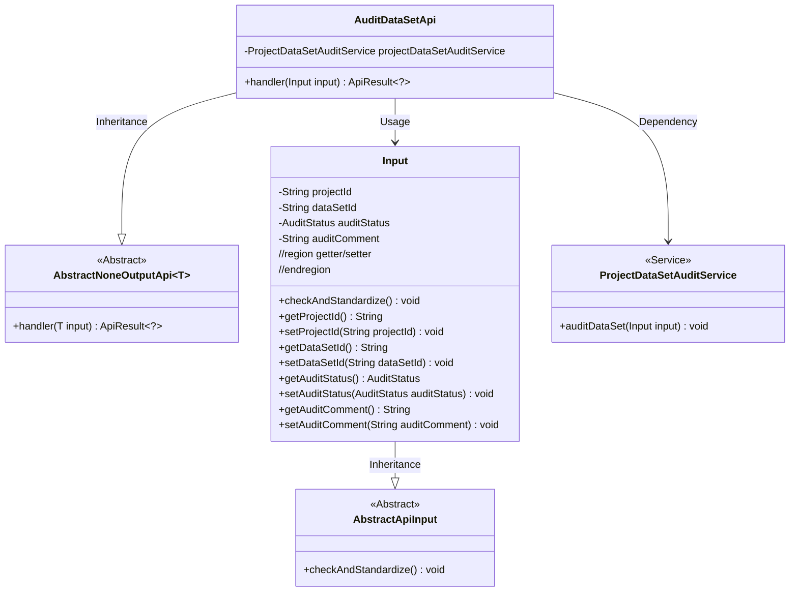
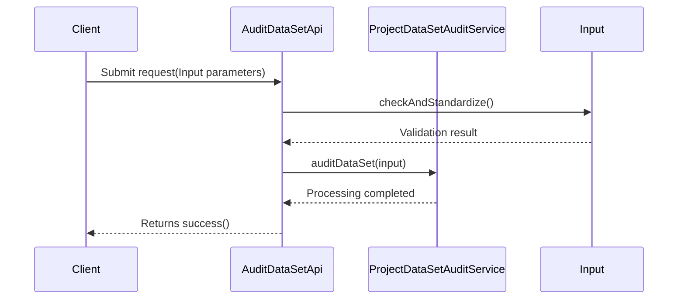

# Basic Information

|      |      |
|------|------|
| Name | AuditDataSetApi |
| Language | .java |
| Code Path | WeFe/board/board-service/src/main/java/com/welab/wefe/board/service/api/project/dataset/AuditDataSetApi.java |
| Package Name | com.welab.wefe.board.service.api.project.dataset |
| Dependencies | ['com.welab.wefe.board.service.service.ProjectDataSetAuditService', 'com.welab.wefe.common.StatusCode', 'com.welab.wefe.common.exception.StatusCodeWithException', 'com.welab.wefe.common.fieldvalidate.annotation.Check', 'com.welab.wefe.common.util.StringUtil', 'com.welab.wefe.common.web.api.base.AbstractNoneOutputApi', 'com.welab.wefe.common.web.api.base.Api', 'com.welab.wefe.common.web.dto.AbstractApiInput', 'com.welab.wefe.common.web.dto.ApiResult', 'com.welab.wefe.common.wefe.enums.AuditStatus', 'org.springframework.beans.factory.annotation.Autowired'] |
| Brief Description | This is an API class for authorizing audit project datasets, containing required fields such as project ID, dataset ID, audit status, and comments. A reason must be provided when rejecting. |

# Description

The code defines an API class named `AuditDataSetApi`, designed to review dataset authorization requests within a project. The API path is `project/data_resource/audit`, which inherits from `AbstractNoneOutputApi`, with the input parameters defined by the inner class `Input`. `Input` includes mandatory fields such as project ID, dataset ID, review status, and an optional review comment. An exception is thrown if the review status is "rejected" and no comment is provided. The processing logic executes the review operation via the `auditDataSet` method of the `ProjectDataSetAuditService`.

# Class Summary

| Name   | Type  | Description |
|-------|------|-------------|
| AuditDataSetApi | class | API for reviewing dataset authorization applications in a project, including mandatory parameters such as project ID, dataset ID, status, and review comments. Reasons must be provided when rejecting the application. |

## Class AuditDataSetApi

|      |      |
|------|------|
| Access Modifier | @Api(path = "project/data_resource/audit", name = "audit the data set authorization application in the project");public |
| Type | class |
| Name | AuditDataSetApi |
| Description | API for reviewing dataset authorization applications in a project, including mandatory parameters such as project ID, dataset ID, status, and review comments. Reasons must be provided when rejecting the application. |

### UML Class Diagram

This class diagram illustrates the core structure of the Audit Dataset API. AuditDataSetApi inherits from the generic abstract class AbstractNoneOutputApi, processes parameters of type Input, and relies on ProjectDataSetAuditService to perform audit operations. The Input class inherits from AbstractApiInput, containing audit parameters such as project ID and dataset ID, and implements parameter validation logic. The overall design adopts a layered architecture, achieving functional decoupling through inheritance and service dependencies.

### Internal Method Call Graph

```mermaid
graph TD
    A["Class AuditDataSetApi"]
    B["Inheritance: AbstractNoneOutputApi<Input>"]
    C["Annotation: @Api"]
    D["Dependency Injection: ProjectDataSetAuditService"]
    E["Overridden Method: handler(Input input)"]
    F["Inner Class: Input"]
    G["Inheritance: AbstractApiInput"]
    H["Validation Method: checkAndStandardize()"]
    I["Properties: projectId, dataSetId, auditStatus, auditComment"]
    J["getter/setter methods"]

    A --> B
    A --> C
    A --> D
    A --> E
    E --> D["Calls projectDataSetAuditService.auditDataSet"]
    A --> F
    F --> G
    F --> H
    F --> I
    F --> J
    H -->|Validation Condition| I["auditComment required when auditStatus is disagree"]
```

This code implements an API interface for dataset authorization auditing, consisting of two core components: the AuditDataSetApi class handles the audit request flow, while the Input inner class encapsulates request parameters and implements validation logic. The flowchart illustrates the class structure and key method call relationships, while the sequence diagram depicts the complete call chain from client request to service processing. The code defines API paths through annotations, inherits abstract classes for standardized processing, and strictly enforces the business rule that rejection reasons must be provided when audit status is "disagree".

### Field List

| Name  | Type  | Description |
|-------|-------|------|
| projectDataSetAuditService | ProjectDataSetAuditService | Using @Autowired to automatically inject an instance of the ProjectDataSetAuditService. |

### Method List

| Name  | Type  | Description |
|-------|-------|------|
| handler | ApiResult<?> | Method override, call the audit service to process the input data, and return the result upon success. |

