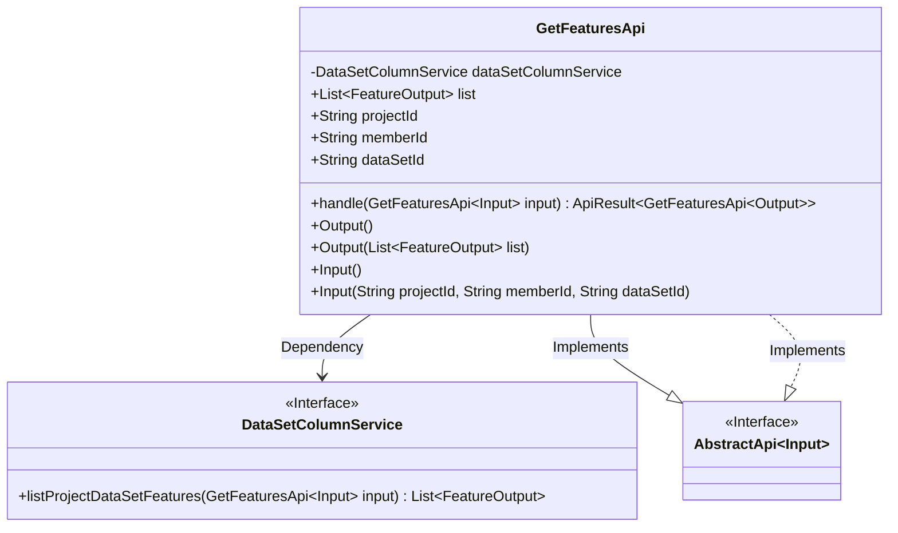
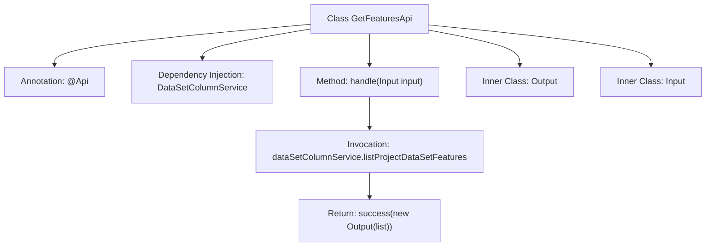

# Basic Information

|      |      |
|------|------|
| Name | GetFeaturesApi |
| Language | .java |
| Code Path | WeFe/board/board-service/src/main/java/com/welab/wefe/board/service/api/project/dataset/GetFeaturesApi.java |
| Package Name | com.welab.wefe.board.service.api.project.dataset |
| Dependencies | ['com.welab.wefe.board.service.dto.vo.FeatureOutput', 'com.welab.wefe.board.service.service.DataSetColumnService', 'com.welab.wefe.common.fieldvalidate.annotation.Check', 'com.welab.wefe.common.web.api.base.AbstractApi', 'com.welab.wefe.common.web.api.base.Api', 'com.welab.wefe.common.web.dto.AbstractApiInput', 'com.welab.wefe.common.web.dto.ApiResult', 'org.springframework.beans.factory.annotation.Autowired', 'java.util.List'] |
| Brief Description | Retrieve the feature list of a dataset in the project, including data type information. Requires providing the project ID, member ID, and dataset ID. Returns the feature list result. |

# Description

This API is used to retrieve the feature list of a dataset within a project, including the data type information of the features. The endpoint is `project/table_data_set/feature/list`, and it allows signed access. The input parameters include the required `projectId`, `memberId`, and `dataSetId`. The output is a list of `FeatureOutput`, obtained through the `DataSetColumnService`. This API inherits from `AbstractApi` and implements the definition of input/output classes as well as the request processing logic.

# Class Summary

| Name   | Type  | Description |
|-------|------|-------------|
| GetFeaturesApi | class | Get the feature list of the dataset in the project, including data types. Project ID, member ID, and dataset ID must be provided. |

## Class GetFeaturesApi

|      |      |
|------|------|
| Access Modifier | @Api(path = "project/table_data_set/feature/list",;        name = "获取项目中数据集的特征列表",;        desc = "这里返回的特征列表会包含特征的数据类型，这个信息在union中不存在，所以需要额外获取。",;        allowAccessWithSign = true;);public |
| Type | class |
| Name | GetFeaturesApi |
| Description | Get the feature list of the dataset in the project, including data types. Project ID, member ID, and dataset ID must be provided. |

### UML Class Diagram

This class diagram illustrates the structure of an API for retrieving feature lists from project datasets. The GetFeaturesApi inherits from the generic AbstractApi class and contains two static nested classes: Input and Output. The Input class implements the AbstractApiInput interface and includes three mandatory fields, while the Output class encapsulates a collection of feature lists. The API fetches data by depending on the DataSetColumnService, adhering to layered architecture principles with clear separation between input/output and business logic.

### Internal Method Call Graph

This code defines an API class named GetFeaturesApi for retrieving feature lists of datasets in a project. The class inherits from AbstractApi and contains two inner classes: Input and Output. The main workflow involves calling the listProjectDataSetFeatures method through the injected DataSetColumnService to obtain the feature list, which is then wrapped into an Output object for return. The input parameters include three mandatory fields: projectId, memberId, and dataSetId. The entire process clearly demonstrates the complete chain from request handling to data return.

### Field List

| Name  | Type  | Description |
|-------|-------|------|
| dataSetColumnService | DataSetColumnService | Automatically inject dataset column service instances. |

### Method List

| Name  | Type  | Description |
|-------|-------|------|
| handle | ApiResult<GetFeaturesApi.Output> | Processing the GetFeaturesApi request, invoking the dataSetColumnService to retrieve the feature list of the project dataset, and returning a successful result. |

