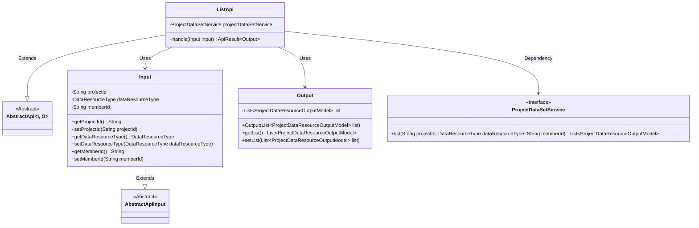

# Basic Information

|      |      |
|------|------|
| Name | ListApi |
| Language | .java |
| Code Path | WeFe/board/board-service/src/main/java/com/welab/wefe/board/service/api/project/dataset/ListApi.java |
| Package Name | com.welab.wefe.board.service.api.project.dataset |
| Dependencies | ['com.welab.wefe.board.service.dto.entity.project.data_set.ProjectDataResourceOutputModel', 'com.welab.wefe.board.service.service.ProjectDataSetService', 'com.welab.wefe.common.exception.StatusCodeWithException', 'com.welab.wefe.common.fieldvalidate.annotation.Check', 'com.welab.wefe.common.web.api.base.AbstractApi', 'com.welab.wefe.common.web.api.base.Api', 'com.welab.wefe.common.web.dto.AbstractApiInput', 'com.welab.wefe.common.web.dto.ApiResult', 'com.welab.wefe.common.wefe.enums.DataResourceType', 'org.springframework.beans.factory.annotation.Autowired', 'java.util.List'] |
| Brief Description | The ListApi class is used to list project datasets, accepting parameters such as project ID, dataset type, and member ID, and returns a list of datasets. |

# Description

This is a Java class named ListApi, designed for listing project datasets. It inherits from AbstractApi and processes Input and Output. The input includes a project ID (required), dataset type, and member ID (optional). The output contains a list of datasets. The class injects ProjectDataSetService and retrieves data through the list method. Input parameters are annotated with validation to ensure required fields and clear descriptions. Getter and setter methods are used for property access and modification. The overall functionality is to query and return the dataset list for a specified project.

# Class Summary

| Name   | Type  | Description |
|-------|------|-------------|
| ListApi | class | The ListApi class is used to list project datasets, accepting parameters such as project ID, dataset type, and member ID, and returning a dataset list. |

## Class ListApi

|      |      |
|------|------|
| Access Modifier | @Api(path = "project/data_resource/list", name = "list all of the project data sets");public |
| Type | class |
| Name | ListApi |
| Description | The ListApi class is used to list project datasets, accepting parameters such as project ID, dataset type, and member ID, and returning a dataset list. |

### UML Class Diagram

This code demonstrates the implementation structure of a project dataset list query API. ListApi inherits from the generic abstract class AbstractApi, defining input type Input and output type Output. The Input class includes query parameters such as project ID, dataset type, and member ID, while the Output class encapsulates the returned dataset list. ListApi implements data query functionality through the dependency-injected ProjectDataSetService interface. The overall design follows a layered pattern, separating input/output from business logic, and complies with RESTful API design specifications.

### Internal Method Call Graph

```mermaid
graph TD
    A["Class ListApi"]
    B["Annotation: @Api"]
    C["Inheritance: AbstractApi<Input, Output>"]
    D["Dependency Injection: @Autowired ProjectDataSetService"]
    E["Overridden Method: handle(Input input)"]
    F["Inner Class: Input"]
    G["Inner Class: Output"]
    H["Input Property: String projectId"]
    I["Input Property: DataResourceType dataResourceType"]
    J["Input Property: String memberId"]
    K["Input Methods: getter/setter"]
    L["Output Property: List<ProjectDataResourceOutputModel> list"]
    M["Output Methods: Constructor/getter/setter"]
    N["Invocation: projectDataSetService.list()"]
    O["Return: ApiResult<Output>"]

    A --> B
    A --> C
    A --> D
    A --> E
    A --> F
    A --> G
    F --> H
    F --> I
    F --> J
    F --> K
    G --> L
    G --> M
    E --> N
    N --> O
```

This code represents a Spring framework-based API implementation class primarily used for listing project datasets. The flowchart illustrates class structure relationships, showing the main ListApi class inheriting from AbstractApi and containing two inner classes (Input and Output) for handling input/output data. The core processing logic resides in the handle method, which retrieves a data list through projectDataSetService and returns a wrapped result. The Input class contains three fields with validation annotations and corresponding getter/setter methods, while the Output class encapsulates the returned data list. The entire process clearly demonstrates the data flow from request handling to result return.

### Field List

| Name  | Type  | Description |
|-------|-------|------|
| projectDataSetService | ProjectDataSetService | Automatically inject the ProjectDataSetService instance. |

### Method List

| Name  | Type  | Description |
|-------|-------|------|
| handle | ApiResult<Output> | This method overrides the parent class logic, queries the project data resource list based on the input parameters, and returns the successful result. The input includes the project ID, resource type, and member ID, and the output is the query result list. |

