# Basic Information

|      |      |
|------|------|
| Name | QueryDerivedDataSetApi |
| Language | .java |
| Code Path | WeFe/board/board-service/src/main/java/com/welab/wefe/board/service/api/project/dataset/QueryDerivedDataSetApi.java |
| Package Name | com.welab.wefe.board.service.api.project.dataset |
| Dependencies | ['com.welab.wefe.board.service.dto.base.PagingInput', 'com.welab.wefe.board.service.dto.base.PagingOutput', 'com.welab.wefe.board.service.dto.entity.project.data_set.DerivedProjectDataSetOutputModel', 'com.welab.wefe.board.service.service.ProjectDataSetService', 'com.welab.wefe.common.exception.StatusCodeWithException', 'com.welab.wefe.common.fieldvalidate.annotation.Check', 'com.welab.wefe.common.web.api.base.AbstractApi', 'com.welab.wefe.common.web.api.base.Api', 'com.welab.wefe.common.web.dto.ApiResult', 'com.welab.wefe.common.wefe.enums.ComponentType', 'com.welab.wefe.common.wefe.enums.DataResourceType', 'org.springframework.beans.factory.annotation.Autowired'] |
| Brief Description | To query the API for derived datasets of a project, you need to provide the project ID and dataset type, with optional source type, process ID, task ID, and dataset ID, which returns paginated results. |

# Description

The code defines an API class named `QueryDerivedDataSetApi` for querying a list of derived datasets in a project. The API path is `"project/derived_data_set/query"`. It inherits from `AbstractApi`, with the input type as the inner class `Input` and the output as a paginated `DerivedProjectDataSetOutputModel`. The `Input` class includes fields such as project ID, dataset type, source type, source process ID, source task ID, and dataset ID, all annotated with validation annotations. The processing logic is implemented through the `queryDerivedDataSet` method of `ProjectDataSetService`, returning paginated results. All fields have corresponding getter and setter methods.

# Class Summary

| Name   | Type  | Description |
|-------|------|-------------|
| QueryDerivedDataSetApi | class | Query the API for derived datasets in a project by providing the project ID and dataset type, with optional parameters including source type, process ID, task ID, and dataset ID, returning paginated results. |


## Class QueryDerivedDataSetApi

|      |      |
|------|------|
| Access Modifier | @Api(path = "project/derived_data_set/query", name = "get a list of derived data sets in the project");public |
| Type | class |
| Name | QueryDerivedDataSetApi |
| Description | Query the API for derived datasets in a project by providing the project ID and dataset type, with optional parameters including source type, process ID, task ID, and dataset ID, returning paginated results. |


### UML Class Diagram

```mermaid
classDiagram
    class QueryDerivedDataSetApi {
        -ProjectDataSetService projectDataSetService
        +handle(Input input) ApiResult~PagingOutput~DerivedProjectDataSetOutputModel~~
    }
    
    class PagingInput {
        <<abstract>>
    }
    
    class Input {
        -String projectId
        -DataResourceType dataResourceType
        -ComponentType sourceType
        -String sourceFlowId
        -String sourceJobId
        -String dataSetId
        +getProjectId() String
        +setProjectId(String projectId)
        +getDataResourceType() DataResourceType
        +setDataResourceType(DataResourceType dataResourceType)
        +getSourceType() ComponentType
        +setSourceType(ComponentType sourceType)
        +getSourceFlowId() String
        +setSourceFlowId(String sourceFlowId)
        +getSourceJobId() String
        +setSourceJobId(String sourceJobId)
        +getDataSetId() String
        +setDataSetId(String dataSetId)
    }
    
    class AbstractApi~T, R~ {
        <<abstract>>
        +handle(T input) ApiResult~R~
    }
    
    class ProjectDataSetService {
        <<Interface>>
        +queryDerivedDataSet(Input input) PagingOutput~DerivedProjectDataSetOutputModel~
    }
    
    class PagingOutput~T~ {
    }
    
    class DerivedProjectDataSetOutputModel {
    }
    
    class DataResourceType {
    }
    
    class ComponentType {
    }
    
    class ApiResult~T~ {
    }
    
    QueryDerivedDataSetApi --> AbstractApi~Input, PagingOutput~DerivedProjectDataSetOutputModel~~ : extends
    Input --|> PagingInput : extends
    QueryDerivedDataSetApi --> ProjectDataSetService : depends
    ProjectDataSetService --> Input : uses
    ProjectDataSetService --> PagingOutput~DerivedProjectDataSetOutputModel~ : returns
    AbstractApi~T, R~ --> ApiResult~R~ : returns
    Input --> DataResourceType : contains
    Input --> ComponentType : contains
```

This code defines a query derived dataset API interface that inherits from the abstract class AbstractApi and uses the ProjectDataSetService to process query requests. The Input class serves as input parameters, containing fields such as project ID and dataset type, and inherits from PagingInput for paginated queries. The API returns a paginated derived dataset output model, invoking the service layer logic through the handle method. The overall design adheres to layered architecture principles, with clear responsibilities for each component.


### Internal Method Call Graph

```mermaid
graph TD
    A["Class QueryDerivedDataSetApi"]
    B["Annotation: @Api"]
    C["Inheritance: AbstractApi<Input, PagingOutput<DerivedProjectDataSetOutputModel>>"]
    D["Dependency Injection: @Autowired ProjectDataSetService"]
    E["Overridden Method: handle(Input input)"]
    F["Inner Class: Input"]
    G["Inheritance: PagingInput"]
    H["Validation Field: @Check projectId"]
    I["Validation Field: @Check dataResourceType"]
    J["Validation Field: @Check sourceType"]
    K["Validation Field: @Check sourceFlowId"]
    L["Validation Field: @Check sourceJobId"]
    M["Validation Field: @Check dataSetId"]
    N["Getter/Setter Method Group"]

    A --> B
    A --> C
    A --> D
    A --> E
    A --> F
    F --> G
    F --> H
    F --> I
    F --> J
    F --> K
    F --> L
    F --> M
    F --> N
    E --> D
```



This flowchart illustrates the complete structure of the QueryDerivedDataSetApi class, including API annotations, parent class inheritance, service dependency injection, and core processing methods. It highlights the structure of the inner Input class, detailing its inherited PagingInput parent class, six fields with validation annotations, and their getter/setter methods. The handle method executes business logic through the injected ProjectDataSetService, ultimately returning paginated query results. The entire design demonstrates clear hierarchical relationships and responsibility division.

### Field List

| Name  | Type  | Description |
|-------|-------|------|
| projectDataSetService | ProjectDataSetService | Automatically inject the ProjectDataSetService instance. |

### Method List

| Name  | Type  | Description |
|-------|-------|------|
| handle | ApiResult<PagingOutput<DerivedProjectDataSetOutputModel>> | Rewrite the method to process input, invoke the service to query derived datasets, and return paginated results. |


