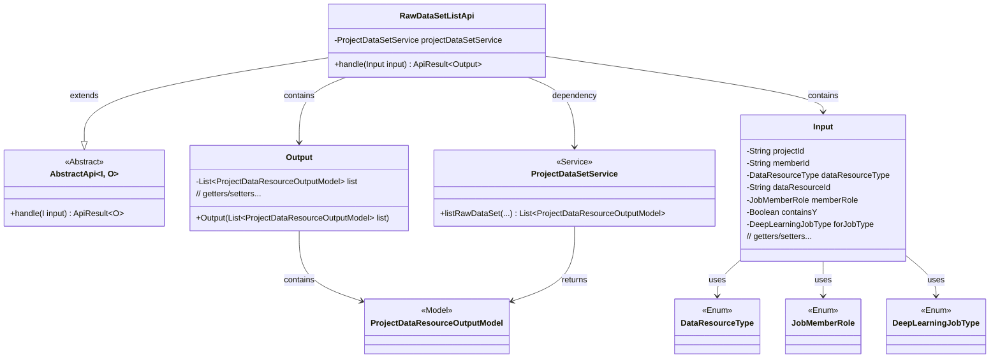

# Basic Information

|      |      |
|------|------|
| Name | RawDataSetListApi |
| Language | .java |
| Code Path | WeFe/board/board-service/src/main/java/com/welab/wefe/board/service/api/project/dataset/RawDataSetListApi.java |
| Package Name | com.welab.wefe.board.service.api.project.dataset |
| Dependencies | ['com.welab.wefe.board.service.dto.entity.project.data_set.ProjectDataResourceOutputModel', 'com.welab.wefe.board.service.service.ProjectDataSetService', 'com.welab.wefe.common.exception.StatusCodeWithException', 'com.welab.wefe.common.fieldvalidate.annotation.Check', 'com.welab.wefe.common.web.api.base.AbstractApi', 'com.welab.wefe.common.web.api.base.Api', 'com.welab.wefe.common.web.dto.AbstractApiInput', 'com.welab.wefe.common.web.dto.ApiResult', 'com.welab.wefe.common.wefe.enums.DataResourceType', 'com.welab.wefe.common.wefe.enums.DeepLearningJobType', 'com.welab.wefe.common.wefe.enums.JobMemberRole', 'org.springframework.beans.factory.annotation.Autowired', 'java.util.List'] |
| Brief Description | API for retrieving the original dataset list in a project requires parameters such as project ID, member ID, and dataset type, and returns the dataset list. |

# Description

The code defines an API class named `RawDataSetListApi`, which is used to retrieve a list of raw datasets in a project. The API path is `project/raw_data_set/list`, and it inherits from the `AbstractApi` class, with `Input` as the input class and `Output` as the output class. The `Input` class includes required and optional fields such as project ID, member ID, dataset type, data resource ID, member role, whether to include Y, and target task type. The `Output` class contains a list of datasets. The processing logic fetches data via the `listRawDataSet` method of `projectDataSetService` and returns a successful result. All input fields are annotated with validation and have getter/setter methods.

# Class Summary

| Name   | Type  | Description |
|-------|------|-------------|
| RawDataSetListApi | class | API to retrieve the original dataset list in a project, requiring parameters such as project ID, member ID, dataset type, etc., and returning the dataset list. |

## Class RawDataSetListApi

|      |      |
|------|------|
| Access Modifier | @Api(path = "project/raw_data_set/list", name = "Get the list of raw data sets in the project");public |
| Type | class |
| Name | RawDataSetListApi |
| Description | API to retrieve the original dataset list in a project, requiring parameters such as project ID, member ID, dataset type, etc., and returning the dataset list. |

### UML Class Diagram

This code describes an API class `RawDataSetListApi` for retrieving raw dataset lists in projects. The class inherits from the generic abstract class `AbstractApi`, with defined input parameter class `Input` and output result class `Output`. `Input` contains multiple fields with validation annotations, while `Output` encapsulates the dataset list. The API fetches data through the `ProjectDataSetService` service, involving multiple enum types and model classes. The class diagram clearly illustrates inheritance, dependency, and containment relationships between classes.

### Internal Method Call Graph

```mermaid
graph TD
    A["Class RawDataSetListApi"]
    B["Inherits: AbstractApi<Input, Output>"]
    C["Dependency: ProjectDataSetService"]
    D["Method: handle(Input input)"]
    E["Calls: projectDataSetService.listRawDataSet"]
    F["Returns: ApiResult<Output>"]
    G["Inner Class Input"]
    H["Properties: projectId, memberId (7 fields total)"]
    I["Inner Class Output"]
    J["Property: List<ProjectDataResourceOutputModel> list"]

    A --> B
    A --> C
    A --> D
    D --> E
    E --> F
    A --> G
    G --> H
    A --> I
    I --> J
```

This code defines an API class named RawDataSetListApi for retrieving a list of raw datasets in a project. The class inherits from AbstractApi and implements the handle method, which fetches data by calling ProjectDataSetService's listRawDataSet method. It contains two static inner classes Input and Output - Input defines 7 request parameters with validation annotations, while Output encapsulates the returned data list. The flowchart illustrates class inheritance, method call chains, and inner class structure.

### Field List

| Name  | Type  | Description |
|-------|-------|------|
| projectDataSetService | ProjectDataSetService | Automatically inject the ProjectDataSetService instance. |

### Method List

| Name  | Type  | Description |
|-------|-------|------|
| handle | ApiResult<Output> | The method processes input parameters, invokes the service to retrieve a list of project data resources, and returns the successful result along with the list data. |

