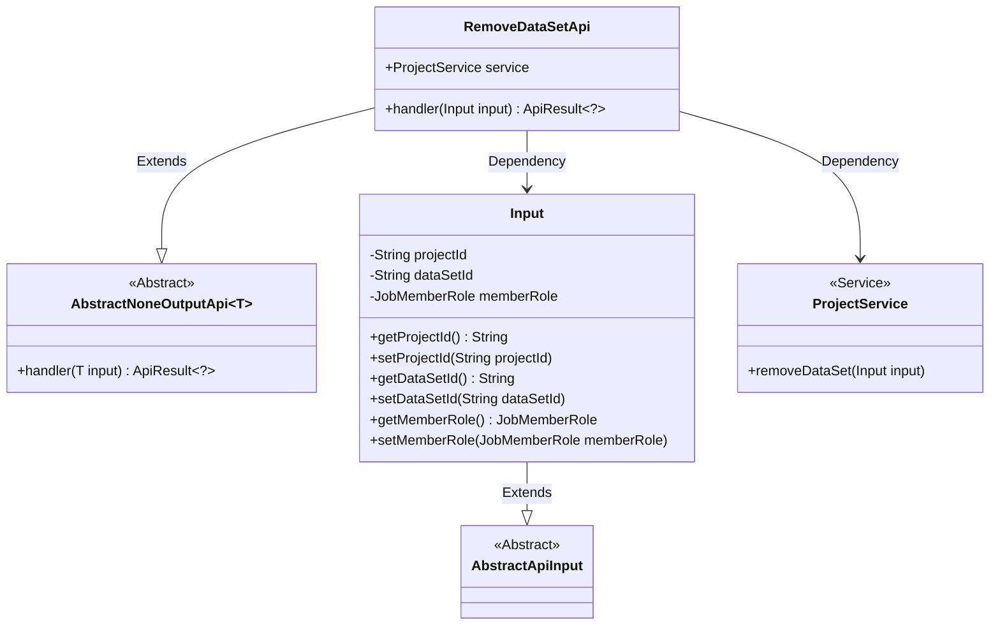

# Basic Information

|      |      |
|------|------|
| Name | RemoveDataSetApi |
| Language | .java |
| Code Path | WeFe/board/board-service/src/main/java/com/welab/wefe/board/service/api/project/dataset/RemoveDataSetApi.java |
| Package Name | com.welab.wefe.board.service.api.project.dataset |
| Dependencies | ['com.welab.wefe.board.service.service.ProjectService', 'com.welab.wefe.common.fieldvalidate.annotation.Check', 'com.welab.wefe.common.web.api.base.AbstractNoneOutputApi', 'com.welab.wefe.common.web.api.base.Api', 'com.welab.wefe.common.web.dto.AbstractApiInput', 'com.welab.wefe.common.web.dto.ApiResult', 'com.welab.wefe.common.wefe.enums.JobMemberRole', 'org.springframework.beans.factory.annotation.Autowired'] |
| Brief Description | API interface for deleting datasets in a project requires providing the project ID, dataset ID, and member role (required for original datasets). |

# Description

This is an API class for removing datasets from a project, with the path "project/data_resource/remove". It inherits from AbstractNoneOutputApi and takes an internal class Input as its parameter. Input includes three fields: a required project ID, a required dataset ID, and an optional member role (only required when deleting the original dataset). The API processes the deletion request via the removeDataSet method of ProjectService and returns an empty result upon success.

# Class Summary

| Name   | Type  | Description |
|-------|------|-------------|
| RemoveDataSetApi | class | API for deleting datasets in a project requires the project ID, dataset ID, and member role (only when deleting the original dataset). The operation is performed by calling the ProjectService. |

## Class RemoveDataSetApi

|      |      |
|------|------|
| Access Modifier | @Api(path = "project/data_resource/remove", name = "Delete the data set in the project");public |
| Type | class |
| Name | RemoveDataSetApi |
| Description | API for deleting datasets in a project requires the project ID, dataset ID, and member role (only when deleting the original dataset). The operation is performed by calling the ProjectService. |

### UML Class Diagram

This code demonstrates the implementation of an API for removing a dataset from a project. The RemoveDataSetApi inherits from AbstractNoneOutputApi, processes parameters of type Input, and executes the actual deletion operation through ProjectService. The Input class contains fields such as project ID, dataset ID, and member role, inheriting from AbstractApiInput. ProjectService provides the removeDataSet method to perform the deletion logic. The overall structure reflects clear hierarchical and dependency relationships, adhering to the principles of encapsulation and single responsibility in API design.

### Internal Method Call Graph

```mermaid
graph TD
    A["Class RemoveDataSetApi"]
    B["Inheritance: AbstractNoneOutputApi<Input>"]
    C["Annotation: @Api(path='project/data_resource/remove', name='Delete the data set in the project')"]
    D["Dependency Injection: @Autowired ProjectService service"]
    E["Overridden Method: handler(Input input)"]
    F["Inner Class: Input"]
    G["Field: String projectId @Check(name='Project ID', require=true)"]
    H["Field: String dataSetId @Check(name='Dataset ID', require=true)"]
    I["Field: JobMemberRole memberRole @Check(name='Member Role', desc='Required role for deleting original dataset')"]
    J["Method: getter/setter"]

    A --> B
    A --> C
    A --> D
    A --> E
    A --> F
    F --> G
    F --> H
    F --> I
    F --> J
    E --> D
    E --> K["Invocation: service.removeDataSet(input)"]
    E --> L["Return: success()"]
```

This code describes an API class RemoveDataSetApi for deleting datasets in a project, which inherits from AbstractNoneOutputApi with specified input parameter type Input. The class contains an @Autowired-injected ProjectService and overrides the handler method to process deletion logic. The inner Input class defines three fields with validation annotations (project ID, dataset ID, member role) and their getter/setter methods. The flowchart clearly illustrates the class structure, inheritance relationship, dependency injection, and core method invocation chain.

### Field List

| Name  | Type  | Description |
|-------|-------|------|
| service | ProjectService | Automatically inject the ProjectService instance. |

### Method List

| Name  | Type  | Description |
|-------|-------|------|
| handler | ApiResult<?> | Method override, call the service to remove the dataset, with input parameter as input, and return the result upon success. |

