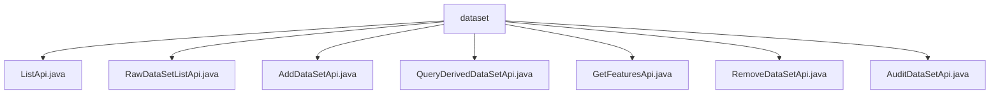

# Basic Information

|      |      |
|------|------|
| Name | dataset |
| Language | .java |
| Code Path | WeFe/board/board-service/src/main/java/com/welab/wefe/board/service/api/project/dataset |
| Package Name | docs.board.board-service.src.main.java.com.welab.wefe.board.service.api.project.dataset |
| Brief Description | ListApi lists project datasets, RawDataSetListApi retrieves the raw dataset list, AddDataSetApi adds a dataset, QueryDerivedDataSetApi queries derived datasets, GetFeaturesApi obtains feature lists, RemoveDataSetApi deletes a dataset, AuditDataSetApi audits dataset authorization. |

# Description

## Overview  
The core responsibility of this module is to manage the full lifecycle of project datasets, including operations such as list queries, addition, deletion, review, and feature retrieval, functioning as a CRUD management center for datasets. The interface specifications uniformly inherit from `AbstractApi` or its variants, with inputs and outputs encapsulated using internal classes. Mandatory fields are ensured through validation annotations, such as the project ID (`projectId`), which is universally required.  

Key data structures include the `Input` class (containing fields like project ID and dataset ID), the `Output` class (containing dataset lists or paginated results), and the derived dataset model (`DerivedProjectDataSetOutputModel`). External dependencies are concentrated in backend services like `ProjectDataSetService` and `ProjectService`, with business logic implemented via `Autowired` injection. For example, `ProjectDataSetService` provides methods such as `listRawDataSet`.  

## Key Business Scenarios  
The workflow covers the entire process from dataset creation to cleanup: adding resources via `AddDataSetApi` (e.g., the `dataResourceList` field), querying by type using `ListApi`/`RawDataSetListApi`, paginated retrieval of derived datasets via `QueryDerivedDataSetApi`, feature metadata retrieval via `GetFeaturesApi`, resource cleanup via `RemoveDataSetApi`, and authorization review handling via `AuditDataSetApi`.  

The interaction mode uniformly employs service-layer calls, such as `ProjectService.removeDataSet` for deletion. Typical applications include member collaboration (relying on the `memberId` field) and data provenance (tracking via source process IDs). API types encompass query classes (e.g., `ListApi`), modification classes (e.g., `AddDataSetApi`), and review classes. Integration examples include feature list queries requiring simultaneous validation of `projectId` and `dataSetId`.

### Package Internal Structure View

This flowchart illustrates the hierarchical structure of the project's dataset APIs, with the root node being the dataset folder containing seven Java API files: ListApi, RawDataSetListApi, AddDataSetApi, etc. These API files reside at the same level without nested relationships, collectively forming a functional suite for dataset operations, including core modules such as list queries, data addition, and feature retrieval.

# File List

| Name   | Type  | Description |
|-------|------|-------------|
| [ListApi.java](ListApi.md) | file | The ListApi class is used to list project datasets, accepting parameters such as project ID, dataset type, and member ID, and returning a dataset list. |
| [RawDataSetListApi.java](RawDataSetListApi.md) | file | API to retrieve the original dataset list in a project. Requires parameters such as project ID, member ID, and dataset type, and returns the dataset list. |
| [AddDataSetApi.java](AddDataSetApi.md) | file | This is an API class for adding datasets to a project, which takes the project ID and a list of datasets as input parameters and invokes the `addProjectDataSet` method of `ProjectService` to process the request. |
| [QueryDerivedDataSetApi.java](QueryDerivedDataSetApi.md) | file | Query the API for derived datasets of a project requires providing the project ID and dataset type, with optional source type, process ID, task ID, and dataset ID, returning paginated results. |
| [GetFeaturesApi.java](GetFeaturesApi.md) | file | Get the feature list of a dataset in the project, including data type information. Requires providing the project ID, member ID, and dataset ID. Returns the feature list result. |
| [RemoveDataSetApi.java](RemoveDataSetApi.md) | file | API interface for deleting datasets in a project requires providing the project ID, dataset ID, and member role (required for original datasets). |
| [AuditDataSetApi.java](AuditDataSetApi.md) | file | This is an API class for authorizing project dataset reviews, containing mandatory fields such as project ID, dataset ID, review status, and comments. A reason must be provided when rejecting. |

