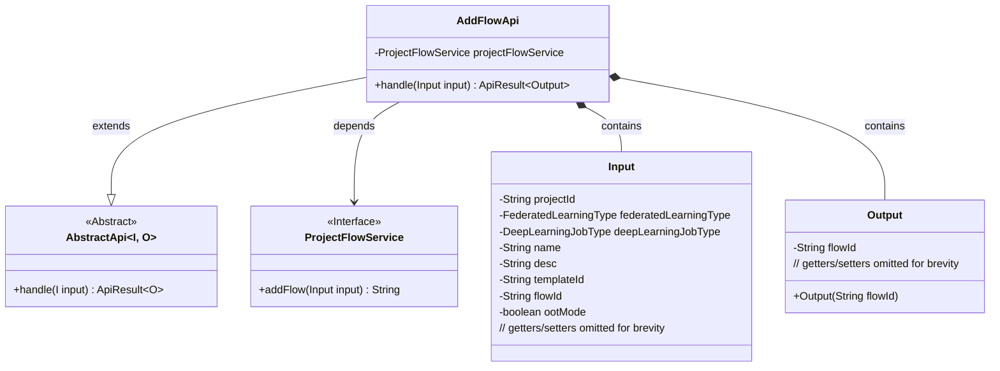

# Basic Information

|      |      |
|------|------|
| Name | AddFlowApi |
| Language | .java |
| Code Path | WeFe/board/board-service/src/main/java/com/welab/wefe/board/service/api/project/flow/AddFlowApi.java |
| Package Name | com.welab.wefe.board.service.api.project.flow |
| Dependencies | ['com.welab.wefe.board.service.service.ProjectFlowService', 'com.welab.wefe.common.exception.StatusCodeWithException', 'com.welab.wefe.common.fieldvalidate.annotation.Check', 'com.welab.wefe.common.web.api.base.AbstractApi', 'com.welab.wefe.common.web.api.base.Api', 'com.welab.wefe.common.web.dto.AbstractApiInput', 'com.welab.wefe.common.web.dto.ApiResult', 'com.welab.wefe.common.wefe.enums.DeepLearningJobType', 'com.welab.wefe.common.wefe.enums.FederatedLearningType', 'org.springframework.beans.factory.annotation.Autowired'] |
| Brief Description | The AddFlowApi class is used to add project workflows, accepting inputs such as project ID, federation type, task type, etc. It invokes the ProjectFlowService to generate and return a workflow ID. The input includes both mandatory and optional parameters, and the output is the workflow ID. |

# Description

The code defines an API class named `AddFlowApi`, designed to handle requests for adding new project workflows. The API path is `project/flow/add`, and its name is `New project flow`. It inherits from `AbstractApi`, with the input type as `Input` and the output type as `Output`.  

The `Input` class includes multiple required and optional fields, such as project ID, federated learning type, deep learning task type, workflow name, description, template ID, etc., along with corresponding getter and setter methods. The `Output` class contains only a single workflow ID field.  

The API processing logic is implemented by invoking the `addFlow` method of `ProjectFlowService`. Upon success, it returns an `Output` object containing the workflow ID.

# Class Summary

| Name   | Type  | Description |
|-------|------|-------------|
| AddFlowApi | class | The AddFlowApi class is used to add project workflows. It takes inputs such as project ID, federation type, and task type, then invokes projectFlowService.addFlow to generate and return a workflow ID. The inputs include both mandatory and optional parameters, and the output is the workflow ID. |

## Class AddFlowApi

|      |      |
|------|------|
| Access Modifier | @Api(path = "project/flow/add", name = "New project flow");public |
| Type | class |
| Name | AddFlowApi |
| Description | The AddFlowApi class is used to add project workflows. It takes inputs such as project ID, federation type, and task type, then invokes projectFlowService.addFlow to generate and return a workflow ID. The inputs include both mandatory and optional parameters, and the output is the workflow ID. |

### UML Class Diagram

This class diagram illustrates the structure of AddFlowApi, which is an API class for handling new project flows, inheriting from the generic abstract class AbstractApi. It includes two inner classes Input and Output as request parameters and response data structures, implementing core business logic through the ProjectFlowService interface. The diagram clearly presents inheritance, dependency, and composition relationships between classes, reflecting the complete process of API request handling.

### Internal Method Call Graph

```mermaid
graph TD
    A["Class AddFlowApi"]
    B["Annotation: @Api(path='project/flow/add', name='New project flow')"]
    C["Inheritance: AbstractApi<Input, Output>"]
    D["Dependency Injection: @Autowired ProjectFlowService"]
    E["Overridden Method: handle(Input input)"]
    F["Invocation: projectFlowService.addFlow(input)"]
    G["Return: success(new Output(flowId))"]
    H["Nested Class Input"]
    I["Nested Class Output"]
    J["Input Properties: projectId, federatedLearningType, etc."]
    K["Input Methods: getter/setter"]
    L["Output Constructor: Output(String flowId)"]
    M["Output Methods: getFlowId/setFlowId"]

    A --> B
    A --> C
    A --> D
    A --> E
    E --> F
    F --> G
    A --> H
    A --> I
    H --> J
    H --> K
    I --> L
    I --> M
```

This flowchart illustrates the core structure of the AddFlowApi class, including class annotations, inheritance relationships, service injection, and the main method invocation chain. It highlights the complete process where the handle method creates a flow through projectFlowService and returns the result, while clearly presenting the property and method structures of the two nested classes Input/Output. After strict validation of input parameters, a flow ID is generated and ultimately encapsulated as an ApiResult for return.

### Field List

| Name  | Type  | Description |
|-------|-------|------|
| projectFlowService | ProjectFlowService | Automatically inject the ProjectFlowService service instance. |

### Method List

| Name  | Type  | Description |
|-------|-------|------|
| handle | ApiResult<Output> | Method override, processes the input and returns an output containing the process ID. |

