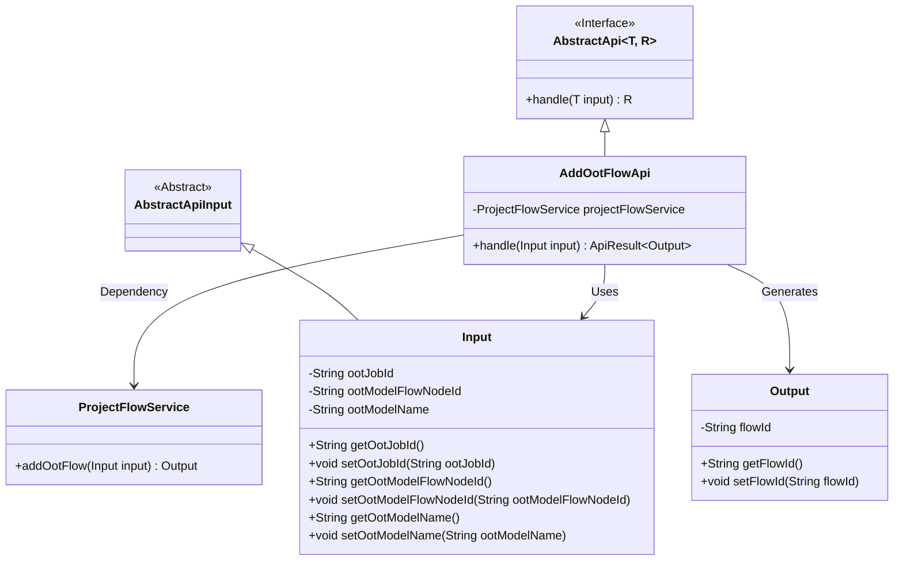
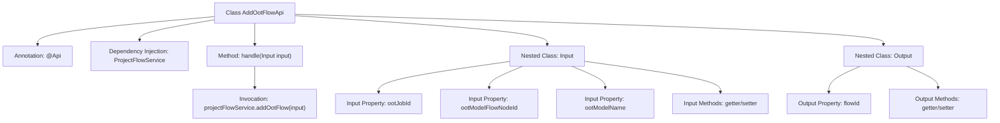

# Basic Information

|      |      |
|------|------|
| Name | AddOotFlowApi |
| Language | .java |
| Code Path | WeFe/board/board-service/src/main/java/com/welab/wefe/board/service/api/project/flow/AddOotFlowApi.java |
| Package Name | com.welab.wefe.board.service.api.project.flow |
| Dependencies | ['com.welab.wefe.board.service.service.ProjectFlowService', 'com.welab.wefe.common.exception.StatusCodeWithException', 'com.welab.wefe.common.fieldvalidate.annotation.Check', 'com.welab.wefe.common.web.api.base.AbstractApi', 'com.welab.wefe.common.web.api.base.Api', 'com.welab.wefe.common.web.dto.AbstractApiInput', 'com.welab.wefe.common.web.dto.ApiResult', 'org.springframework.beans.factory.annotation.Autowired'] |
| Brief Description | The `AddOotFlowApi` class is used to add an OOT flow, with inputs including the task ID, model node ID, and model name, and the output being the flow ID. |

# Description

The code defines an API class named `AddOotFlowApi`, designed to handle requests for adding OOT flows. The API path is `project/flow/add_oot`, and it processes input and returns results through the `addOotFlow` method of `ProjectFlowService`. The input class `Input` includes three fields: the required `ootJobId` (task ID) and `ootModelFlowNodeId` (model node ID), along with the optional `ootModelName` (model name). The output class `Output` contains a `flowId` field, representing the generated flow ID. This API inherits from `AbstractApi` and uses `ApiResult` to wrap the returned results.

# Class Summary

| Name   | Type  | Description |
|-------|------|-------------|
| AddOotFlowApi | class | The API class `AddOotFlowApi` is used to add an OOT flow. The input includes the task ID, model node ID, and model name, while the output is the flow ID. |

## Class AddOotFlowApi

|      |      |
|------|------|
| Access Modifier | @Api(path = "project/flow/add_oot", name = "Add OOT process");public |
| Type | class |
| Name | AddOotFlowApi |
| Description | The API class `AddOotFlowApi` is used to add an OOT flow. The input includes the task ID, model node ID, and model name, while the output is the flow ID. |

### UML Class Diagram

This code demonstrates the class structure of an API for handling OOT flow addition. The AddOotFlowApi inherits from the generic abstract class AbstractApi and utilizes ProjectFlowService for business logic processing. The Input class extends AbstractApiInput, containing fields related to OOT job and model IDs, while the Output class includes the generated flow ID. The overall design reflects clear dependency relationships and a layered architecture.

### Internal Method Call Graph

This code demonstrates the structure of an API class for handling OOT (Out Of Time) flow addition. The AddOotFlowApi class extends AbstractApi and contains nested input/output classes along with core business logic. The flowchart clearly presents the main components of the class: API annotation, service injection, handler method, input/output data structures with their properties and methods, as well as key business service invocation relationships. The input class includes three fields with validation annotations, while the output class contains a flow ID field, with core processing logic delegated to projectFlowService.

### Field List

| Name  | Type  | Description |
|-------|-------|------|
| projectFlowService | ProjectFlowService | Using @Autowired to automatically inject an instance of ProjectFlowService. |

### Method List

| Name  | Type  | Description |
|-------|-------|------|
| handle | ApiResult<Output> | Process the input and invoke the service to add the workflow, then return a successful result or exception. |

