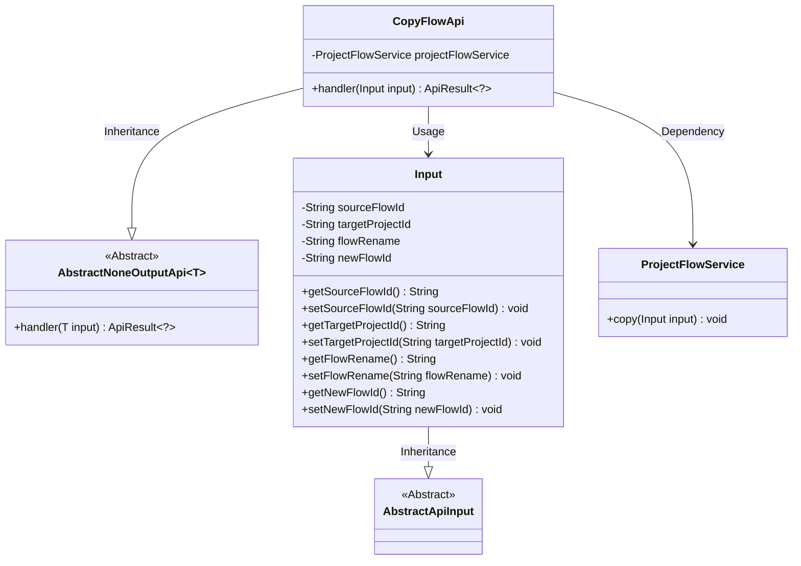

# Basic Information

|      |      |
|------|------|
| Name | CopyFlowApi |
| Language | .java |
| Code Path | WeFe/board/board-service/src/main/java/com/welab/wefe/board/service/api/project/flow/CopyFlowApi.java |
| Package Name | com.welab.wefe.board.service.api.project.flow |
| Dependencies | ['com.welab.wefe.board.service.service.ProjectFlowService', 'com.welab.wefe.common.exception.StatusCodeWithException', 'com.welab.wefe.common.fieldvalidate.annotation.Check', 'com.welab.wefe.common.web.api.base.AbstractNoneOutputApi', 'com.welab.wefe.common.web.api.base.Api', 'com.welab.wefe.common.web.dto.AbstractApiInput', 'com.welab.wefe.common.web.dto.ApiResult', 'org.springframework.beans.factory.annotation.Autowired'] |
| Brief Description | The CopyFlowApi is used to copy a workflow, requiring the source workflow ID and target project ID, with optional parameters for a new workflow ID and renaming. It invokes the ProjectFlowService to perform the copy operation. |

# Description

The code defines an API class named CopyFlowApi, which handles flow copy operations. The API path is project/flow/copy, inheriting from AbstractNoneOutputApi with the input type as the inner class Input. The copy operation is executed via ProjectFlowService, with input parameters including the mandatory source flow ID and target project ID, as well as optional flow rename and new flow ID. The Input class contains four fields and their getter/setter methods, all validated through the Check annotation.

# Class Summary

| Name   | Type  | Description |
|-------|------|-------------|
| CopyFlowApi | class | The CopyFlowApi class is used to copy workflows, including input parameters such as the source workflow ID, target project ID, workflow rename, and new workflow ID, and it invokes the ProjectFlowService to perform the copy operation. |

## Class CopyFlowApi

|      |      |
|------|------|
| Access Modifier | @Api(path = "project/flow/copy", name = "copy flow");public |
| Type | class |
| Name | CopyFlowApi |
| Description | The CopyFlowApi class is used to copy workflows, including input parameters such as the source workflow ID, target project ID, workflow rename, and new workflow ID, and it invokes the ProjectFlowService to perform the copy operation. |

### UML Class Diagram

This code describes the implementation structure of a flow copy API. The CopyFlowApi inherits from the generic abstract class AbstractNoneOutputApi, specifically handling parameters of type Input. The Input class contains four fields with validation annotations, storing the source flow ID, target project ID, rename, and new flow ID. The CopyFlowApi completes the core copy logic through the injected ProjectFlowService, demonstrating a clear hierarchical structure and dependency relationships, which aligns with the design principle of separating API interfaces from business logic.

### Internal Method Call Graph

```mermaid
graph TD
    A["Class CopyFlowApi"]
    B["Annotation: @Api(path='project/flow/copy', name='copy flow')"]
    C["Inheritance: AbstractNoneOutputApi<Input>"]
    D["Dependency Injection: @Autowired ProjectFlowService"]
    E["Overridden Method: handler(Input input)"]
    F["Inner Class: Input"]
    G["Field: String sourceFlowId"]
    H["Field: String targetProjectId"]
    I["Field: String flowRename"]
    J["Field: String newFlowId"]
    K["getter/setter methods"]

    A --> B
    A --> C
    A --> D
    A --> E
    A --> F
    F --> G
    F --> H
    F --> I
    F --> J
    F --> K
    E --> D
    E -->|invokes| F
```

This code defines a CopyFlowApi class for duplicating workflows, which inherits from AbstractNoneOutputApi and contains an Input inner class. Its primary functionality is to implement workflow copying via ProjectFlowService.copy() method, with the Input class encapsulating essential parameters like source flow ID and target project ID. The flowchart illustrates the class structure, annotations, inheritance relationships, dependency injection, and inner class composition, where the handler method serves as the core logic to invoke ProjectFlowService and process Input parameters.

### Field List

| Name  | Type  | Description |
|-------|-------|------|
| projectFlowService | ProjectFlowService | Automatically inject the ProjectFlowService instance. |

### Method List

| Name  | Type  | Description |
|-------|-------|------|
| handler | ApiResult<?> | Rewrite the handler method to call projectFlowService.copy for processing the input, returning ApiResult upon success. Throw StatusCodeWithException in case of exceptions. |

