# Basic Information

|      |      |
|------|------|
| Name | DeleteApi |
| Language | .java |
| Code Path | WeFe/board/board-service/src/main/java/com/welab/wefe/board/service/api/project/flow/DeleteApi.java |
| Package Name | com.welab.wefe.board.service.api.project.flow |
| Dependencies | ['com.welab.wefe.board.service.dto.base.PagingInput', 'com.welab.wefe.board.service.dto.base.PagingOutput', 'com.welab.wefe.board.service.dto.entity.project.ProjectFlowListOutputModel', 'com.welab.wefe.board.service.service.ProjectFlowService', 'com.welab.wefe.common.exception.StatusCodeWithException', 'com.welab.wefe.common.fieldvalidate.annotation.Check', 'com.welab.wefe.common.web.api.base.AbstractApi', 'com.welab.wefe.common.web.api.base.Api', 'com.welab.wefe.common.web.dto.ApiResult', 'org.springframework.beans.factory.annotation.Autowired'] |
| Brief Description | The DeleteApi class is used to delete project workflows. It takes a workflow ID as a parameter, invokes the flowService to perform the deletion operation, and returns a success result. |

# Description

The code defines an API class named `DeleteApi`, designed to handle requests for deleting project flows. The class path is `project/flow/delete`, which inherits from `AbstractApi`, with the input type being `DeleteApi.Input` and the output type being `PagingOutput<ProjectFlowListOutputModel>`. It executes the deletion operation by injecting `ProjectFlowService` and calling the `delete` method. The input class `Input` inherits from `PagingInput` and includes a required field `flowId` representing the flow ID, along with corresponding getter and setter methods. Upon successful processing, it returns an `ApiResult`-encapsulated success response.

# Class Summary

| Name   | Type  | Description |
|-------|------|-------------|
| DeleteApi | class | This is an API class for the project deletion flow, with the path "project/flow/delete". It uses ProjectFlowService to handle deletion requests, takes flowId as the input parameter, and returns paginated results. |


## Class DeleteApi

|      |      |
|------|------|
| Access Modifier | @Api(path = "project/flow/delete", name = "delete flow");public |
| Type | class |
| Name | DeleteApi |
| Description | This is an API class for the project deletion flow, with the path "project/flow/delete". It uses ProjectFlowService to handle deletion requests, takes flowId as the input parameter, and returns paginated results. |


### UML Class Diagram

```mermaid
classDiagram
    class DeleteApi {
        -ProjectFlowService flowService
        +handle(Input input) ApiResult~PagingOutput~ProjectFlowListOutputModel~~
    }
    class Input {
        -String flowId
        +String getFlowId()
        +void setFlowId(String flowId)
    }
    class PagingInput {
        <<Abstract>>
    }
    class PagingOutput~T~ {
        <<Generic>>
    }
    class ProjectFlowListOutputModel {
    }
    class ApiResult~T~ {
        <<Generic>>
    }
    class StatusCodeWithException {
        <<Exception>>
    }
    class ProjectFlowService {
        <<Service>>
        +delete(Input input) void
    }

    DeleteApi --> ProjectFlowService : Dependency
    DeleteApi --> Input : Uses
    Input --|> PagingInput : Inheritance
    DeleteApi ..|> AbstractApi~Input, PagingOutput~ProjectFlowListOutputModel~~ : Implements
    PagingOutput~ProjectFlowListOutputModel~~ --> ProjectFlowListOutputModel : Contains
    DeleteApi ..> ApiResult~PagingOutput~ProjectFlowListOutputModel~~ : Returns
    DeleteApi ..> StatusCodeWithException : Throws
```

This code demonstrates the implementation of a Delete API, where the DeleteApi class inherits from the AbstractApi generic class to handle flow deletion requests. It depends on ProjectFlowService to perform the actual deletion operation, using the internal Input class as request parameters that inherit from PagingInput. The API returns paginated output results encapsulated in ApiResult and may throw StatusCodeWithException exceptions. The class diagram clearly illustrates the inheritance, dependency, and association relationships between components.


### Internal Method Call Graph

```mermaid
graph TD
    A["Class DeleteApi"]
    B["Annotation: @Api(path='project/flow/delete', name='delete flow')"]
    C["Inheritance: AbstractApi<Input, PagingOutput<ProjectFlowListOutputModel>>"]
    D["Dependency Injection: @Autowired ProjectFlowService flowService"]
    E["Overridden Method: handle(Input input)"]
    F["Inner Class: Input"]
    G["Field: @Check(name='Flow ID') String flowId"]
    H["getter/setter: getFlowId()/setFlowId()"]
    I["Method Invocation: flowService.delete(input)"]
    J["Return Result: success()"]

    A --> B
    A --> C
    A --> D
    A --> E
    E --> I
    E --> J
    A --> F
    F --> G
    F --> H
```



This code demonstrates a Spring framework-based API class DeleteApi designed to handle project flow deletion requests. The class inherits from the abstract template class AbstractApi, injects ProjectFlowService via @Autowired, and implements specific business logic by overriding the handle method. The inner class Input defines the request parameter structure, including a flow ID field with validation annotations. The flowchart clearly presents the class structure, dependency relationships, and method invocation chain, illustrating the complete process from request handling to service invocation.

### Field List

| Name  | Type  | Description |
|-------|-------|------|
| flowService | ProjectFlowService | Automatically inject the ProjectFlowService instance flowService. |

### Method List

| Name  | Type  | Description |
|-------|-------|------|
| handle | ApiResult<PagingOutput<ProjectFlowListOutputModel>> | Process the input and delete the flow, returning a successful result. |


