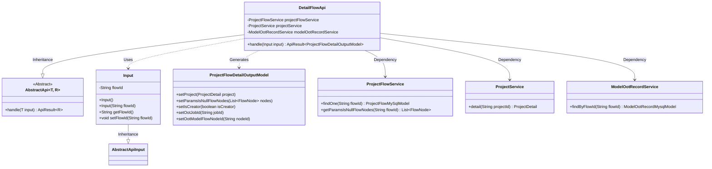
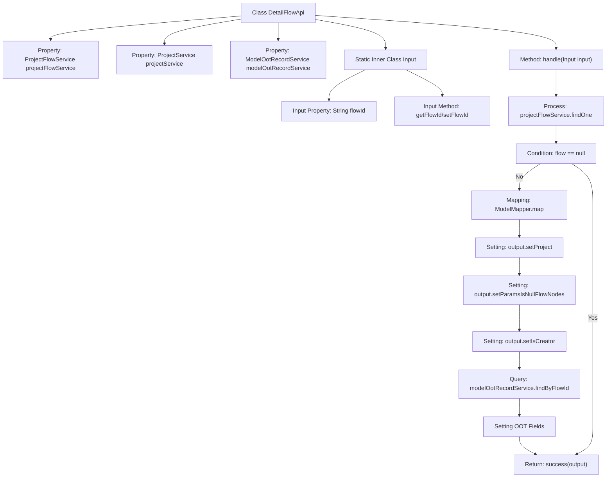

# Basic Information

|      |      |
|------|------|
| Name | DetailFlowApi |
| Language | .java |
| Code Path | WeFe/board/board-service/src/main/java/com/welab/wefe/board/service/api/project/flow/DetailFlowApi.java |
| Package Name | com.welab.wefe.board.service.api.project.flow |
| Dependencies | ['com.welab.wefe.board.service.database.entity.job.ModelOotRecordMysqlModel', 'com.welab.wefe.board.service.database.entity.job.ProjectFlowMySqlModel', 'com.welab.wefe.board.service.dto.entity.project.ProjectFlowDetailOutputModel', 'com.welab.wefe.board.service.service.CacheObjects', 'com.welab.wefe.board.service.service.ModelOotRecordService', 'com.welab.wefe.board.service.service.ProjectFlowService', 'com.welab.wefe.board.service.service.ProjectService', 'com.welab.wefe.common.exception.StatusCodeWithException', 'com.welab.wefe.common.fieldvalidate.annotation.Check', 'com.welab.wefe.common.web.api.base.AbstractApi', 'com.welab.wefe.common.web.api.base.Api', 'com.welab.wefe.common.web.dto.AbstractApiInput', 'com.welab.wefe.common.web.dto.ApiResult', 'com.welab.wefe.common.web.util.ModelMapper', 'org.springframework.beans.factory.annotation.Autowired'] |
| Brief Description | The DetailFlowApi class handles requests for retrieving flow details, queries flow information by flowId, including project details, nodes with empty parameters, creator identifiers, and OOT model records, and returns a ProjectFlowDetailOutputModel result. |

# Description

The DetailFlowApi is an API class designed to retrieve workflow details, inheriting from AbstractApi. It takes an Input class as input and outputs a ProjectFlowDetailOutputModel. By injecting ProjectFlowService, ProjectService, and ModelOotRecordService, it processes the request. The core logic includes querying workflow information based on the flowId. If the workflow exists, it maps the data to the output model and sets project details, empty parameter workflow nodes, creator identifiers, and OOT model-related information. The Input class contains a mandatory flowId field along with its getter and setter methods.

# Class Summary

| Name   | Type  | Description |
|-------|------|-------------|
| DetailFlowApi | class | The DetailFlowApi class handles requests for retrieving process details. It queries process information by flowId, supplements project details, parameters for empty nodes, and creator identifiers, checks OOT model records, and returns the process detail output model. |

## Class DetailFlowApi

|      |      |
|------|------|
| Access Modifier | @Api(path = "project/flow/detail", name = "get flow detail");public |
| Type | class |
| Name | DetailFlowApi |
| Description | The DetailFlowApi class handles requests for retrieving process details. It queries process information by flowId, supplements project details, parameters for empty nodes, and creator identifiers, checks OOT model records, and returns the process detail output model. |

### UML Class Diagram

This code implements an API interface for retrieving flow details, inheriting from the abstract class AbstractApi. Its primary functionality is to query flow information via flowId and assemble an output object containing project details, parameter-null-node flags, creator identification, and OOT model information. The class diagram illustrates relationships between core classes: DetailFlowApi depends on three service classes for data queries, uses Input as the input parameter, and generates ProjectFlowDetailOutputModel as the response result. The overall design adheres to a layered architecture, isolating data access logic through service classes.

### Internal Method Call Graph

This code implements the DetailFlowApi class, primarily used to retrieve project flow details. The flowchart illustrates the process starting from input parameter handling, querying flow data via projectFlowService, performing null checks, mapping output models, and setting relevant attributes including project details, flow nodes with null parameters, creator identification, and OOT model information, before finally returning the processed result. The entire process encompasses key steps such as data querying, model transformation, conditional checks, and result assembly.

### Field List

| Name  | Type  | Description |
|-------|-------|------|
| projectFlowService | ProjectFlowService | The code snippet uses the @Autowired annotation to automatically inject an instance of ProjectFlowService. |
| projectService | ProjectService | Using @Autowired to automatically inject an instance of ProjectService. |
| modelOotRecordService | ModelOotRecordService | Using @Autowired to automatically inject an instance of ModelOotRecordService. |

### Method List

| Name  | Type  | Description |
|-------|-------|------|
| handle | ApiResult<ProjectFlowDetailOutputModel> | Processing the project flow details request, querying flow information and mapping the output model, supplementing project details, parameter empty nodes, and creator identifiers. If OOT model records exist, adding the relevant IDs, and finally returning the result. |

