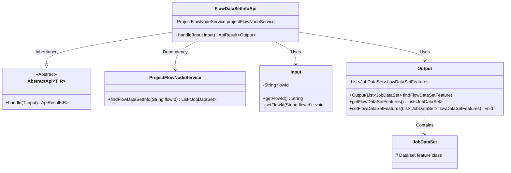

# Basic Information

|      |      |
|------|------|
| Name | FlowDataSetInfoApi |
| Language | .java |
| Code Path | WeFe/board/board-service/src/main/java/com/welab/wefe/board/service/api/project/flow/FlowDataSetInfoApi.java |
| Package Name | com.welab.wefe.board.service.api.project.flow |
| Dependencies | ['com.welab.wefe.board.service.dto.kernel.machine_learning.JobDataSet', 'com.welab.wefe.board.service.service.ProjectFlowNodeService', 'com.welab.wefe.common.exception.StatusCodeWithException', 'com.welab.wefe.common.fieldvalidate.annotation.Check', 'com.welab.wefe.common.web.api.base.AbstractApi', 'com.welab.wefe.common.web.api.base.Api', 'com.welab.wefe.common.web.dto.AbstractApiInput', 'com.welab.wefe.common.web.dto.ApiResult', 'org.springframework.beans.factory.annotation.Autowired', 'java.util.List'] |
| Brief Description | The FlowDataSetInfoApi class retrieves dataset information via flowId. The input requires flowId validation, and the output includes a JobDataSet list. |

# Description

The code defines an API class named `FlowDataSetInfoApi`, which is used to retrieve flow dataset information. The API path is `flow/dataset/info`, inheriting from the `AbstractApi` class with generics specifying the input and output types. The input class `Input` includes a required field `flowId`, while the output class `Output` contains a list of flow dataset features `flowDataSetFeatures`. The processing logic queries flow dataset information via `projectFlowNodeService` and returns the result. The entire API implements a standard request-response pattern, including input parameter validation and result encapsulation functionality.

# Class Summary

| Name   | Type  | Description |
|-------|------|-------------|
| FlowDataSetInfoApi | class | The FlowDataSetInfoApi class retrieves dataset information via flowId. The input must include flowId, and the output returns a JobDataSet list. |

## Class FlowDataSetInfoApi

|      |      |
|------|------|
| Access Modifier | @Api(path = "flow/dataset/info", name = "Get information about the flow data set");public |
| Type | class |
| Name | FlowDataSetInfoApi |
| Description | The FlowDataSetInfoApi class retrieves dataset information via flowId. The input must include flowId, and the output returns a JobDataSet list. |

### UML Class Diagram

This class diagram illustrates the structure and relationships of FlowDataSetInfoApi. FlowDataSetInfoApi inherits from the generic abstract class AbstractApi, processing input and output types as Input and Output respectively. It relies on ProjectFlowNodeService to retrieve workflow dataset information, where the Output class contains a list of JobDataSet. The Input class encapsulates flow ID validation logic, collectively forming a complete API processing flow.

### Internal Method Call Graph

```mermaid
graph TD
    A["Class FlowDataSetInfoApi"]
    B["Inheritance: AbstractApi<Input,Output>"]
    C["Annotation: @Api(path='flow/dataset/info', name='Get information about the flow data set')"]
    D["Dependency Injection: @Autowired ProjectFlowNodeService"]
    E["Overridden Method: handle(Input input)"]
    F["Inner Class: Input"]
    G["Inner Class: Output"]
    H["Input Property: String flowId"]
    I["Input Methods: getFlowId/setFlowId"]
    J["Output Property: List<JobDataSet> flowDataSetFeatures"]
    K["Output Methods: getFlowDataSetFeatures/setFlowDataSetFeatures"]
    L["Process: handle calls projectFlowNodeService.findFlowDataSetInfo"]
    M["Return: success(new Output(...))"]

    A --> B
    A --> C
    A --> D
    A --> E
    A --> F
    A --> G
    F --> H
    F --> I
    G --> J
    G --> K
    E --> L
    L --> M
```

This code demonstrates a Spring framework-based API class for retrieving flow dataset information. The flowchart clearly illustrates the class structure relationships, including inheritance from AbstractApi, dependency-injected services, definitions of inner input/output classes, and the call chain of the core handler method. The API queries flow data through projectFlowNodeService and encapsulates results in an Output object for return, reflecting a typical controller-layer design pattern.

### Field List

| Name  | Type  | Description |
|-------|-------|------|
| projectFlowNodeService | ProjectFlowNodeService | The code snippet uses @Autowired to automatically inject an instance of ProjectFlowNodeService. |

### Method List

| Name  | Type  | Description |
|-------|-------|------|
| handle | ApiResult<Output> | This method overrides the parent class's processing logic, takes an Input parameter, invokes a service to query process dataset information, encapsulates the result into an Output object, and returns a successful outcome. It may throw a StatusCodeWithException. |

