# Basic Information

|      |      |
|------|------|
| Name | FlowQueryApi |
| Language | .java |
| Code Path | WeFe/board/board-service/src/main/java/com/welab/wefe/board/service/api/project/flow/FlowQueryApi.java |
| Package Name | com.welab.wefe.board.service.api.project.flow |
| Dependencies | ['com.welab.wefe.board.service.dto.base.PagingInput', 'com.welab.wefe.board.service.dto.base.PagingOutput', 'com.welab.wefe.board.service.dto.entity.project.ProjectFlowListOutputModel', 'com.welab.wefe.board.service.service.ProjectFlowService', 'com.welab.wefe.common.exception.StatusCodeWithException', 'com.welab.wefe.common.fieldvalidate.annotation.Check', 'com.welab.wefe.common.web.api.base.AbstractApi', 'com.welab.wefe.common.web.api.base.Api', 'com.welab.wefe.common.web.dto.ApiResult', 'com.welab.wefe.common.wefe.enums.FederatedLearningType', 'com.welab.wefe.common.wefe.enums.ProjectFlowStatisticsStatus', 'org.springframework.beans.factory.annotation.Autowired', 'java.util.List'] |
| Brief Description | This is an API class for querying a list of project workflows. It accepts inputs such as pagination parameters, project ID, and workflow ID list, and returns paginated workflow list data. |

# Description

This is an API class named FlowQueryApi, designed for querying project flow lists. It inherits from AbstractApi, accepts an Input class as the input parameter, and returns a paginated ProjectFlowListOutputModel result. The Input class includes pagination parameters and multiple query condition fields, such as deletion status, project ID, flow ID list, federated learning type, status, and creator. The API processes query requests through the injected ProjectFlowService and returns successful results. All input fields have corresponding validation annotations explaining their purposes.

# Class Summary

| Name   | Type  | Description |
|-------|------|-------------|
| FlowQueryApi | class | The FlowQueryApi is used for paginated querying of project flow lists, accepting an Input that includes parameters such as deletion status, project ID, and flow ID list, and returning paginated results. The query logic is processed via the flowService. |


## Class FlowQueryApi

|      |      |
|------|------|
| Access Modifier | @Api(path = "project/flow/query", name = "query flow list");public |
| Type | class |
| Name | FlowQueryApi |
| Description | The FlowQueryApi is used for paginated querying of project flow lists, accepting an Input that includes parameters such as deletion status, project ID, and flow ID list, and returning paginated results. The query logic is processed via the flowService. |


### UML Class Diagram

```mermaid
classDiagram
    class FlowQueryApi {
        -ProjectFlowService flowService
        +handle(Input input) ApiResult~PagingOutput~ProjectFlowListOutputModel~~
    }
    
    class AbstractApi~T, R~ {
        <<Abstract>>
        +handle(T input) ApiResult~R~
    }
    
    class Input {
        -boolean deleted
        -String projectId
        -List~String~ flowIdList
        -FederatedLearningType federatedLearningType
        -ProjectFlowStatisticsStatus status
        -String creator
    }
    
    class PagingInput {
        <<Abstract>>
    }
    
    class PagingOutput~T~ {
        <<Interface>>
    }
    
    class ProjectFlowListOutputModel {
    }
    
    class ProjectFlowService {
        <<Interface>>
        +query(Input input) PagingOutput~ProjectFlowListOutputModel~
    }
    
    AbstractApi~Input, PagingOutput~ProjectFlowListOutputModel~~ <|-- FlowQueryApi
    Input --|> PagingInput
    FlowQueryApi --> ProjectFlowService : depends
    FlowQueryApi --> Input : uses
    ProjectFlowService ..> PagingOutput~ProjectFlowListOutputModel~ : returns
```

This code describes the implementation structure of a flow query API. The FlowQueryApi inherits from the generic abstract class AbstractApi, processes Input parameters, and returns paginated ProjectFlowListOutputModel results. The Input class extends PagingInput and contains multiple query condition fields. The ProjectFlowService interface provides query functionality, returning paginated output results. The overall architecture adopts a layered design, achieving type-safe data processing through generics and inheritance, complying with enterprise-level API development standards.


### Internal Method Call Graph

```mermaid
graph TD
    A["Class FlowQueryApi"]
    B["Inheritance: AbstractApi<Input, PagingOutput<ProjectFlowListOutputModel>>"]
    C["Dependency Injection: @Autowired ProjectFlowService"]
    D["Overridden Method: handle(Input input)"]
    E["Inner Class: Input"]
    F["Property: boolean deleted"]
    G["Property: String projectId"]
    H["Property: List<String> flowIdList"]
    I["Property: FederatedLearningType federatedLearningType"]
    J["Property: ProjectFlowStatisticsStatus status"]
    K["Property: String creator"]
    L["Inheritance: PagingInput"]

    A --> B
    A --> C
    A --> D
    A --> E
    E --> L
    E --> F
    E --> G
    E --> H
    E --> I
    E --> J
    E --> K
    D --> C
```



This code illustrates a Spring framework-based API class `FlowQueryApi`, which inherits from `AbstractApi` and handles paginated queries for workflow lists. The class contains an inner class `Input` to encapsulate query parameters, including deletion status, project ID, workflow ID list, etc. The actual query execution is performed by the `@Autowired` injected `ProjectFlowService`. The flowchart clearly depicts the class inheritance relationships, dependency injection, and the structure of inner class properties, demonstrating the complete request processing chain.

### Field List

| Name  | Type  | Description |
|-------|-------|------|
| flowService | ProjectFlowService | Use @Autowired to automatically inject the ProjectFlowService instance flowService. |

### Method List

| Name  | Type  | Description |
|-------|-------|------|
| handle | ApiResult<PagingOutput<ProjectFlowListOutputModel>> | Process the input and return a paginated query result of the project workflow list. |


