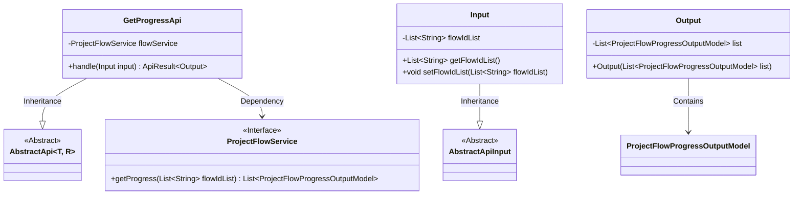

# Basic Information

|      |      |
|------|------|
| Name | GetProgressApi |
| Language | .java |
| Code Path | WeFe/board/board-service/src/main/java/com/welab/wefe/board/service/api/project/flow/GetProgressApi.java |
| Package Name | com.welab.wefe.board.service.api.project.flow |
| Dependencies | ['com.welab.wefe.board.service.dto.entity.project.ProjectFlowProgressOutputModel', 'com.welab.wefe.board.service.service.ProjectFlowService', 'com.welab.wefe.common.exception.StatusCodeWithException', 'com.welab.wefe.common.fieldvalidate.annotation.Check', 'com.welab.wefe.common.web.api.base.AbstractApi', 'com.welab.wefe.common.web.api.base.Api', 'com.welab.wefe.common.web.dto.AbstractApiInput', 'com.welab.wefe.common.web.dto.ApiResult', 'org.springframework.beans.factory.annotation.Autowired', 'java.util.List'] |
| Brief Description | API for retrieving the latest progress of specified workflows, with input as a list of workflow IDs and output as a list of progress data. |

# Description

This is an API class named GetProgressApi, designed to retrieve the latest progress of specified workflows. It inherits from AbstractApi, accepts Input parameters, and returns Output results. The Input includes a mandatory list of workflow IDs named flowIdList. The API utilizes the injected ProjectFlowService to call the getProgress method for fetching progress data, then encapsulates the results in the Output for return. The Output contains a list of ProjectFlowProgressOutputModel. The API path is project/flow/get_progress, featuring clear functionality and a well-structured design.

# Class Summary

| Name   | Type  | Description |
|-------|------|-------------|
| GetProgressApi | class | API for retrieving the latest progress of specified workflows, with workflow ID list as input and progress information list as output. |

## Class GetProgressApi

|      |      |
|------|------|
| Access Modifier | @Api(path = "project/flow/get_progress", name = "Get the latest progress of the specified flow");public |
| Type | class |
| Name | GetProgressApi |
| Description | API for retrieving the latest progress of specified workflows, with workflow ID list as input and progress information list as output. |

### UML Class Diagram

This code describes an API class `GetProgressApi` for retrieving the latest progress of specified workflows. It inherits from the generic abstract class `AbstractApi` and utilizes the `ProjectFlowService` to fetch workflow progress data. The input class `Input` contains a list of workflow IDs and inherits from `AbstractApiInput`, while the output class `Output` encapsulates the progress data list. The overall structure demonstrates a typical API layer implementation pattern, consisting of three main components: request handling, service invocation, and data encapsulation, achieving loose coupling through dependency injection and service interfaces.

### Internal Method Call Graph

This flowchart illustrates the structure and internal relationships of the GetProgressApi class. The main class includes API annotations, service injection, and a core processing method, where the handle method invokes flowService to retrieve progress data and returns encapsulated results. Two nested classes, Input and Output, handle input parameters and output data respectively. Input contains a flow ID list with its getter/setter methods, while Output encapsulates the progress result list. The diagram presents a complete call chain from request processing to data return.

### Field List

| Name  | Type  | Description |
|-------|-------|------|
| flowService | ProjectFlowService | Using @Autowired to automatically inject the ProjectFlowService instance flowService. |

### Method List

| Name  | Type  | Description |
|-------|-------|------|
| handle | ApiResult<Output> | Process the input and return a list of workflow progress. Invoke the flowService to retrieve the progress, encapsulate it as Output, and return a successful result. |

