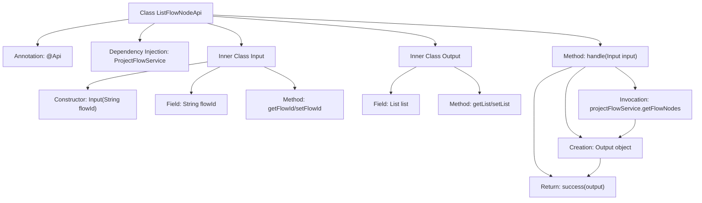

# Basic Information

|      |      |
|------|------|
| Name | ListFlowNodeApi |
| Language | .java |
| Code Path | WeFe/board/board-service/src/main/java/com/welab/wefe/board/service/api/project/flow/ListFlowNodeApi.java |
| Package Name | com.welab.wefe.board.service.api.project.flow |
| Dependencies | ['com.welab.wefe.board.service.dto.entity.job.ProjectFlowNodeOutputModel', 'com.welab.wefe.board.service.service.ProjectFlowService', 'com.welab.wefe.common.exception.StatusCodeWithException', 'com.welab.wefe.common.fieldvalidate.annotation.Check', 'com.welab.wefe.common.web.api.base.AbstractApi', 'com.welab.wefe.common.web.api.base.Api', 'com.welab.wefe.common.web.dto.AbstractApiInput', 'com.welab.wefe.common.web.dto.AbstractApiOutput', 'com.welab.wefe.common.web.dto.ApiResult', 'org.springframework.beans.factory.annotation.Autowired', 'java.io.IOException', 'java.util.List'] |
| Brief Description | The API retrieves a list of process nodes by process ID. The input must include the process ID, and the output returns the node list. |

# Description

The code defines an API class named `ListFlowNodeApi`, designed to query a list of flow nodes by flow ID. The API path is `project/flow_node/list`, and it relies on the `ProjectFlowService` to fetch data. The input class `Input` includes a required field `flowId`, while the output class `Output` contains a list of `ProjectFlowNodeOutputModel`. The processing logic retrieves the node list via the `getFlowNodes` method and encapsulates the output. The entire API inherits from `AbstractApi`, implementing a standard input-output processing flow.

# Class Summary

| Name   | Type  | Description |
|-------|------|-------------|
| ListFlowNodeApi | class | This is an API class for querying a list of process nodes, which retrieves the node list by process ID. The input is the process ID, and the output is the node list. It uses ProjectFlowService to handle the request and returns the result encapsulated in ApiResult. |


## Class ListFlowNodeApi

|      |      |
|------|------|
| Access Modifier | @Api(path = "project/flow_node/list", name = "query flow node list by flow id");public |
| Type | class |
| Name | ListFlowNodeApi |
| Description | This is an API class for querying a list of process nodes, which retrieves the node list by process ID. The input is the process ID, and the output is the node list. It uses ProjectFlowService to handle the request and returns the result encapsulated in ApiResult. |


### UML Class Diagram

```mermaid
classDiagram
    class ListFlowNodeApi {
        -ProjectFlowService projectFlowService
        +handle(Input input) ApiResult~Output~
    }
    <<Interface>> AbstractApi~Input,Output~
    ListFlowNodeApi --|> AbstractApi~Input,Output~ : extends
    ListFlowNodeApi --> ProjectFlowService : dependency

    class Input {
        -String flowId
        +Input(String flowId)
        +String getFlowId()
        +void setFlowId(String flowId)
    }
    Input --|> AbstractApiInput : extends

    class Output {
        -List~ProjectFlowNodeOutputModel~ list
        +List~ProjectFlowNodeOutputModel~ getList()
        +void setList(List~ProjectFlowNodeOutputModel~ list)
    }
    Output --|> AbstractApiOutput : extends

    class ProjectFlowService {
        +getFlowNodes(String flowId) List~ProjectFlowNodeOutputModel~
    }
    class ProjectFlowNodeOutputModel
```

This code demonstrates a flow node query functionality based on an abstract API framework. The ListFlowNodeApi class inherits from the generic AbstractApi, handling Input/Output parameter types, and retrieves flow node data through ProjectFlowService. The Input class contains the mandatory flowId field and inherits from AbstractApiInput, while the Output class encapsulates the node list results and inherits from AbstractApiOutput. The overall structure reflects clear hierarchical relationships and dependency calls, conforming to common patterns in API interface development.


### Internal Method Call Graph



This code represents a Spring framework-based API class for querying process node lists by flow ID. The flowchart illustrates the main class structure and its inner class relationships. The core processing flow involves: obtaining node data through ProjectFlowService, encapsulating the Output object, and returning a successful result. The Input class validates flow ID parameters, while the Output class packages the returned node list data. The entire design adheres to layered architecture principles with clear responsibility division.

### Field List

| Name  | Type  | Description |
|-------|-------|------|
| projectFlowService | ProjectFlowService | Use @Autowired to automatically inject an instance of ProjectFlowService. |

### Method List

| Name  | Type  | Description |
|-------|-------|------|
| handle | ApiResult<Output> | Process the input and return a list of workflow nodes. Returns an output containing the list upon success, or throws an exception upon failure. |


