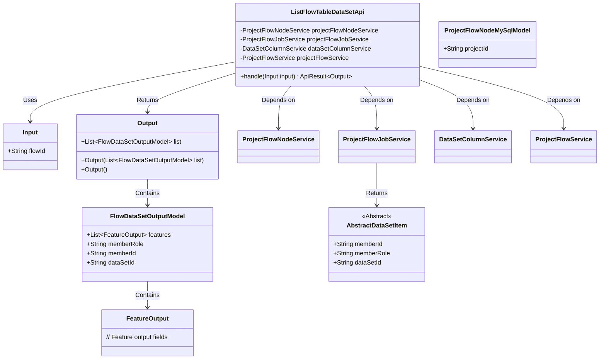
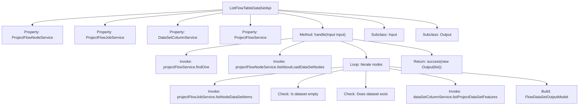

# Basic Information

|      |      |
|------|------|
| Name | ListFlowTableDataSetApi |
| Language | .java |
| Code Path | WeFe/board/board-service/src/main/java/com/welab/wefe/board/service/api/project/flow/ListFlowTableDataSetApi.java |
| Package Name | com.welab.wefe.board.service.api.project.flow |
| Dependencies | ['com.welab.wefe.board.service.api.project.dataset.GetFeaturesApi', 'com.welab.wefe.board.service.component.base.dto.AbstractDataSetItem', 'com.welab.wefe.board.service.database.entity.job.ProjectFlowMySqlModel', 'com.welab.wefe.board.service.database.entity.job.ProjectFlowNodeMySqlModel', 'com.welab.wefe.board.service.dto.vo.FeatureOutput', 'com.welab.wefe.board.service.dto.vo.FlowDataSetOutputModel', 'com.welab.wefe.board.service.service.DataSetColumnService', 'com.welab.wefe.board.service.service.ProjectFlowJobService', 'com.welab.wefe.board.service.service.ProjectFlowNodeService', 'com.welab.wefe.board.service.service.ProjectFlowService', 'com.welab.wefe.common.exception.StatusCodeWithException', 'com.welab.wefe.common.fieldvalidate.annotation.Check', 'com.welab.wefe.common.web.api.base.AbstractApi', 'com.welab.wefe.common.web.api.base.Api', 'com.welab.wefe.common.web.dto.AbstractApiInput', 'com.welab.wefe.common.web.dto.AbstractApiOutput', 'com.welab.wefe.common.web.dto.ApiResult', 'org.apache.commons.collections4.CollectionUtils', 'org.springframework.beans.factory.annotation.Autowired', 'java.io.IOException', 'java.util.ArrayList', 'java.util.List'] |
| Brief Description | API for Retrieving Process Dataset List: Queries related node datasets by process ID, assembles dataset information, and returns it. |

# Description

The API class is used to retrieve the list of datasets used by the current flow, with the path "project/flow/table_data_set/list". It inherits from AbstractApi and handles input/output types defined internally as Input and Output. The main logic includes: searching for the flow via flowId, fetching all DataIO-like nodes, iterating through the nodes to collect dataset information, checking if the dataset already exists, and creating a dataset model while populating feature information if it does not exist. The input parameter is the mandatory flowId, and the output includes the dataset list.

# Class Summary

| Name   | Type  | Description |
|-------|------|-------------|
| ListFlowTableDataSetApi | class | This API is used to retrieve the list of datasets utilized in a workflow by traversing workflow nodes to collect dataset information and return it. The input is a workflow ID, and the output is a dataset list. |

## Class ListFlowTableDataSetApi

|      |      |
|------|------|
| Access Modifier | @Api(path = "project/flow/table_data_set/list", name = "获取当前流程使用到的数据集列表");public |
| Type | class |
| Name | ListFlowTableDataSetApi |
| Description | This API is used to retrieve the list of datasets utilized in a workflow by traversing workflow nodes to collect dataset information and return it. The input is a workflow ID, and the output is a dataset list. |

### UML Class Diagram

This code represents an API class designed to retrieve a list of datasets used in a workflow. Its primary functions include: querying workflow information via flowId, locating all data loading nodes, iterating through nodes to gather dataset information, and assembling the results. The class diagram illustrates core classes and their relationships, including input/output parameters, service dependencies, and data models. The API collaborates with multiple services to collect and organize dataset information, ultimately returning a list containing dataset feature details.

### Internal Method Call Graph

This flowchart illustrates the core processing logic of the `ListFlowTableDataSetApi` class. It first retrieves workflow information via `projectFlowService`, then locates relevant nodes through `projectFlowNodeService`. During node iteration, it uses `projectFlowJobService` to obtain dataset entries, performs data validity checks, acquires feature data via `dataSetColumnService`, and finally constructs an output model to return results. The entire process involves multi-layer service invocations and data validation to ensure returning the list of datasets used in the current workflow.

### Field List

| Name  | Type  | Description |
|-------|-------|------|
| dataSetColumnService | DataSetColumnService | Automatically inject dataset column service instances. |
| projectFlowJobService | ProjectFlowJobService | Using @Autowired to automatically inject an instance of ProjectFlowJobService. |
| projectFlowNodeService | ProjectFlowNodeService | Using @Autowired to automatically inject an instance of ProjectFlowNodeService. |
| projectFlowService | ProjectFlowService | Using @Autowired to automatically inject an instance of ProjectFlowService. |

### Method List

| Name  | Type  | Description |
|-------|-------|------|
| handle | ApiResult<Output> | Process the input stream, identify data loading nodes, assemble dataset information, and return results after deduplication. |

