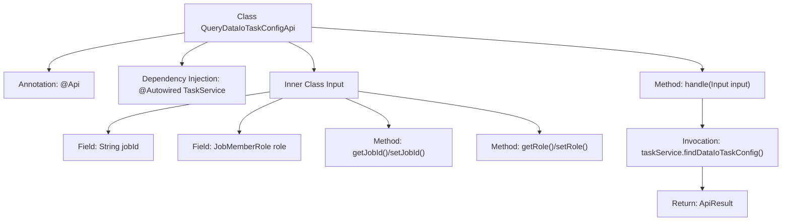

# Basic Information

|      |      |
|------|------|
| Name | QueryDataIoTaskConfigApi |
| Language | .java |
| Code Path | WeFe/board/board-service/src/main/java/com/welab/wefe/board/service/api/project/flow/QueryDataIoTaskConfigApi.java |
| Package Name | com.welab.wefe.board.service.api.project.flow |
| Dependencies | ['com.welab.wefe.board.service.service.TaskService', 'com.welab.wefe.common.exception.StatusCodeWithException', 'com.welab.wefe.common.fieldvalidate.annotation.Check', 'com.welab.wefe.common.util.JObject', 'com.welab.wefe.common.web.api.base.AbstractApi', 'com.welab.wefe.common.web.api.base.Api', 'com.welab.wefe.common.web.dto.AbstractApiInput', 'com.welab.wefe.common.web.dto.ApiResult', 'com.welab.wefe.common.wefe.enums.JobMemberRole', 'org.springframework.beans.factory.annotation.Autowired', 'java.io.IOException'] |
| Brief Description | The QueryDataIoTaskConfigApi class is used to query the input parameters of the data IO component. It requires the jobId and role parameters and calls the taskService.findDataIoTaskConfig method to return configuration information. |

# Description

The code defines an API class named `QueryDataIoTaskConfigApi`, which is used to query the input parameter configuration of a data IO component. The API path is `project/flow/query/data_io_task_config`, and it accepts an input object `Input` containing two mandatory parameters: `jobId` and `role`, where `role` is of type `JobMemberRole`. The request is processed by invoking the `findDataIoTaskConfig` method through the injected `TaskService` service, returning the result in `JObject` format. The input parameters are accessed and modified via getter and setter methods.

# Class Summary

| Name   | Type  | Description |
|-------|------|-------------|
| QueryDataIoTaskConfigApi | class | API interface for querying data IO task configuration requires providing the task ID and role parameters, and returns the task configuration information. |


## Class QueryDataIoTaskConfigApi

|      |      |
|------|------|
| Access Modifier | @Api(path = "project/flow/query/data_io_task_config", name = "Query input parameters of dataio component");public |
| Type | class |
| Name | QueryDataIoTaskConfigApi |
| Description | API interface for querying data IO task configuration requires providing the task ID and role parameters, and returns the task configuration information. |


### UML Class Diagram

```mermaid
classDiagram
    class QueryDataIoTaskConfigApi {
        -TaskService taskService
        +handle(Input input) ApiResult~JObject~
    }
    QueryDataIoTaskConfigApi --> TaskService : Dependency
    QueryDataIoTaskConfigApi --> AbstractApi~Input, JObject~ : Inheritance
    QueryDataIoTaskConfigApi ..|> <<Interface>> Api : Implementation

    class AbstractApi~Input, JObject~ {
        <<Abstract>>
        +handle(Input input) ApiResult~JObject~
    }

    class Input {
        -String jobId
        -JobMemberRole role
        +String getJobId()
        +void setJobId(String jobId)
        +JobMemberRole getRole()
        +void setRole(JobMemberRole role)
    }
    Input --> AbstractApiInput : Inheritance

    class AbstractApiInput {
        <<Abstract>>
    }

    class TaskService {
        +findDataIoTaskConfig(Input input) JObject
    }

    class JobMemberRole {
        <<Enumeration>>
    }

    class ApiResult~JObject~ {
    }

    class JObject {
    }

    <<Interface>> Api {
        <<Interface>>
    }
```

This code demonstrates the class structure of an API for querying data IO task configurations. The QueryDataIoTaskConfigApi inherits from the generic abstract class AbstractApi and implements the Api interface, retrieving task configurations via TaskService. The inner class Input extends AbstractApiInput, containing fields jobId and role along with their accessor methods. The overall design adopts a layered architecture, implementing business logic through dependency injection of TaskService, with input parameters encapsulated and validated via nested classes.


### Internal Method Call Graph



This flowchart illustrates the structure of the QueryDataIoTaskConfigApi class, including the API annotation, autowired TaskService dependency, core handler method, and nested Input parameter class. The processing flow starts from the handle method, invokes taskService to query configurations, and returns encapsulated results. The Input class contains annotated fields with corresponding getter/setter methods. The class relationships clearly present a typical Spring Boot API structure.

### Field List

| Name  | Type  | Description |
|-------|-------|------|
| taskService | TaskService | Using @Autowired to automatically inject an instance of TaskService. |

### Method List

| Name  | Type  | Description |
|-------|-------|------|
| handle | ApiResult<JObject> | Process the input and return task configuration data, containing results upon success and throwing exceptions upon failure. |


