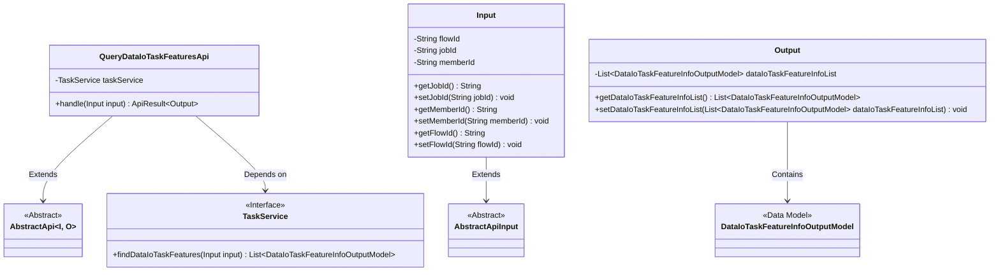
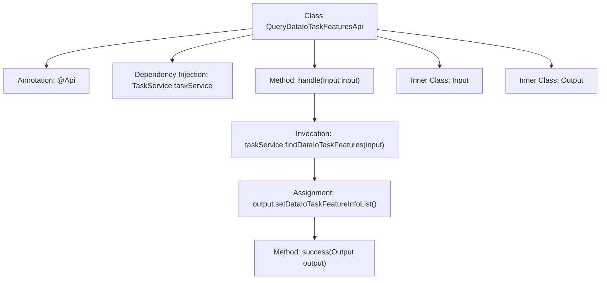

# Basic Information

|      |      |
|------|------|
| Name | QueryDataIoTaskFeaturesApi |
| Language | .java |
| Code Path | WeFe/board/board-service/src/main/java/com/welab/wefe/board/service/api/project/flow/QueryDataIoTaskFeaturesApi.java |
| Package Name | com.welab.wefe.board.service.api.project.flow |
| Dependencies | ['com.welab.wefe.board.service.dto.entity.DataIoTaskFeatureInfoOutputModel', 'com.welab.wefe.board.service.service.TaskService', 'com.welab.wefe.common.exception.StatusCodeWithException', 'com.welab.wefe.common.fieldvalidate.annotation.Check', 'com.welab.wefe.common.web.api.base.AbstractApi', 'com.welab.wefe.common.web.api.base.Api', 'com.welab.wefe.common.web.dto.AbstractApiInput', 'com.welab.wefe.common.web.dto.ApiResult', 'org.springframework.beans.factory.annotation.Autowired', 'java.io.IOException', 'java.util.List'] |
| Brief Description | Query the API for data IO task feature columns to retrieve feature information based on jobId and memberId, supporting non-OOT mode flowId queries. The input includes flowId, jobId, and memberId, and the output is a list of features. |

# Description

This API is used to query the feature columns of a member's data IO task based on the jobid. The path is "project/flow/query/data_io_task_features". It inherits from AbstractApi, with Input as the input class and Output as the output class. Input includes three fields: flowId, jobId, and memberId, representing the flow ID, task ID, and member ID, respectively. Output contains a dataIoTaskFeatureInfoList to store the query results. Data is retrieved through the findDataIoTaskFeatures method of TaskService and encapsulated into Output for return. If memberId is empty, it queries the data of all members under the specified jobid.

# Class Summary

| Name   | Type  | Description |
|-------|------|-------------|
| QueryDataIoTaskFeaturesApi | class | The API retrieves the modeling feature columns of a member data task based on the job ID. The input includes flowId, jobId, and memberId, and the output is a list of feature columns. |

## Class QueryDataIoTaskFeaturesApi

|      |      |
|------|------|
| Access Modifier | @Api(path = "project/flow/query/data_io_task_features", name = "Query the modeling feature column of the dataio task of the member according to jobid");public |
| Type | class |
| Name | QueryDataIoTaskFeaturesApi |
| Description | The API retrieves the modeling feature columns of a member data task based on the job ID. The input includes flowId, jobId, and memberId, and the output is a list of feature columns. |

### UML Class Diagram

This code describes the implementation of an API for querying data IO task features. The QueryDataIoTaskFeaturesApi inherits from the generic abstract class AbstractApi, processes Input parameters, and returns Output results. It retrieves the feature list through the dependent TaskService. The Input class includes query parameters such as flow ID, job ID, and member ID, while the Output class encapsulates the feature information list. The design follows a layered architecture, with Input/Output serving as data transfer objects that inherit from abstract base classes, and core business logic implemented via interface calls.

### Internal Method Call Graph

This code flowchart illustrates the core structure and execution flow of the QueryDataIoTaskFeaturesApi class. The class is an API implementation that defines interface paths and names through the @Api annotation, inherits AbstractApi, and specifies input/output types. The main flow starts with the handle method, which invokes taskService to query data IO task features, sets the results to the Output object, and returns a success response. The Input and Output inner classes handle request parameters and response data respectively, where Input includes validation fields such as process ID, task ID, and member ID, while Output encapsulates the feature information list. The entire process clearly demonstrates the data flow path from request processing to service invocation.

### Field List

| Name  | Type  | Description |
|-------|-------|------|
| taskService | TaskService | Using @Autowired to automatically inject the TaskService instance. |

### Method List

| Name  | Type  | Description |
|-------|-------|------|
| handle | ApiResult<Output> | Java method overriding, processes input and returns output containing task characteristics, may throw exceptions or IO errors. |

