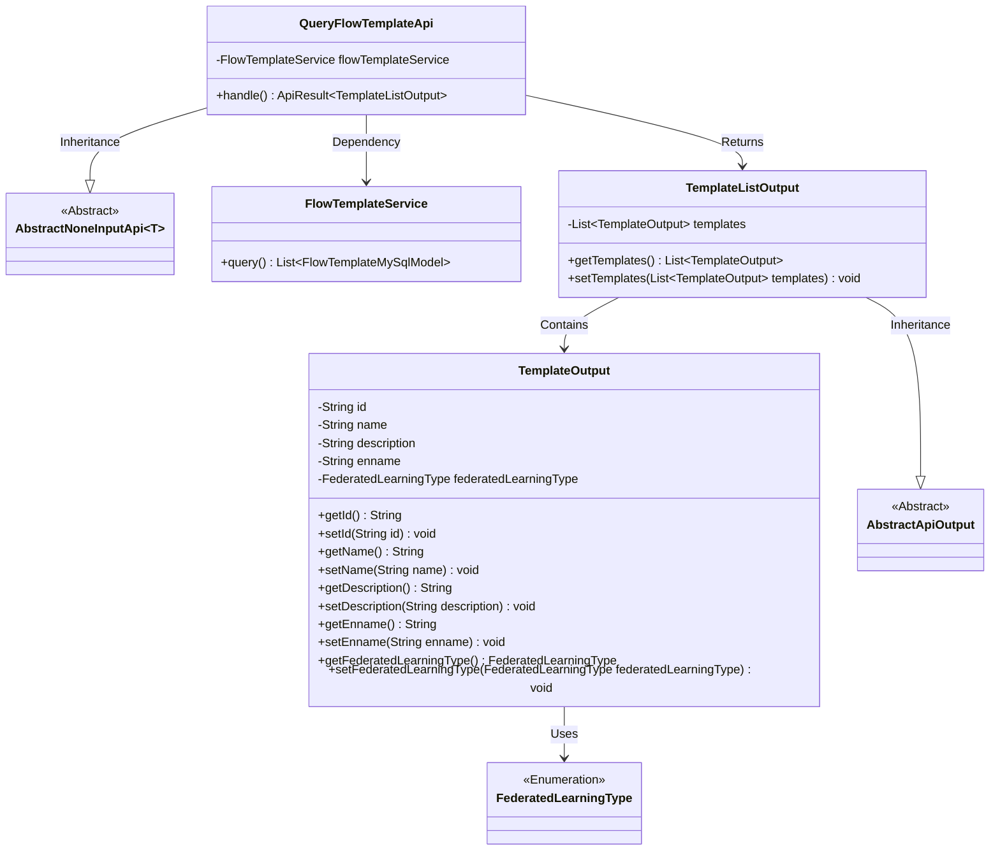
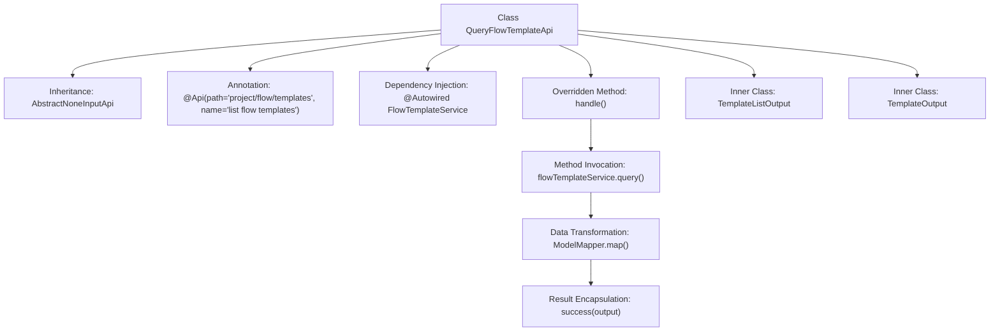

# Basic Information

|      |      |
|------|------|
| Name | QueryFlowTemplateApi |
| Language | .java |
| Code Path | WeFe/board/board-service/src/main/java/com/welab/wefe/board/service/api/project/flow/QueryFlowTemplateApi.java |
| Package Name | com.welab.wefe.board.service.api.project.flow |
| Dependencies | ['com.welab.wefe.board.service.api.project.flow.QueryFlowTemplateApi.TemplateListOutput', 'com.welab.wefe.board.service.database.entity.flow.FlowTemplateMySqlModel', 'com.welab.wefe.board.service.service.FlowTemplateService', 'com.welab.wefe.common.exception.StatusCodeWithException', 'com.welab.wefe.common.fieldvalidate.annotation.Check', 'com.welab.wefe.common.web.api.base.AbstractNoneInputApi', 'com.welab.wefe.common.web.api.base.Api', 'com.welab.wefe.common.web.dto.AbstractApiOutput', 'com.welab.wefe.common.web.dto.ApiResult', 'com.welab.wefe.common.web.util.ModelMapper', 'com.welab.wefe.common.wefe.enums.FederatedLearningType', 'org.springframework.beans.factory.annotation.Autowired', 'javax.persistence.EnumType', 'javax.persistence.Enumerated', 'java.util.List', 'java.util.stream.Collectors'] |
| Brief Description | The QueryFlowTemplateApi class is used to query the list of process templates. It retrieves data through the flowTemplateService and converts it into the TemplateOutput format for return, including fields such as template ID, name, description, English name, and federated learning type. |

# Description

The code defines an API class QueryFlowTemplateApi for querying flow templates, which inherits from AbstractNoneInputApi and returns a TemplateListOutput type. The API path is `project/flow/templates`, and its name is "list flow templates". It queries template data through FlowTemplateService, converts FlowTemplateMySqlModel to TemplateOutput, and encapsulates it into TemplateListOutput for return. TemplateOutput includes fields such as id, name, description, English name, and federated learning type, while TemplateListOutput contains a list of templates.

# Class Summary

| Name   | Type  | Description |
|-------|------|-------------|
| QueryFlowTemplateApi | class | The QueryFlowTemplateApi class retrieves a list of process templates via the flowTemplateService, returning an output list of templates containing IDs, names, descriptions, and federated learning types. |

## Class QueryFlowTemplateApi

|      |      |
|------|------|
| Access Modifier | @Api(path = "project/flow/templates", name = "list flow templates");public |
| Type | class |
| Name | QueryFlowTemplateApi |
| Description | The QueryFlowTemplateApi class retrieves a list of process templates via the flowTemplateService, returning an output list of templates containing IDs, names, descriptions, and federated learning types. |

### UML Class Diagram

This code demonstrates the implementation of a query flow template API. The core class QueryFlowTemplateApi inherits from AbstractNoneInputApi, retrieves data through FlowTemplateService, and converts it into TemplateListOutput for output. TemplateListOutput contains multiple TemplateOutput objects, each storing template attributes such as ID, name, description, etc., and utilizes the FederatedLearningType enumeration. The overall structure reflects layered design and data transformation logic.

### Internal Method Call Graph

This flowchart illustrates the structure and execution flow of the QueryFlowTemplateApi class. As an API controller, it implements business logic by extending AbstractNoneInputApi and overriding the handle method. The process starts with the handle method, which invokes flowTemplateService to retrieve data, performs model transformation via ModelMapper, and ultimately encapsulates the result as TemplateListOutput. The inner classes TemplateListOutput and TemplateOutput define the return data structure and contained template information respectively. The entire chain demonstrates a complete workflow from data query to result delivery.

### Field List

| Name  | Type  | Description |
|-------|-------|------|
| flowTemplateService | FlowTemplateService | Using @Autowired to automatically inject an instance of FlowTemplateService. |

### Method List

| Name  | Type  | Description |
|-------|-------|------|
| handle | ApiResult<TemplateListOutput> | This method queries the process template list, maps the results to output objects, and returns a successful response. |

