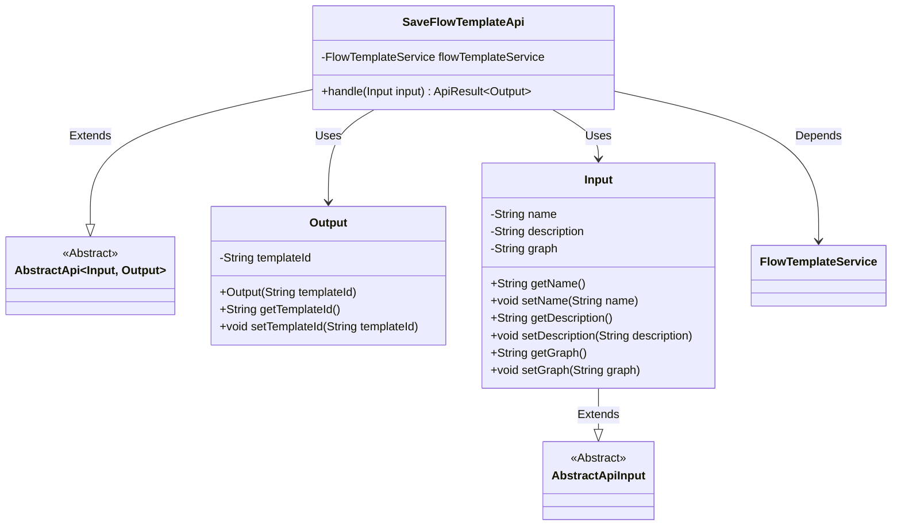
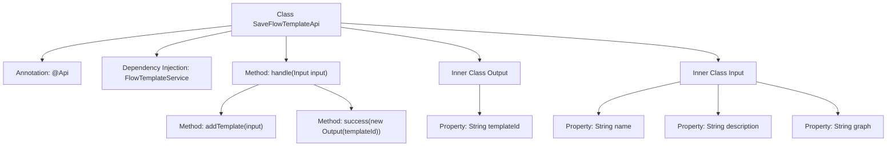

# Basic Information

|      |      |
|------|------|
| Name | SaveFlowTemplateApi |
| Language | .java |
| Code Path | WeFe/board/board-service/src/main/java/com/welab/wefe/board/service/api/project/flow/SaveFlowTemplateApi.java |
| Package Name | com.welab.wefe.board.service.api.project.flow |
| Dependencies | ['com.welab.wefe.board.service.service.FlowTemplateService', 'com.welab.wefe.common.exception.StatusCodeWithException', 'com.welab.wefe.common.fieldvalidate.annotation.Check', 'com.welab.wefe.common.web.api.base.AbstractApi', 'com.welab.wefe.common.web.api.base.Api', 'com.welab.wefe.common.web.dto.AbstractApiInput', 'com.welab.wefe.common.web.dto.ApiResult', 'org.springframework.beans.factory.annotation.Autowired'] |
| Brief Description | API for saving process templates, which receives name, description, and flowchart inputs, invokes a service to generate a template ID and returns it. Includes input/output class definitions and core processing logic. |

# Description

This is an API class named SaveFlowTemplateApi, used for saving workflow templates. The API path is project/flow/template/save. It inherits from the AbstractApi class and utilizes FlowTemplateService to handle business logic. The input parameter Input includes the template name, description, and flowchart, all annotated with validation annotations. The output parameter Output contains the generated template ID. The processing logic involves adding the template via the flowTemplateService.addTemplate method and returning a successful result containing the template ID.

# Class Summary

| Name   | Type  | Description |
|-------|------|-------------|
| SaveFlowTemplateApi | class | Save Process Template API, which receives name, description, and flowchart inputs, invokes the service to generate a template ID and returns it. |

## Class SaveFlowTemplateApi

|      |      |
|------|------|
| Access Modifier | @Api(path = "project/flow/template/save", name = "save flow template");public |
| Type | class |
| Name | SaveFlowTemplateApi |
| Description | Save Process Template API, which receives name, description, and flowchart inputs, invokes the service to generate a template ID and returns it. |

### UML Class Diagram

This code demonstrates the class structure of a Save Flow Template API. SaveFlowTemplateApi inherits from the generic abstract class AbstractApi, defining two nested classes Input and Output as parameters. The Input class extends AbstractApiInput, containing fields like template name, description, and flow graph; the Output class includes the generated template ID. The API processes business logic through the injected FlowTemplateService, transforming input into output results. The overall design reflects clear separation of responsibilities and layered architecture.

### Internal Method Call Graph

This flowchart illustrates the structure of the SaveFlowTemplateApi class, including the main class, annotations, dependency-injected service, core processing method handle, and two inner classes Output and Input. The handle method processes input via flowTemplateService.addTemplate and returns a successful result containing the template ID. The Input class includes three validated properties: template name, description, and flowchart, while the Output class encapsulates the generated template ID. The entire process clearly reflects the data flow path of API request handling.

### Field List

| Name  | Type  | Description |
|-------|-------|------|
| flowTemplateService | FlowTemplateService | Automatically inject the process template service instance. |

### Method List

| Name  | Type  | Description |
|-------|-------|------|
| handle | ApiResult<Output> | The method processes the input and invokes the service to add a template, returning a successful result containing the template ID. |

